## Api Gateway
- [Overview](#overview)
- [Features](#features)
- [How To](#how-to)

### Overview

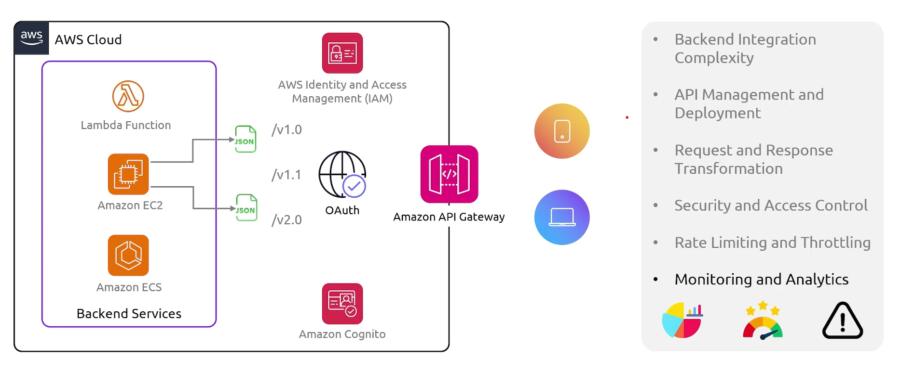
* AWS `api gateway` is a fully managed service that acts as a front door for applications to access backend data 
    - it offloads tasks like authentication, request routing, ratelimiting, and traffic monitoring from your backend servers
* Its overs 3 primary api types:
    - `http apis`: optimized for serverless workloads (lambda) and http backends
    - `rest apis`: provides endpoints that provide api management capabilities
    - `websocket apis`: maintain bi directional connections ideal for real-time applications like chat apps and live gaming dashboards
* Its integration with `lambda` is great for resilience and availability, because `lambda` can scale almost infinitly to handle traffic and it is distributed across multiple `AZs` for fault tolerance

### Features

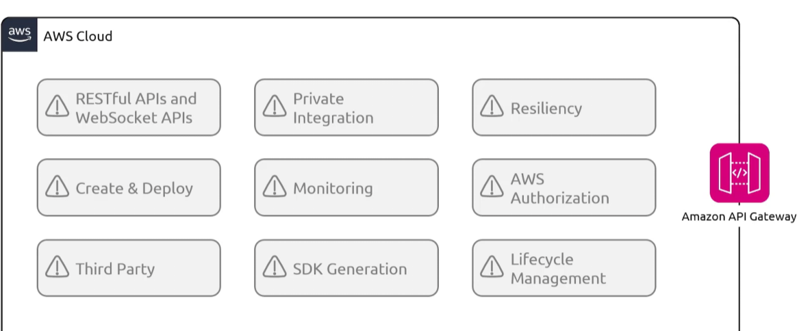
* `Private Integration`: a way to securely expose private applications
    - `ec2`, `lambda`, `ecs`, `step functions`, `beanstalk`, even publicily accesibly none aws applications can be integrated
        * 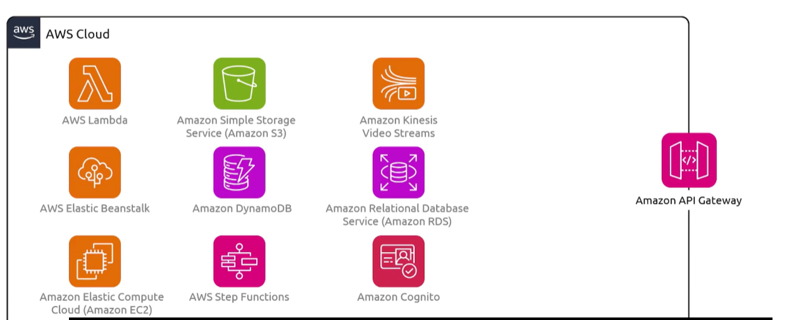
* `Resiliency`: rate limiting
* `Caching`: for rest apis, caching with cusotomize keys and ttl can be configured
* `Monitoring`: provides dashboard for calls made to gateway, integrated with cloudwatch
* `Authorization`: you can use `iam` and policies to control access to apis
    - `lambda` can be used to verify jwt tokens and saml assertions
* `Third Party`: api keys can be generated for third party users to call apis
* `SDK gen`: auto builds platform specific client sdks from your apis
* `Lifecycle managament`: lets you run multiple versions of the same api simultaneously so apps can continue to call previous api versions
    - can manage release stages for api (alpha, beta, prod)
    - each api can be confired to interact with different backend endpoints 
    - specific stages and versions of apis can be associated with a custom domain name
* `API Caching`: a design pattern where your api gateway stores backend http responses in a temporary storage layer
    - when a client makes a matching request, the gateway returns the cached response directly
    - reduces latency, cutss infra cost (saves compute cycles), protects under load

### How To

1. Create a rest api
    - 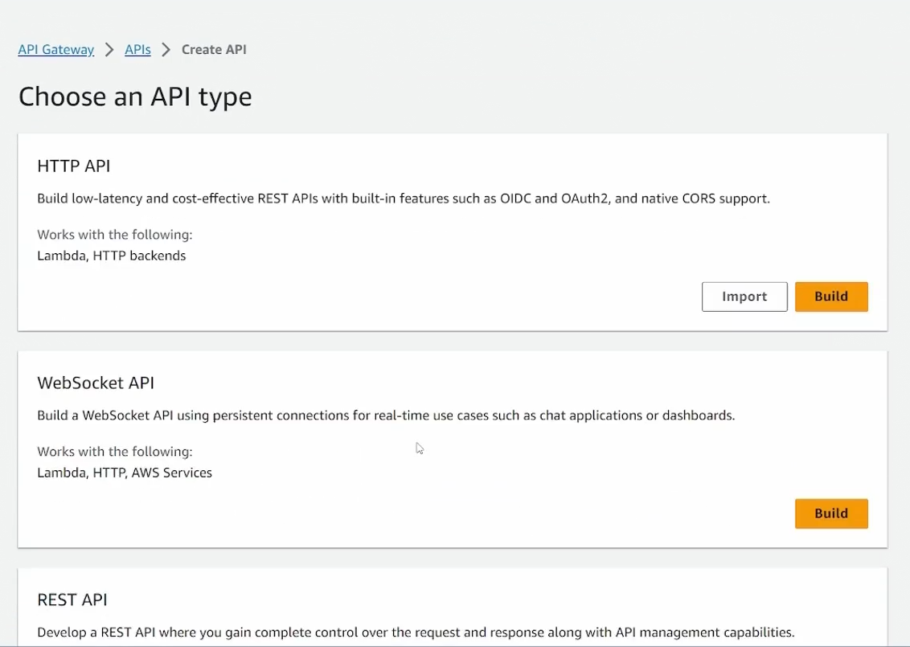
    - 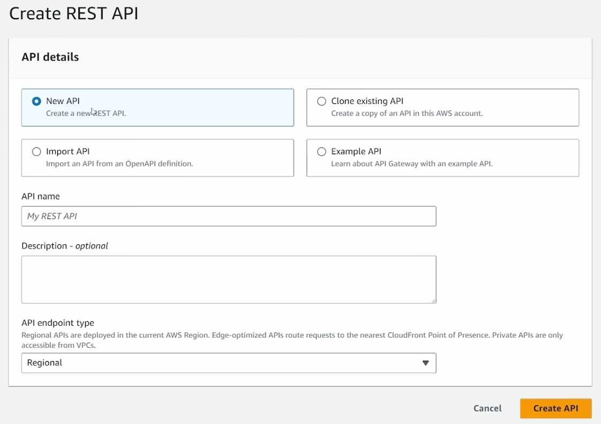

2. Create a resource (path in api where we'll handle requests)
    - 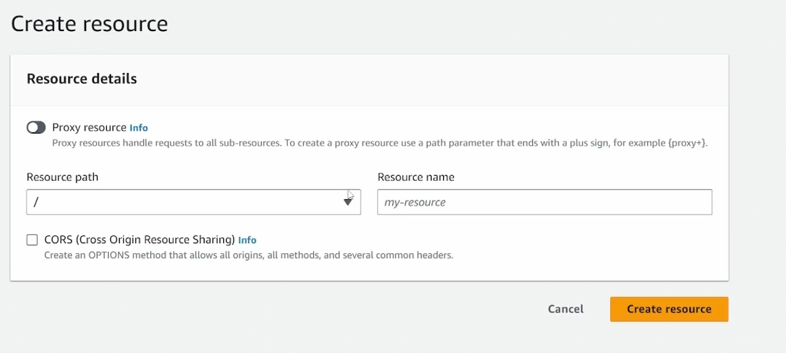

3. Create a method for that resource
    - 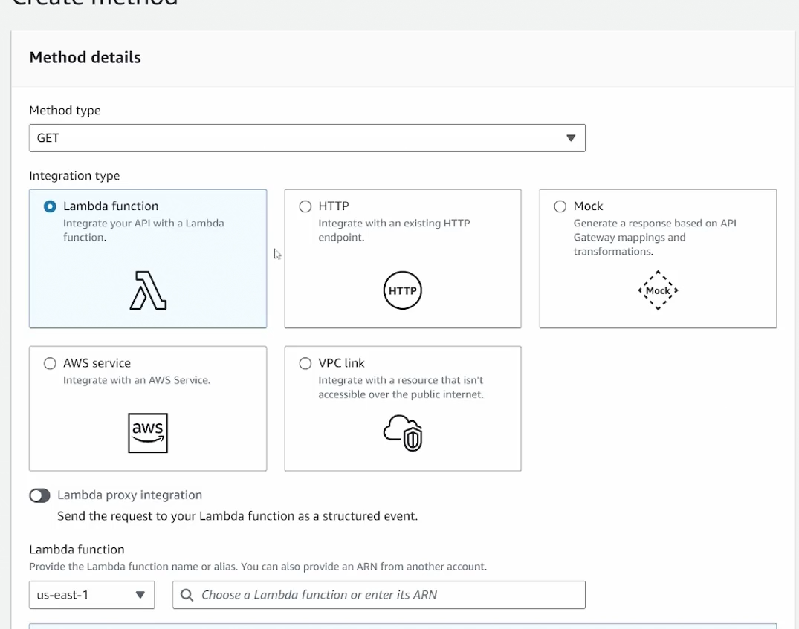
        * A `lambda` function exists that returns a value based on api request sent
        * You'll need to enable `lambda proxy integration` to send body of request to `lambda` for PUT or POST methods
        * Ideally you'd connect the `lambda` to a rds backend, providing creds through `secrets manager`
    - submethods can be defined for subpaths
        * 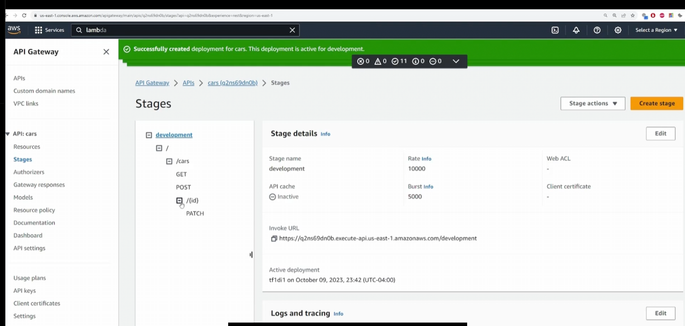
        * You can configure the `lambda function` to show you full event and parse from there
            - 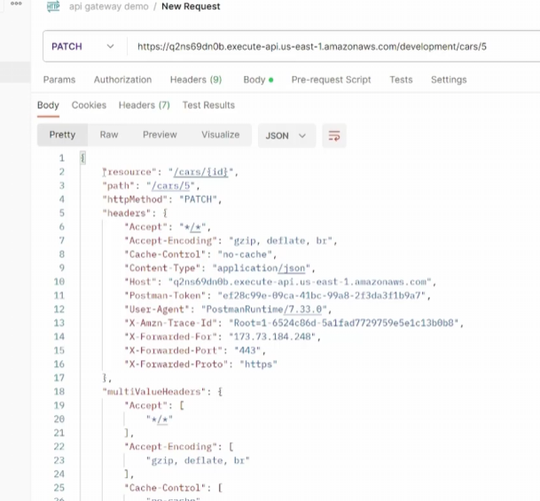

4. Deploy api
    - 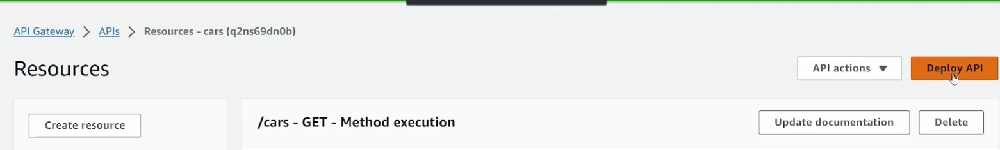
    - 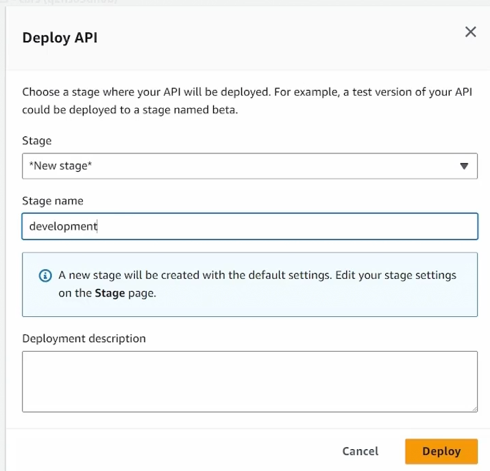
        * set stage for deploy

5. Retrieve invoke url
    - 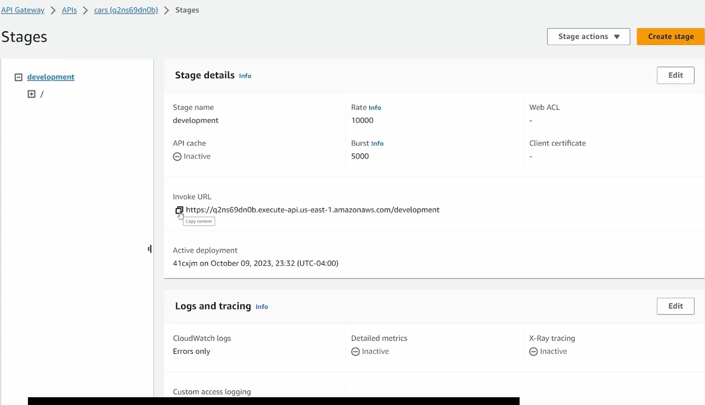
    - 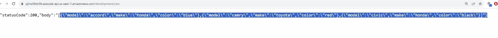