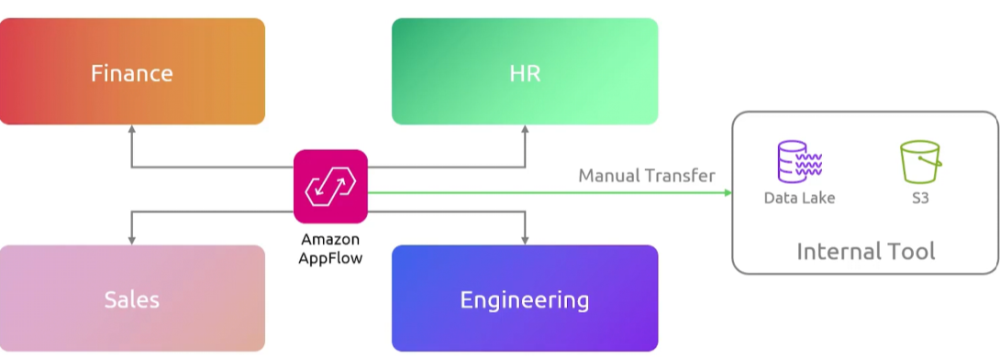
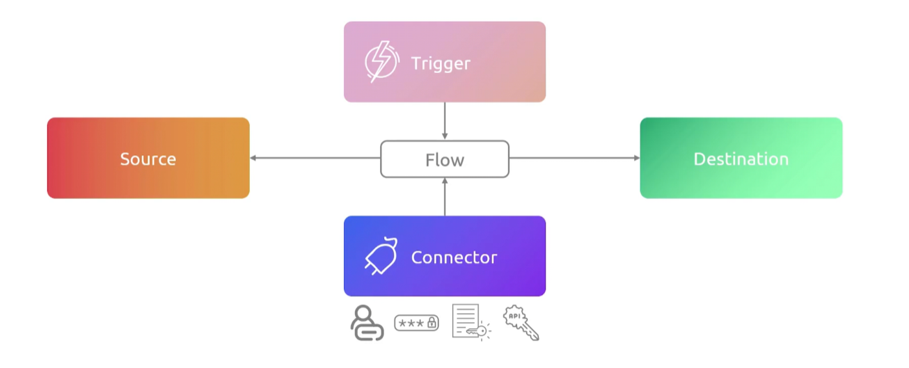
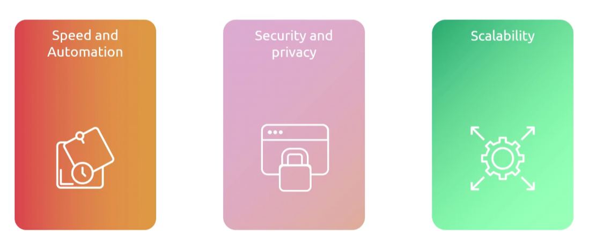

## AppFlow
- [Overview](#overview)
- [Components](#components)
- [Features](#features)

### Overview

* Amazon `appflow` is a fully managed, no-code integration service that lets you securely transfer data between SaaS applications and aws services
    - you can automate transfers on a schedule, on demand or in response to real time events
    * NOTE: data collector, transformator and consolidator

### Components 

* `Flows`: central component that defines the entire data transfer process
    - defines where data comes from, where it goes, how it shuld be mapped and when the transfer happens
* `Connectors`: pre built interfaces that bridge the gap between the applications
    - source: extract data from saas apps (salesforce, slack, zendesk, s3 etc)
    - destination: load the transferred data into aws services (s3, redshift, dynamodb or a saas endpoint)
    * store creds necessary to communicate with source and dest
* `Data Mapping & Transformations`: rules configured during flow creation to manipulate data in transit
    - you can filter fields, mask sensitive data, validate records, and even map source data fields directly to target schemas
* `Flow Triggers`:  rules dictating when the transfer runs
    - on-demand: executing manually
    - scheduled: cron
    - event-drive: event-driven (`eventbridge`)

### Features

* `No code pipelines`: create secure data connectors and map fields
* `Data transformation`: filter, validate, mask, and concat fields when transferring data
* `Flexible triggers`: automate flows on a cron, on demand, or even driven
* `Security`: all data is encrypted in motion and at rest
    - supports `privatelink` to prevent data from traversing the internet
* `Resilience`: can use s3 as buffer storage to act as a buffer storage to ensure that no data is lost due to any issues that may occur