## EventBridge
- [Overview](#overview)
- [Components](#components)
- [Features](#features)
- [Demo](#demo)

### Overview

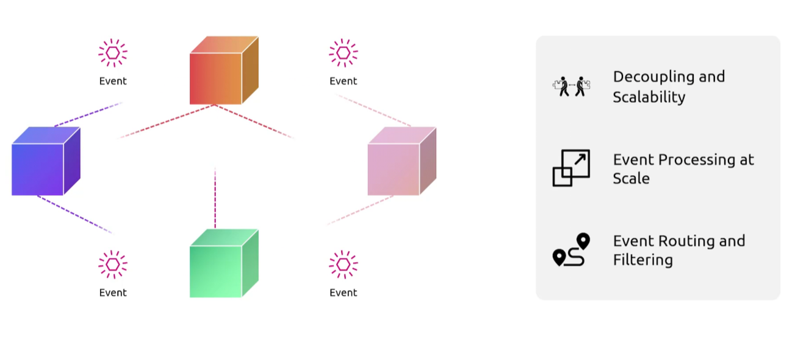
* AWS `Eventbridge` is a serverless, fully managed event bus service that lets you connect aws services, saas applications, and your own custom systems together
    - it simplifies building scalable, event-driven architectures by routing real-time data streams to targets like `lambda`, `sqs`, and `step functions`
    - great for microservices that interact with each other based on events triggered by other microservices

### Components

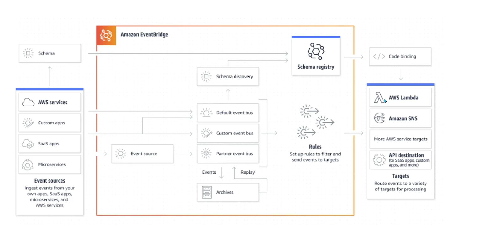
* `Events`: json payloads that represent changes in state or environments
    - a db snapshot being taken, or an instance being created
* `Event Sources`: services that generate events
* `Event Buses`: central pipeline that receives events and routes them to targets based on rules
    - each aws account has a default bus configured
* `Rules`: components tied to an event bus that evaulate the incoming events using defined patterns 
    - if an event matches a rule criteria, it sends it to one or more targets
* `Pipes`: for point to point integrations
    - allow you to create a direct flow from a single source to a single target
    - can filter, transform, and enrich data
    - 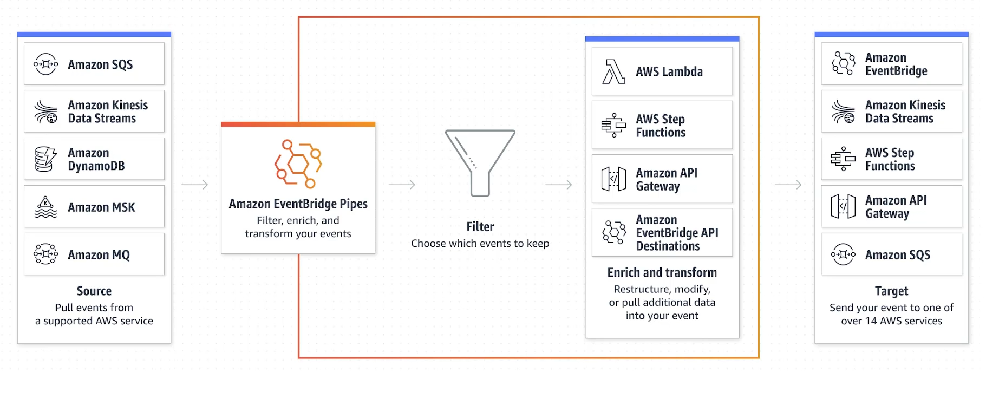
* `Scheduler`: a serverless scheduler that lets you schedule events and tasks at scale
    - 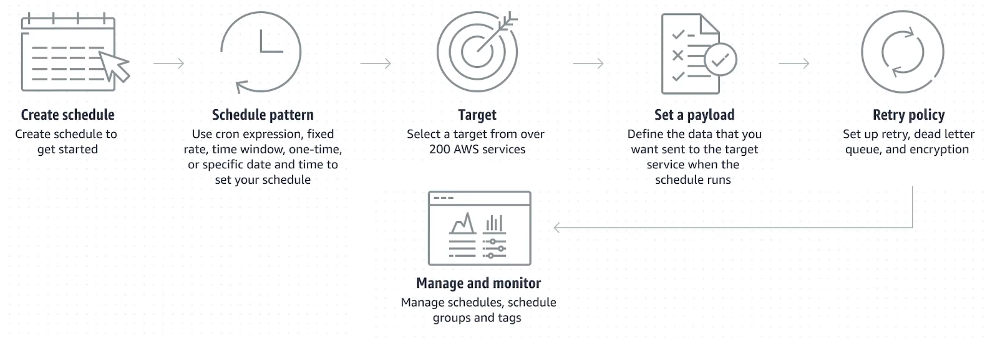

### Features

* `Low Code Integrations`: can be integrated with apis, sending events to endpoints
* `Event Replay`: allows you to save events from your event bus to storage, and replay them later for debugging or reprocessing
* `Schema Registry`: a feature that catalogs the structure of your events, allowing you to generate code bindings in languages like java or python for faster app development
    - define shape of what events will look like so others can know what to expect when that event arrives on the event bus to their target
* `At-Least-Once Delivery`: auto tries until event gets delivered to targets at least one
* `HA`: events are stored across multiple `AZs` with 99.99% availability

### Demo

1. Create a `rule`, first specify which `event bus` to associate it with
    - 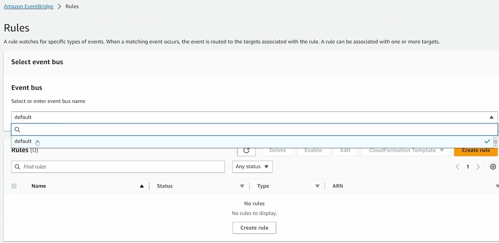
    - 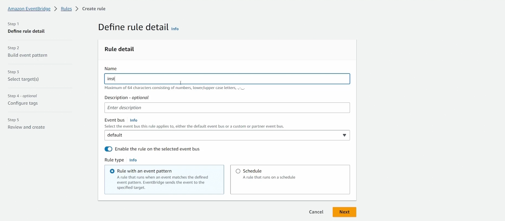

2. Specify `event source`:
    - 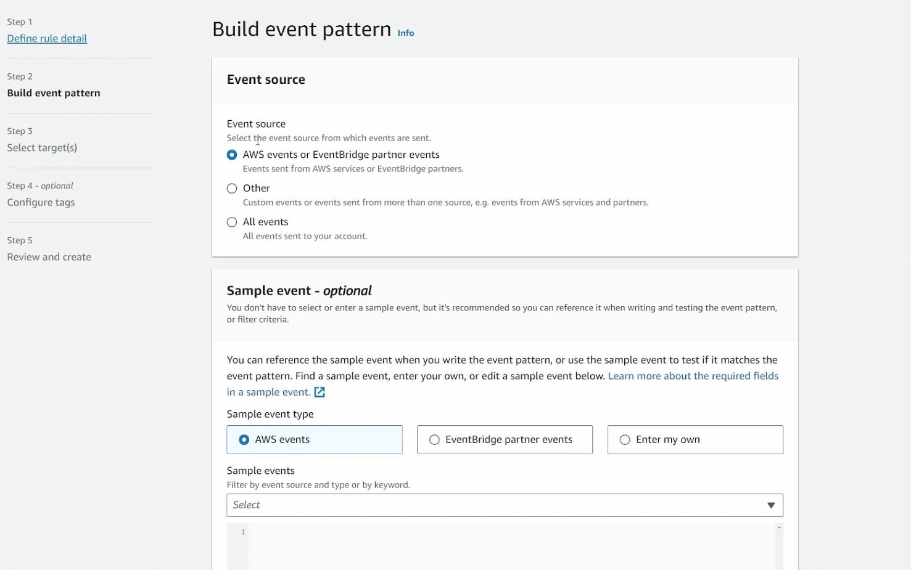
        * Sample events will show you what the event will look like once sent
            - 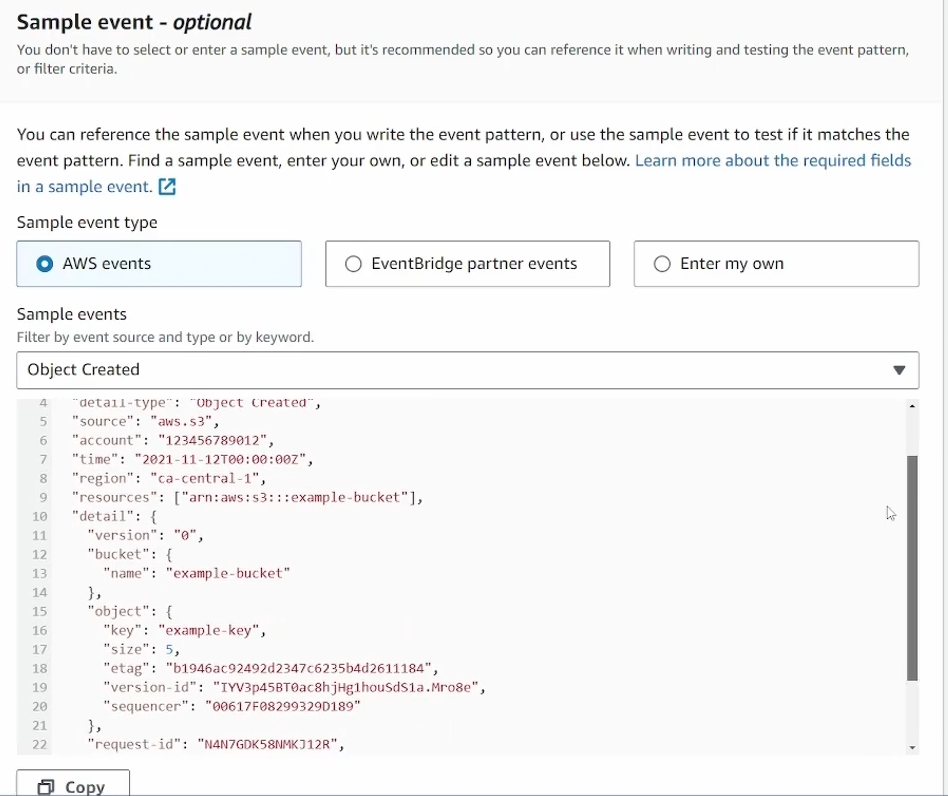

3. Create method and specify event pattern
    - 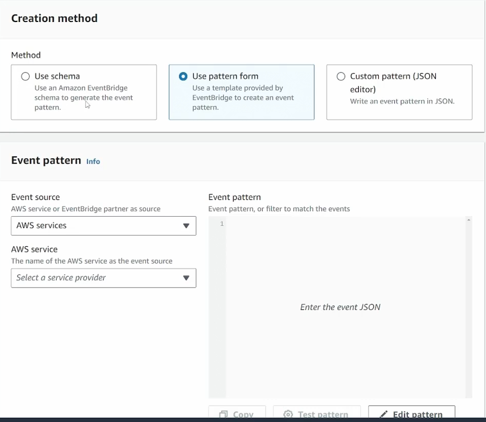
    - specify pattern for if any instance has a state change
        - 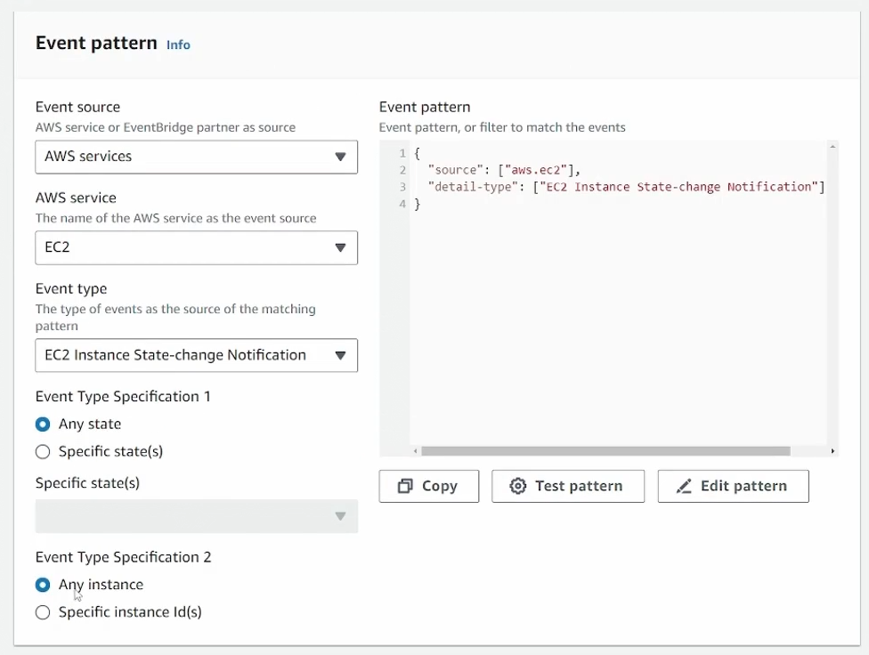

4. Specify target for the rule
    - 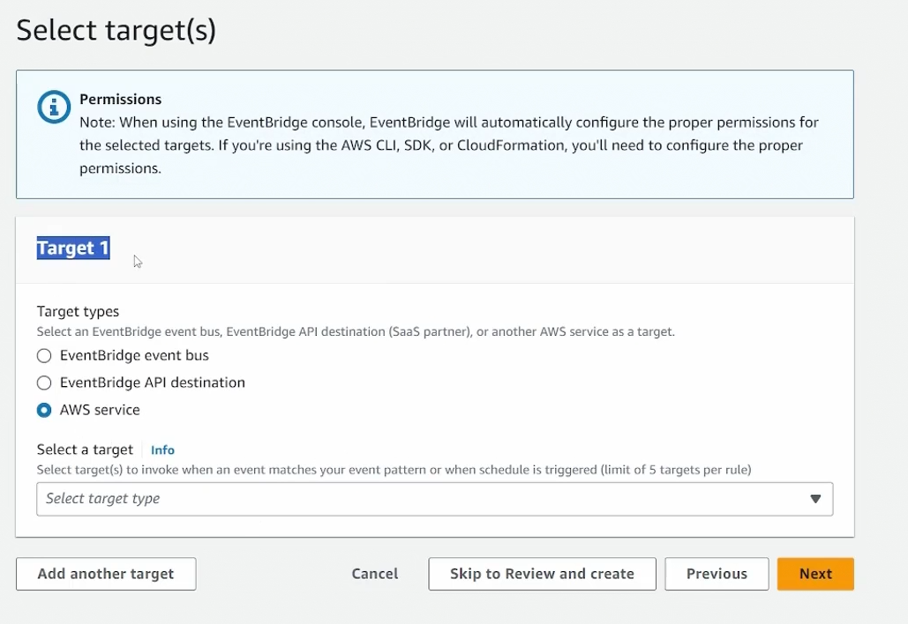

* NOTE: you can configure applications using sdk to generate events in `eventbridge`
    - 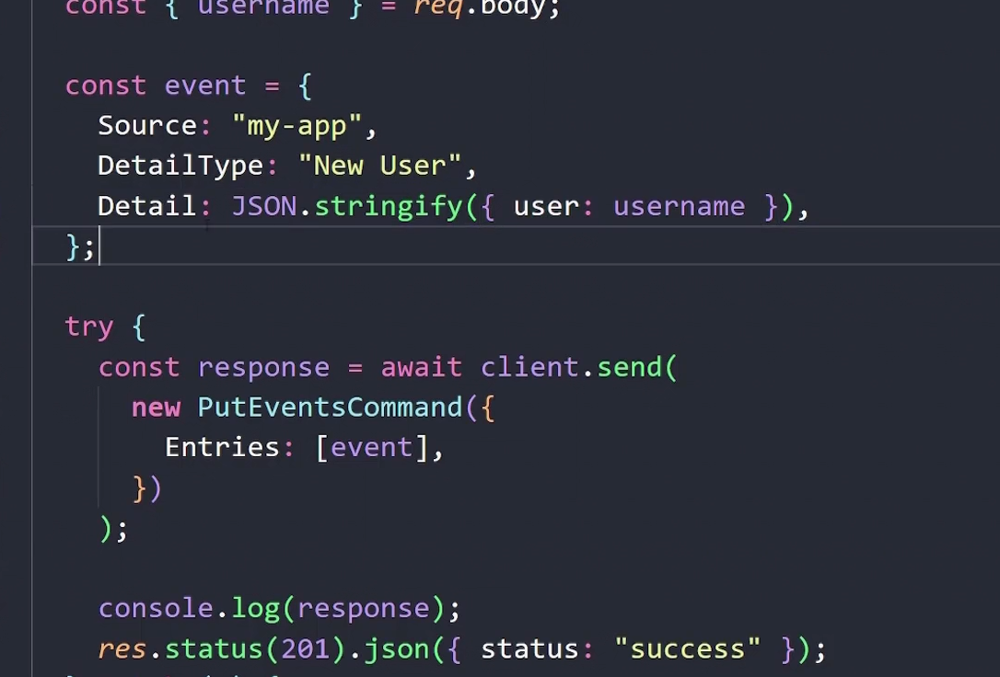
        * create a rule with a custom pattern, based on what your app is sending
            - 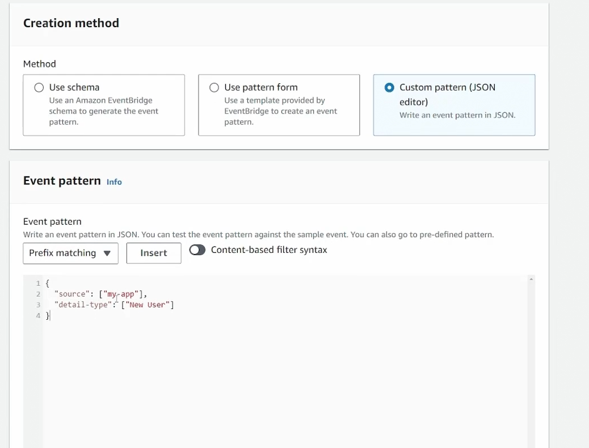
    - On `event bus` you can send an event to test this or any rule out
        - 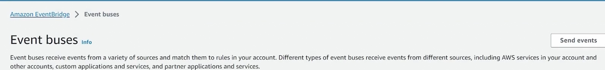
        - 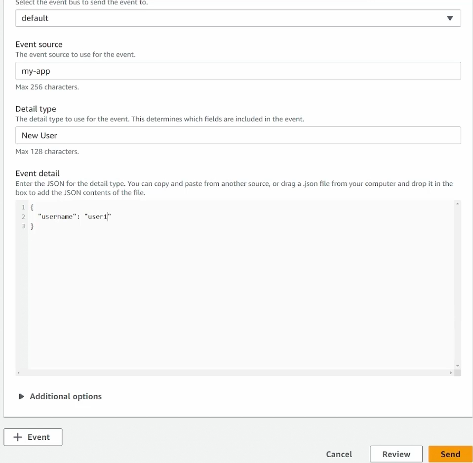
        - 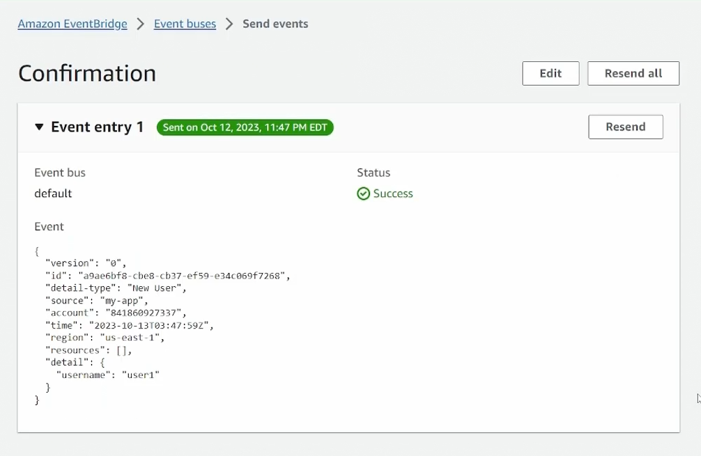
