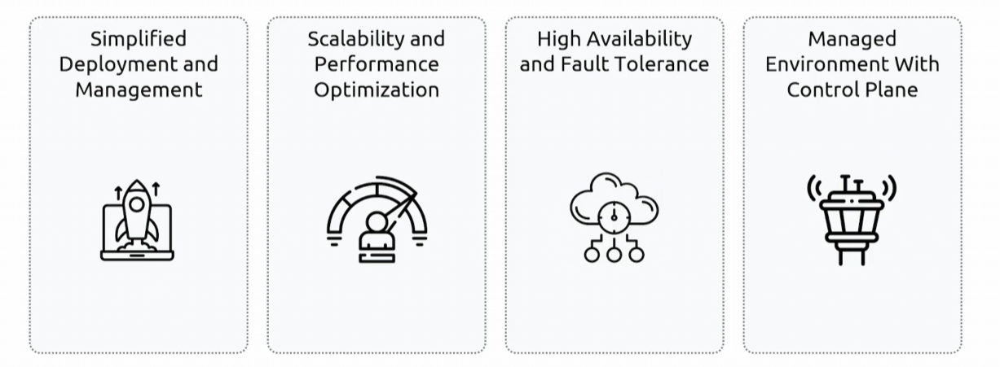

## Managed Apache Airflow
- [Overview](#overview)

### Overview

* A fully managed service that lets you run open-source `apache airflow` on aws without handling infra for scalability, availability, or security

* NOTE: uses an rds postgres db as its underlying database to securely store all core airflow states 