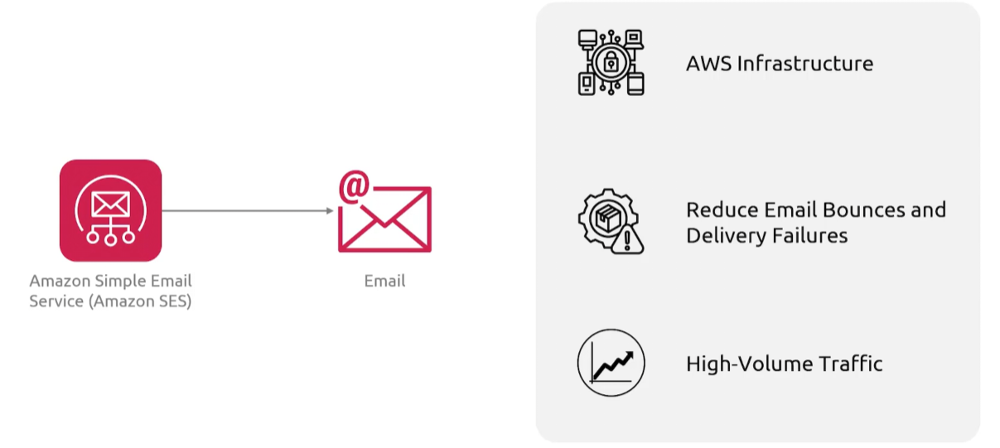
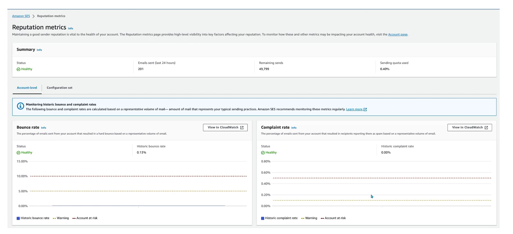

## Simple Email Service
- [Overview](#overview)
- [Components & Features](#components-and-features)

### Overview

* AWS `Simple Email Service (SES)` is a scalable, cloud-based email provider built for bulk, marketing, and transactional emails
    - you pay for what you send and it features high deliverability, dedicated/shared ips, and inbound email processing

### Components and Features

* `Verified Identity`: before snding emails, you must prove you own the domain or email address
    - used Easy DKIM (domainkeys identified mail), Sender Policy Framework (SPF), and Domain based Message Authentication, Reporting and Conformance (DMARC) to authenticate your emails
* `Sending Interfaces`: provides multiple methods for message injection
    - `smtp interface`: integrates with legacy apps or standard email clients using smtp creds
    - `ses api`: integration with sdk for integration with cloud apps
* `Configuration Sets`: control panels that dictate how emails are processed
    - they enable event destinations and reputation management
* `Dedicated Ips`: for reputation management
* `Email Receiving`: receives emails as well as sending
    - you can set up receipt rules to process incoming mail, auto routing attachments to `s3` or triggering `lambda` for auto processings
    - you can define whether you want to accept or reject emails
* `Email Templates`: customize how you send emails to customers
* `Reputation Management`: manage rep
    * 
* `Mailbox Simulator`: test how application responds to scenerios like bounces or complaints
