## Step Functions
- [Overview](#overview)
- [Components](#components)
- [Demo](#demo)

### Overview

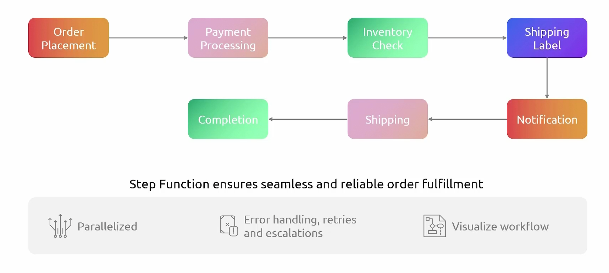
* AWS `Step Functions` is serverless ochestration service that lets you coordinate multiple aws services into visual workflows called `state machines`
    - it manages state, retries, and errors automatically
* Great for ochestrating microservices, long-running processes, error-handling, and complex business logic
    - they are highly stateful
    - built to change multiple `lambda functions` or other aws services
    - meant to supersede the limitations posed by running just `lambda`

* NOTE: you no longer need to ochestrate the `lambda functions`
    - just have they do what they're supposed to do and use `step functions` to ochestrate it all to form a pipeline
    - 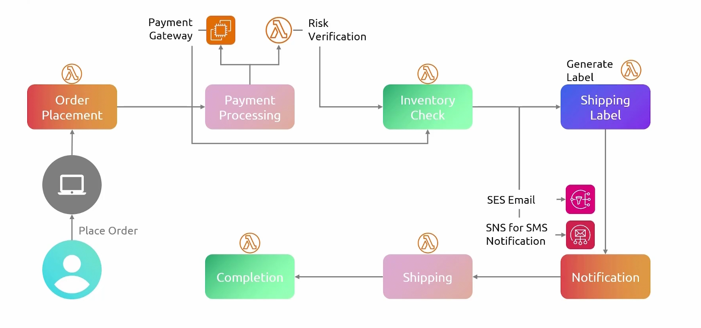

### Components

* `Amazon States Language (ASL)`: json based structured configuration language used to define serverless workflows known as `state mmachines`
* `State Machines`: overall workflow blueprint defined in json using ASL
    - dictates sequence of steps and passes data between components
* `Executions`: running instances of your `state machine`
* `States`: individual steps or stages in your workflow
    - task: represent a unit of work
    - choice: adds a conditional `if/else` logic to branch execution paths based on data
    - map: runs a set of steps for each item in a data array, processing them seque ntially or in parallel
    - parallel: runs multiple branches of steps simultaneously, merging their outputs before moving to the next state
    - pass: passes input directly to its output without performing work
    - wait: delays the workflow for a specified duration
    - succeed/fail: explicitly stops the execution with a sucess of failure status
    - transitions: defines the order of execution between states
    - activities: remote workers that poll step functions for work, execute a specific task, and return the result

### Demo

1. Create a `state machine`
    - 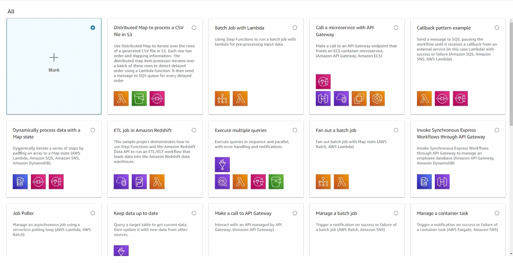
    - 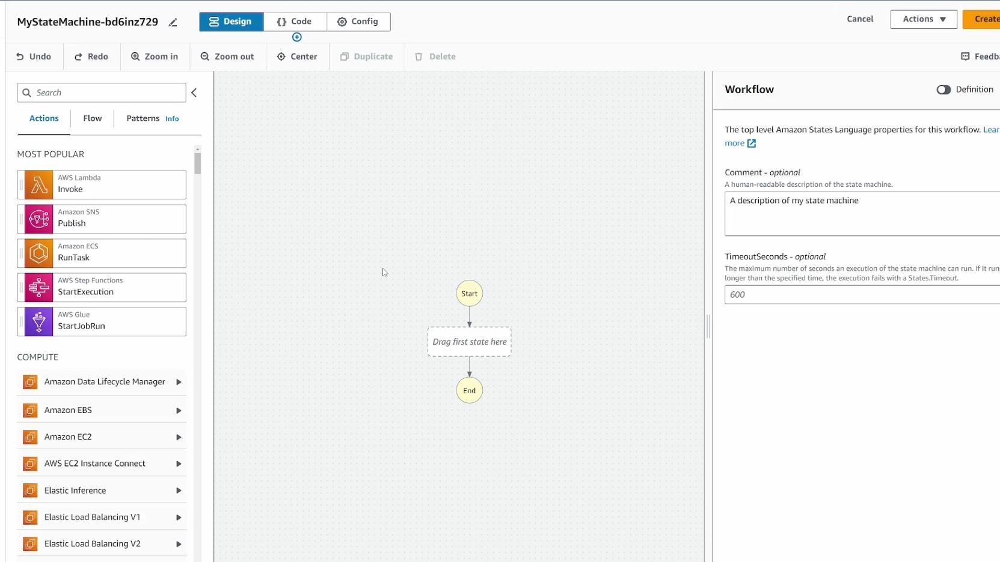
    - flows are defined here
        * 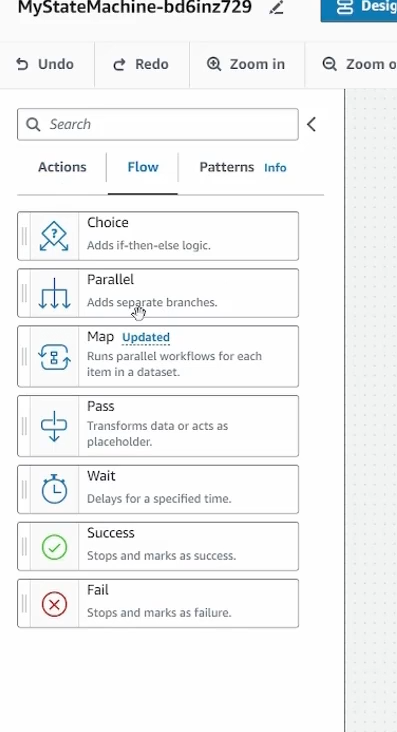

2. Adding a state to the machine will load configurations you can add
    - 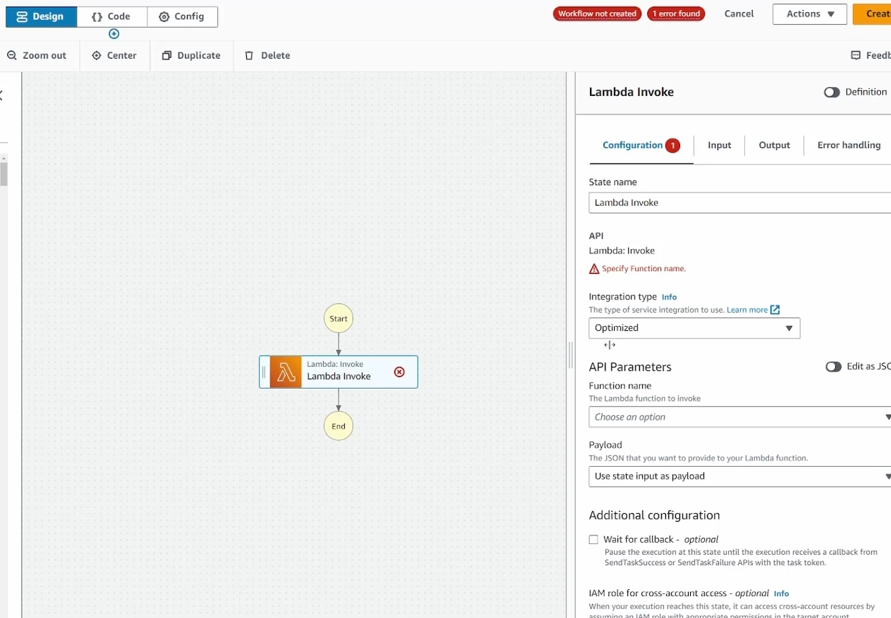
        * you can define which function, parameters, payload, etc
        * you can even wait for callback (some event or user input)
    - 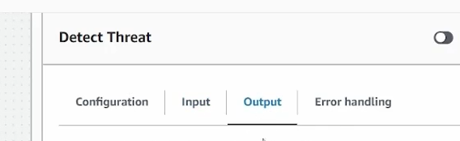
        * input, output, and error handling and be configured
    
3. Add choice flow for conditional logic in workflow
    - 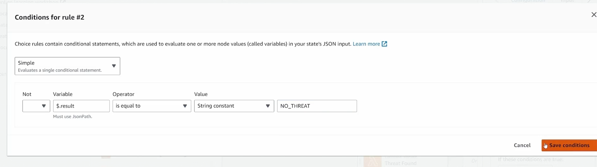
    - 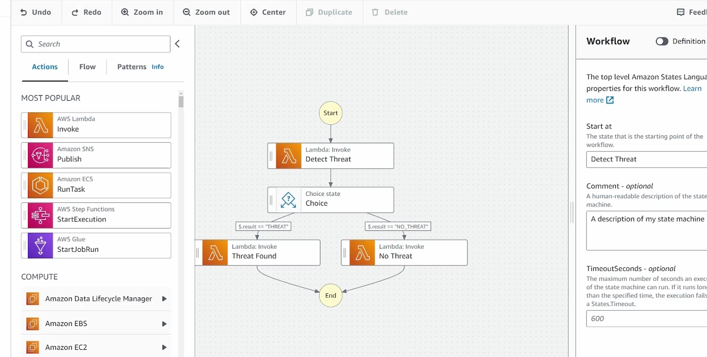

4. When you finish the logic and want to create the machine, `step functions` will try to create a role with the necessary permissions to run the workflow for you
    - 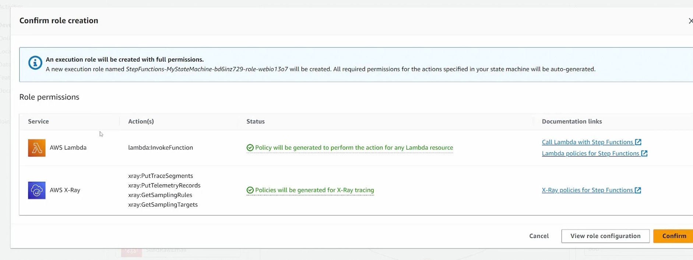

5. Execute the `state machine` and give it sample input
    - 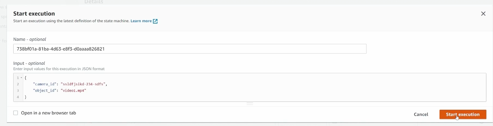

6. You'll see a graphical view of your workflow running
    - 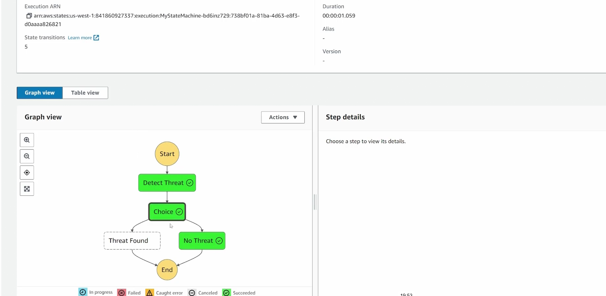
    * you'll be able to analyze each step and view data associated with it (input, output, etc)
        - 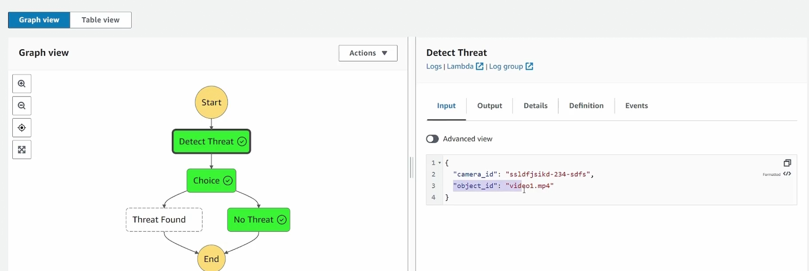
    * events associated with the `state machine`
        - 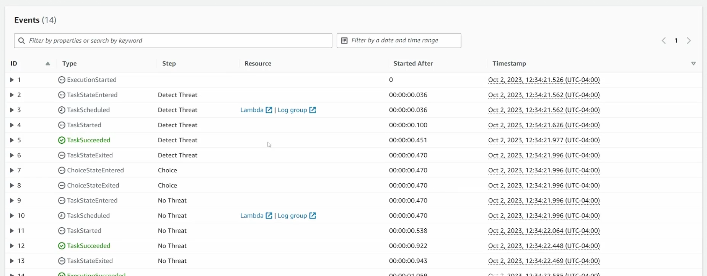

7. View aggregate stats for `state machine`
    - 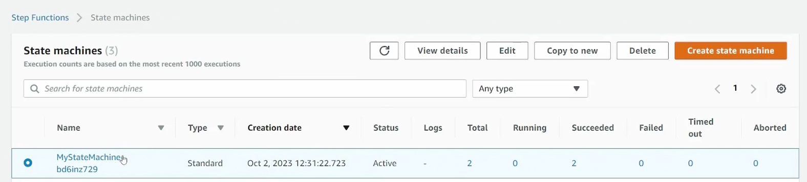
