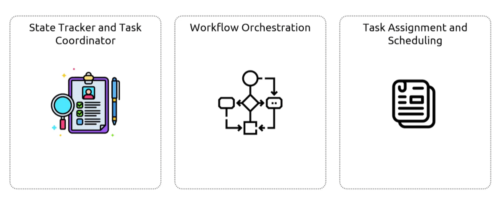

## Simple Workflow Service
- [Overview](#overview)
- [Components](#components)

### Overview

* AWS `Simple Workflow Service (sws)` is a fully managed aws service that helps developers build, run, and scale backgroun jobs featuring parallel or sequential stpes
    - it decouples the coordination logic of your applications from the actual processing of taks
    - very similar to `step functions`, but mean for low level tasks that typical run as backgroup jobs, where as `step functions is for distributed taskes
        * ideal if your application interacts with external forces (user input, intervention, etc) or if you'd like to launch child processes from parent processes and return a result
        * you can also use your preferred programming language for configuring `sws`

### Components

* `Workers`: program that performs the actual logical units of work
* `Deciders`: programs that control the ordering, concurrency, and scheduling of tasks based on app logic
* `Domains`: containers that isolate your workflow types, executions, and tasks within the same aws account