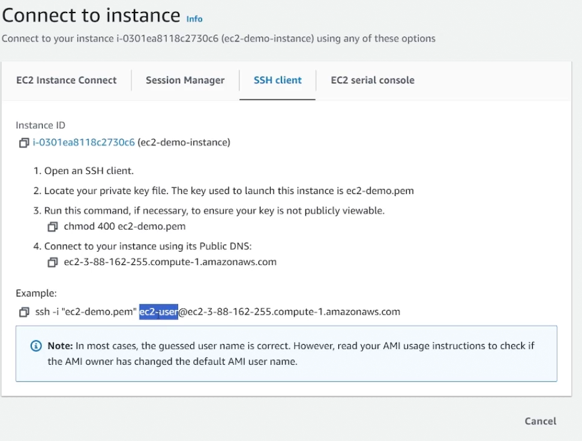
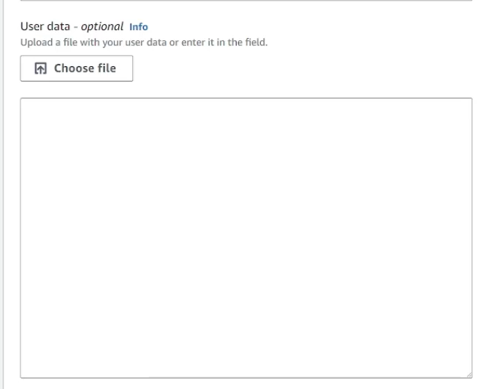
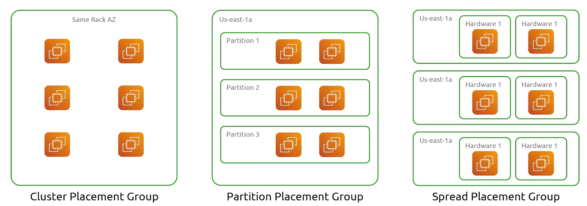
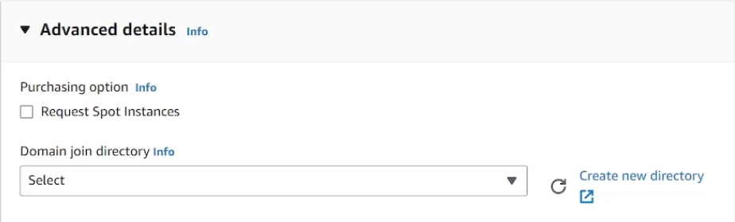

## EC2
- [Overview](#overview)
- [Instance Types](#instance-types)
- [AMI](#ami)
    - [Ec2 Image Builder](#ec2-image-builder)
- [Key Pair](#key-pair)
- [Instance Lifecycle](#instance-lifecycle)
- [User Data](#user-data)
- [Launch Template](#launch-templates)
- [Instance Placements](#instance-placements)
- [Pricing](#pricing-options)

### Overview

* AWS `ec2` allows you to provision virtual servers are whenever you'd like  based on you needs
* You can customize the server's resources during the creation process

### Instance Types

* There are a variety of different `instance types` to choose from
    1. `General Purpose`:
        - provides a balance of compute, memory, and networking resources
        - all purpose `ec2` instance
    2. `Compute Optimized`:
        - as the name suggest, these are for applications that need alot of compute resources (cpus)
    3. `Memory Optimzed`:
        - designed to provide fast performance for workloads that need a disproportional amount of `mem` compared to cpu
    4. `Storage Optimzed`:
        - great for high `iops` operations, anything that needs to rw from disk alot will need something like this
    5. `GPU instance`:
        - for instances that need high performance gpus (ml/ai)

* NOTE: instance families are defined [here](https://aws.amazon.com/ec2/instance-types/)

### AMI

* An `Amazon Machine Image (ami)` tells our `ec2` what `os` we want installed on it. There are `amis` for virtually every type of `os`
* The beauty of `amis` is that they can be customized, your application can be built directly on your `ami`
    - So that you need only create an `ec2` from that `ami` and you custom application can launch automatically once the instance is up, without you needing to ssh in and run the install commands
    - Running `ec2 instances` can also be converted to `ami`. Meaning any live changes can be snapshotted into an ami that can then be deployed as separate instances
* There are a variety of different types of `amis`
    1. `Public AMIs`: `amis` shared by the aws community and are available for anyone to use for free
    2. `Private AMIs`: `amis` custom built by users for their own specific use cases, they are secure and can only be accessed by the owner or specified aws accounts
    3. `Shared AMIs`: `private amis` shared with specific accounts

* NOTE: `amis` have an `id` associated with it
    * `amis` are region specific, so it may be the same image but will have a different `ami id`

#### EC2 Image Builder

* `EC2 Image Builder` is a tool that allows you to automate the building, management, and deployment of customized `amis`

1. Choose a base image
2. Add or remove software from base image
3. Customize settings and scripts with build components
4. Testing customized images
5. Distribute the `amis` to aws regions and other aws accounts
6. Create Instances from custom images

* Within image builder, we provide the image recipe (source image, build components), infra config (where the instance the image will be created from will run, sizing, etc), and distribution config
* It's very similar to packer

### Key Pair

* While creating an instance, you'll be asked to specify a `key pair`
    - A `keypair` is an ssh key:
        1. either created by you and upload (public key) to aws as a keypair
        2. created directly on aws, and you download the private key
    - The public key will automatically be added to the `ec2` so when it full starts you can use your private key to ssh into the newly creatde instance

* NOTE: when sshing, to see what user to ssh into, click connect to instance and it should give you the username
    - 

### Instance Lifecycle

1. `Pending`: this is the state an instance is only when it's first launched
2. `Running`: instance is up
3. `Stopping`: instance is still up, but in the process of being stopped
4. `Stopped`: instance is stopped, can be started back up
5. `Shutting Down`: instance in the process of being terminated
6. `Terminated`: instance is terminated and cannot be restarted

### User Data

* When in instance is being launched, it is possible to pass in `user data`, typically a bootstrap script that installs software or dependencies. This will run when the instance is launched
    - The script cannot be more than 16KB
    * 
        - under advanced option when creating an `ec2`

### Launch Templates

* `Launch Templates` are a bunch of specifications for parameters for `ec2 instances`, used in different services like `ec2 autoscaling groups`
    - `ec2 autoscaling groups` allow you to scale instances based on traffic. Works will with `elb` to automatically load new instances as targets
        * These `launch templates` tells `autoscaling groups` how to create new instances when a scale is triggered

### Instance Placements

* When you deploy an `ec2` it can be placed on any of the thousands of servers within a `AZ`
* This is configureable, you can give aws specifications on where you want your vm to live

* 

    1. `Cluster Placement Group`: place your `ec2` as close to one another as possible
        - great for instances that need as low latency or high network throughput
    2. `Partition Placement Group`: ensures that instances in one partition do not share the same underlying hardware as instances in another partition
        - great for distributed replicated workloads
        - each partition has its own rack and each rack will have its own network and power source
    3. `Spread Placement Group`: spreads instances across distinct underlying hardware to reduce correlated failures
        - ideal for small number of critical instances that should be kept from one another
        - each instance placed on a distinct rack with its own underlying network and power source 

### Pricing Options

* AWS `ec2` has a variety of different pricing options
    1. `On Demand`: allows you to pay for compute resources by hour or second with no long term commitments or upfront payments
        - whenever you want a server, you power one on and you're billed for however long you use it for
        - great for short term irregular workloads that cannot be interrupted
    2. `Spot`: allows you to bid on unused `ec2` capacity at a discount of up to 90% of `on demand` instances
        - these instances can come up whenever since its dependent on whether or not there's capacity
        - these instances can be shutdown at anytime
        * 
            - under advanced option when creating an `ec2`
    3. `Saving Plans`: offers low prices on `ec2` in exchange for a commitment to a consistent amount of usage (money)
        - done for a 1 or 3 year term
        - consistently billing and significant savings in comparison to `on demand` instances
    4. `Reserved Instances`: same as `savings plan` but instead of committing to spending a certain amount per month, your committing to use a certain amount of compute power per month in exchange for discounted prices
    5. `Dedicated Hosts`: you get your own physical `ec2` server dedicated for your own use
        - no one else can use this instance
        - great for meeting compilance
        - when you deploy an `ec2` it will also be launched on the same `dedicated host` reserved exclusively for you and all your vms
            * because of this you can reuse software licenses
    6. `Dedicated Instances`: you get a dedicated server for your `ec2` to be deployed, same as `dedicated host`, the only difference is the host itself can change
        - the host will still be dedicated exclusively to you, but that host can change
            * if you power off the instances running in that host and power them back on, they could move hosts
            * aws looks for a physical server in a data center where no `ec2` is running on it and creates your intance there
        - guarantees your instance will run on hardware that is not shared with another customer, whereas `dedicated host` allows you to specify the host and set it aside for exclusive use
