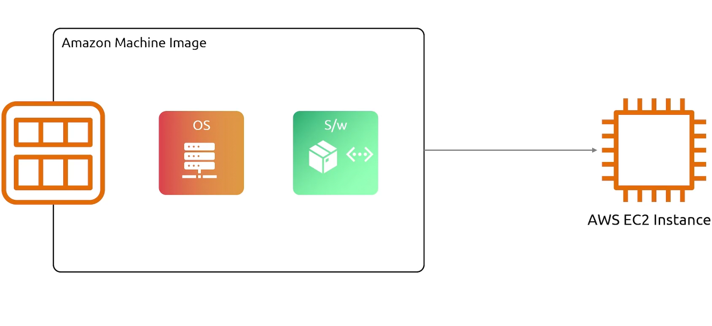

## EC2
- [Overview](#overview)
- [Instance Types](#instance-types)
- [AMI](#ami)
- [Key Pair](#key-pair)
- [Instance Lifecycle](#instance-lifecycle)
- [User Data](#user-data)
- [Launch Template](#launch-templates)
- [Instance Placements](#instance-placements)

### Overview

* AWS `ec2` allows you to provision virtual servers are whenever you'd like  based on you needs
* You can customize the server's resources during the creation process

### Instance Types

* There are a variety of different `instance types` to choose from
    1. `General Purpose`:
        - provides a balance of compute, memory, and networking resources
        - all purpose `ec2` instance
    2. `Compute Optimized`:
        - as the name suggest, these are for applications that need alot of compute resources (cpus)
    3. `Memory Optimzed`:
        - designed to provide fast performance for workloads that need a disproportional amount of `mem` compared to cpu
    4. `Storage Optimzed`:
        - great for high `iops` operations, anything that needs to rw from disk alot will need something like this
    5. `GPU instance`:
        - for instances that need high performance gpus (ml/ai)

### AMI

* An `Amazon Machine Image (ami)` tells our `ec2` what `os` we want installed on it. There are `amis` for virtually every type of `os`
* The beauty of `amis` is that they can be customized, your application can be built directly on your `ami`
    - So that you need only create an `ec2` from that `ami` and you custom application can launch automatically once the instance is up, without you needing to ssh in and run the install commands
    - Running `ec2 instances` can also be converted to `ami`. Meaning any live changes can be snapshotted into an ami that can then be deployed as separate instances
* There are a variety of different types of `amis`
    1. `Public AMIs`: `amis` shared by the aws community and are available for anyone to use for free
    2. `Private AMIs`: `amis` custom built by users for their own specific use cases, they are secure and can only be accessed by the owner or specified aws accounts
    3. `Shared AMIs`: `private amis` shared with specific accounts

### Key Pair

* While creating an instance, you'll be asked to specify a `key pair`
    - A `keypair` is an ssh key:
        1. either created by you and upload (public key) to aws as a keypair
        2. created directly on aws, and you download the private key
    - The public key will automatically be added to the `ec2` so when it full starts you can use your private key to ssh into the newly creatde instance

### Instance Lifecycle

1. `Pending`: this is the state an instance is only when it's first launched
2. `Running`: instance is up
3. `Stopping`: instance is still up, but in the process of being stopped
4. `Stopped`: instance is stopped, can be started back up
5. `Shutting Down`: instance in the process of being terminated
6. `Terminated`: instance is terminated and cannot be restarted

### User Data

* When in instance is being launched, it is possible to pass in `user data`, typically a bootstrap script that installs software or dependencies. This will run when the instance is launched
    - The script cannot be more than 16KB

### Launch Templates

* `Launch Templates` are a bunch of specifications for parameters for `ec2 instances`, used in different services like `ec2 autoscaling groups`
    - `ec2 autoscaling groups` allow you to scale instances based on traffic. Works will with `elb` to automatically load new instances as targets
        * These `launch templates` tells `autoscaling groups` how to create new instances when a scale is triggered

### Instance Placements