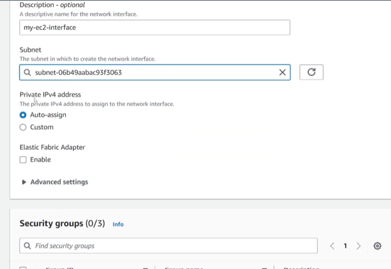
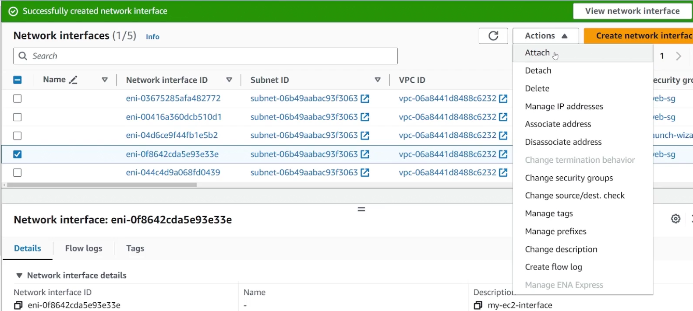
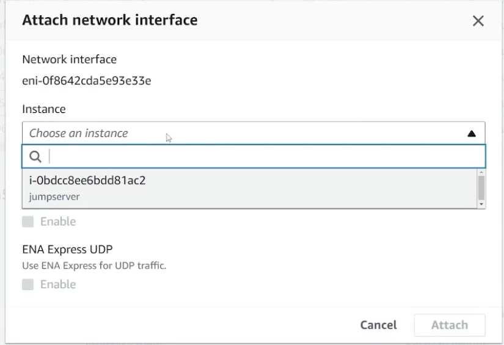
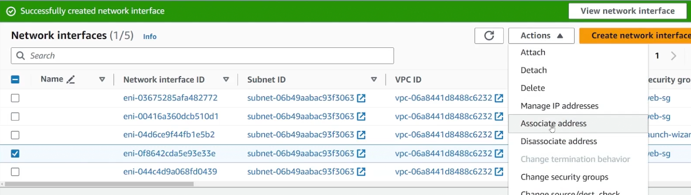
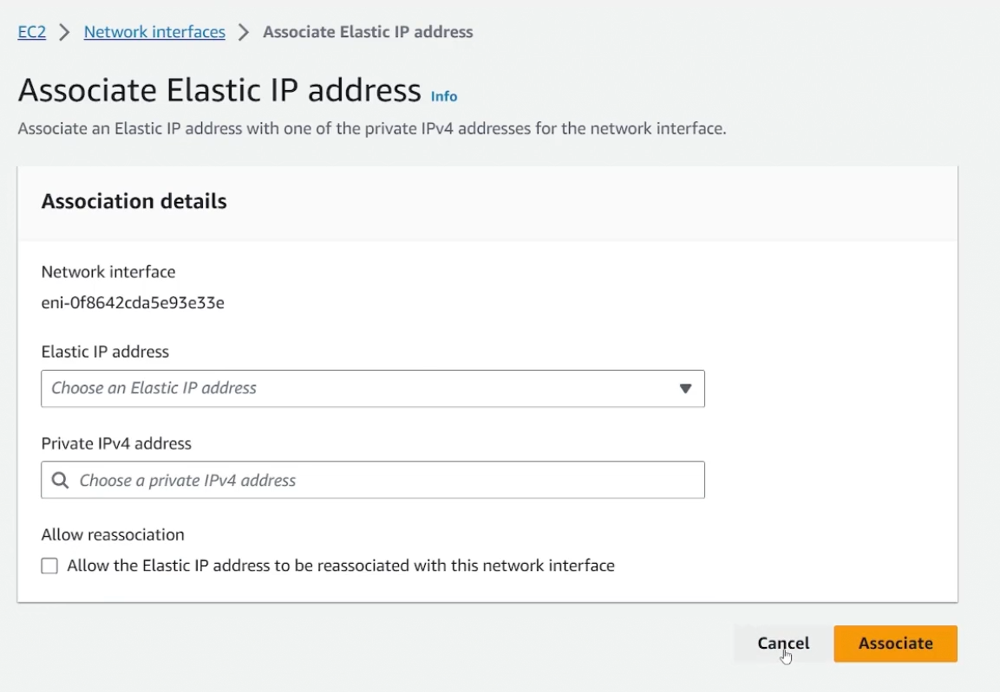
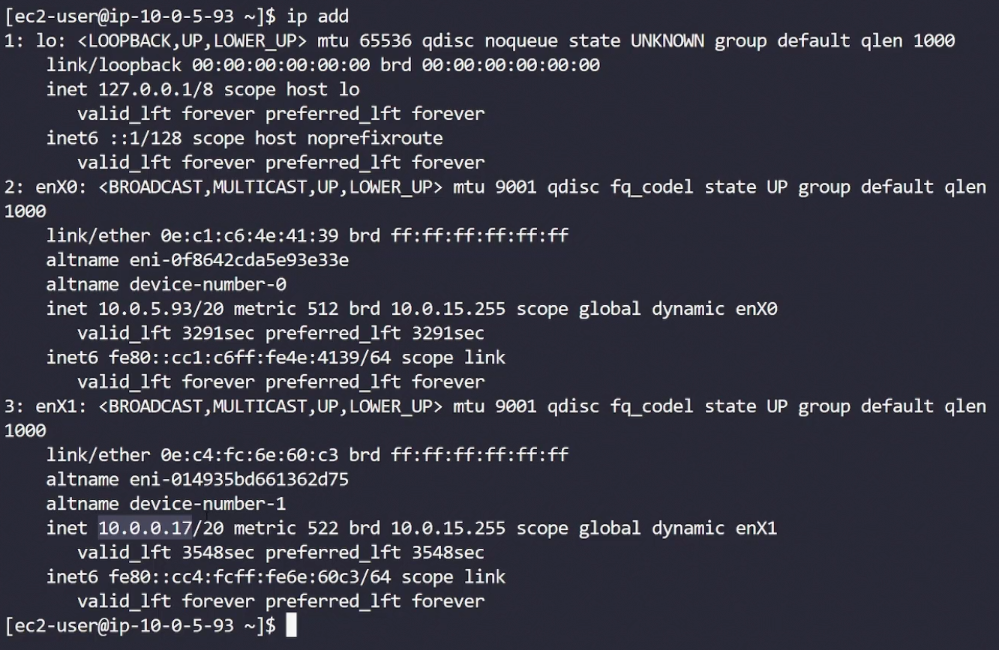

## Elastic Network Interfaces
- [Overview](#overview)
- [EC2](#ec2)
- [Secondary ENI](#secondary-eni)
- [Hands On](#hands-on)

### Overview

* An `elastic network interface (eni)` is a virtual network interface that can be attached to an `ec2`
    - The point is that it abstracts the `network interface` from `ec2` making it so it can be dettached and moved around to other instances
* It represents a virtual network card
    - it can have a primary ipv4 or ipv6 address
    - it can have a secondary ipv4 or ipv6 address
    - it can have an eip
        * which can will persist even if the `eni` is dettached from an instance
    - it can have a public or a private ip address
    - it will also have a mac address

### EC2

* When an `ec2` is created it automatically gets assigned a primary `eni` with a `network interface` name called `eth0`
    - This `eni` is auto assigned a primary private ipv4
* A primary `eni` cannot be dettached from an `instance` and is auto deleted when the instance is terminated
* If the instance is created with public ips enabled, then a primary public ip will also be assigned to the `eni`

### Secondary ENI

* More than one `eni` can be attached to an instance
    - The can have 1 primary ip and multiple secondary private ips
* Unlike primary `eni`, secondary `enis` can be attached and dettached from instances
* NOTE: secondary `enis` can have different `sg` from the primary `eni` allowing for varied networking and security configs
    * When you attach a `sg` to an `ec2`, you're actually applying it to the `eni`

### Hands On

1. Crreate a network interface
    - 

2. Attach it to an instance
    - 
    - 

3. Associate Address to `eni`
    - 
    - 

* NOTE: once logged in, you can view the interfaces in the instance
    - 