## Elastic Container Service
- [Overview](#overview)
- [Compute](#compute)
    - [EC2](#ec2)
    - [Fargate](#fargate)
- [Configuration](#configuration)
    - [Tasks](#tasks)
    - [Port Mapping](#port-mapping)
    - [Services](#services)
    - [Loadbalancer](#loadbalancers)
- [Hands On](#hands-on)

### Overview

* Amazon `Elastic Container Service (ECS)` is aws' solution to managing containers on the cloud
    - It's Amazon's own container orchestrator (e.g Kubernetes)
* More importantly `ecs` is managed by aws
    - The `control plane` of the the container ochestration
        * No workloads actually run on `ecs` and you won't have access to the servers where `ecs` run
    - However you will need to provide the compute resources (`data plane`) for the workloads
* NOTE: `ecs` is specific to aws so migration from `ec2` to another container ochestration tool will be difficult

### Compute

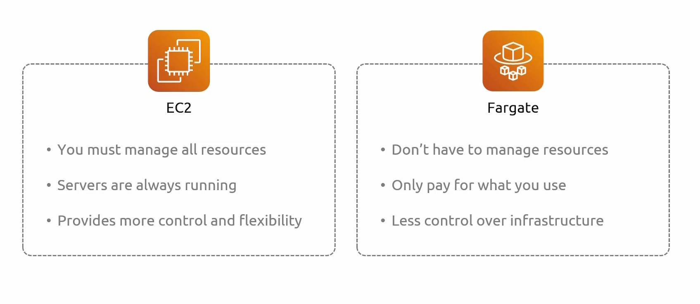
* In `ecs` you define where the compute resources will come from that your containers will run on. There are 2 options for this
    - `ec2 instances`
        * managed
        * self managed
    - `fargate`

#### EC2 

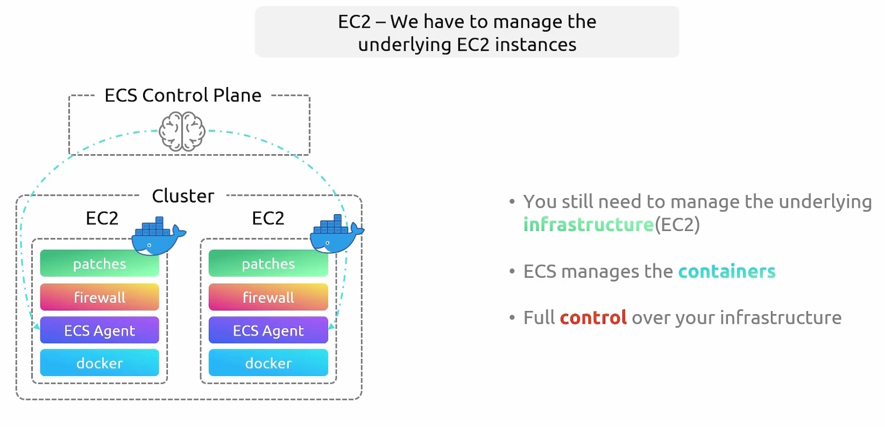
* For the `ec2` launch type, we have to manage the underlying instances
    * The underlying group of instances is known as a `cluster`
    * You have to:
        - install the container runtime you want to use on the instances
        - install an `ecs agent`
        - add all firewalls to secure the instances
        - and manage patches
    * Once you've set up the infra and registered them with `ecs`, it will begin to manage the containers on the cluster
        - The important thing is that you will have full control over the infra

* NOTE: there is now a `managed ec2 instance` launch type for `ecs`
* NOTE: you can also mix and match 2 launch types when creating a cluster
    - 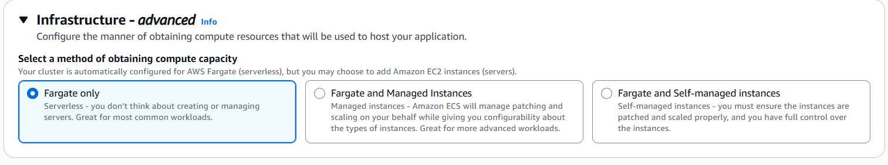

#### Fargate

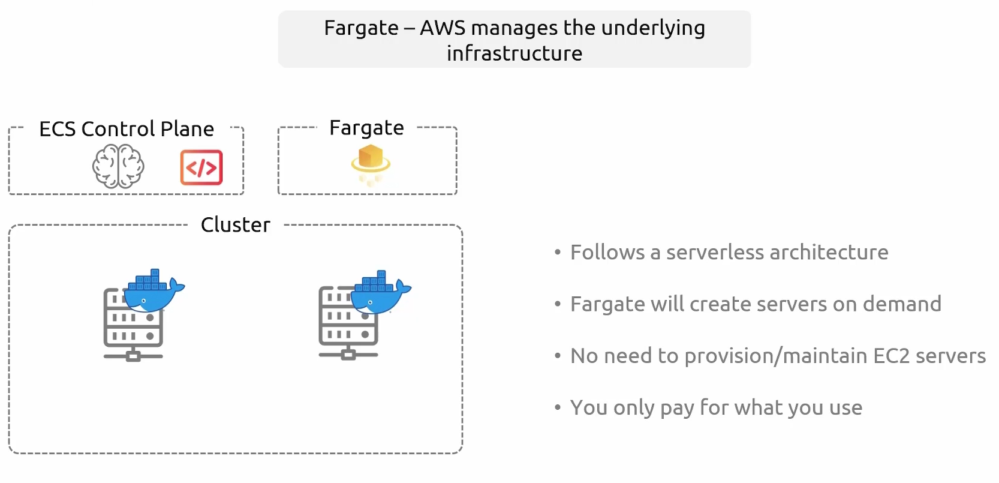
* `Fargate` is the serverless alternative of the `ec2` launch type, where aws manages the underlying infra
    * The underlying group of instances do not exist on the `cluster
    * Once you have you application and configs ready you:
        - pass it to `ecs`
        - `ecs` will look at configs and create servers on demand
        - `ecs` will deploy the containers for you on said instance
    * There is no need to provision or maintain the underlying instances
* NOTE: for `fargate` you only pay for what you use, no containers no servers.

### Configuration
#### Tasks

* You need to create a dockerfile, publish image to a registry, then tell `ecs` how to deploy the container
  - A `task definition` is what you configure to tell `ecs` how to deploy your application
    * you define resources, images, ports, volumes, etc.
* From the `task definition` you can then create a `task`, which is the applied definition
    * `tasks` can have multiple containers in them
        - the primary container is known as the `essential` container

#### Port Mapping

* Port mapping allows you to connect a containers internal port to an external host or network port
* There are two types of mapping:
    - `static mapping`: define a specific fixed `host port` for your container (mapping container port 80 to host port 80)
        * limits one task, that share same port, to one host
    - `dynamic mapping`: set `host port` to 0 and `ecs` auto assigns available port on host machine
        * with an `alb` you bind the `ecs service` to the lb as a `tg` and the `ecs agent` registers the randomly assigned `host port` to the `tg`

* Network modes affect how port mappings work
    - `awsvpc mode`: each `task` gets its own `eni` and `private ip` so `host port` is set to same values as `container port`
    - `bridge mode`: uses docker default virtual network which allows for static and dynamic mapping
    - `host mode`: static mapping is the only mapping supported here
#### Services

* A `service` ensures that a certain number of `tasks` are running at all times
    - It is responsible for creating the `task` based on its definition and managing it within the `data plane`
    - It's basically implements self healing in the way kubernetes does

* NOTE: it is possible to run a `task` without defining a service
    - 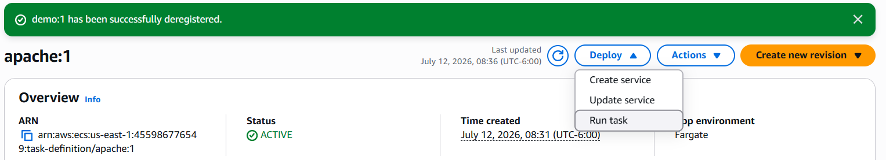
* NOTE: when creating a `service` you can determine how `tasks` are distributed across your `cluster`

#### Loadbalancers

* An lb can be created to route external traffic to your `service` which will balance traffic to all the `tasks` related to that `service`

### Hands On

1. Create a `task defintion`:
    * 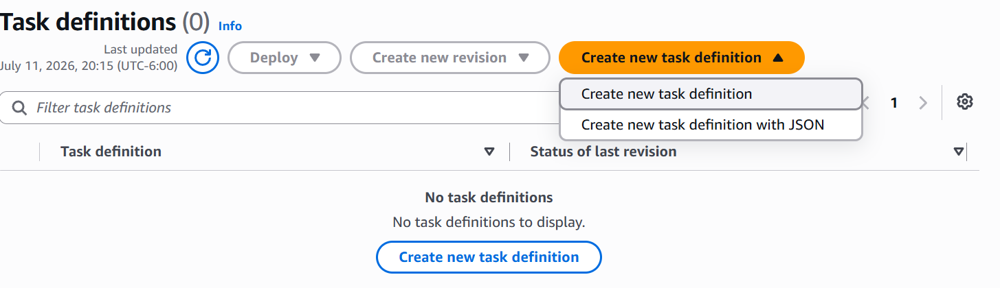
    - create with json
    
        ```json
        {
          "taskDefinitionArn": "arn:aws:ecs:us-east-1:455986776549:task-definition/apache:1",
          "containerDefinitions": [
            {
              "name": "apache",
              "image": "docker.io/httpd",
              "cpu": 0,
              "portMappings": [
                {
                  "containerPort": 80,
                  "hostPort": 80,
                  "protocol": "tcp",
                  "name": "http",
                  "appProtocol": "http"
                }
              ],
              "essential": true,
              "restartPolicy": {
                "enabled": true
              },
              "environment": [],
              "environmentFiles": [],
              "mountPoints": [],
              "volumesFrom": [],
              "readonlyRootFilesystem": false,
              "ulimits": [],
              "systemControls": []
            }
          ],
          "family": "apache",
          "executionRoleArn": "arn:aws:iam::455986776549:role/service-role/ecsTaskExecutionRole", 
          /* iam role that grants ecs container and farget agents permission to make aws api calls on your behalf
          Typically needed if your container pulls images from ecr private repo, sends logs to cloudwatch, has private registry authentication, or references secret data from secrets manager or aws systems manager parameter store
          */
          "networkMode": "awsvpc",
          "revision": 1,
          "volumes": [],
          "status": "ACTIVE",
          "requiresAttributes": [
            {
              "name": "ecs.capability.container-restart-policy"
            },
            {
              "name": "com.amazonaws.ecs.capability.docker-remote-api.1.18"
            },
            {
              "name": "ecs.capability.task-eni"
            }
          ],
          "placementConstraints": [],
          "compatibilities": [
            "EC2",
            "MANAGED_INSTANCES",
            "FARGATE"
          ],
          "runtimePlatform": {
            "cpuArchitecture": "X86_64",
            "operatingSystemFamily": "LINUX"
          },
          "requiresCompatibilities": [
            "FARGATE"
          ],
          "cpu": "1024",
          "memory": "2048",
          "registeredAt": "2026-07-12T14:31:10.153Z",
          "registeredBy": "arn:aws:iam::455986776549:user/kk_labs_user_403010",
          "enableFaultInjection": false,
          "tags": []
        }
        ```

    - create without json
        * configure launch type
            - 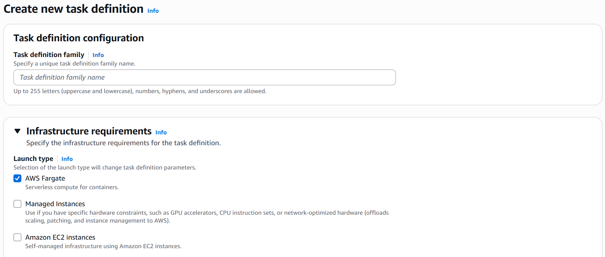
        * 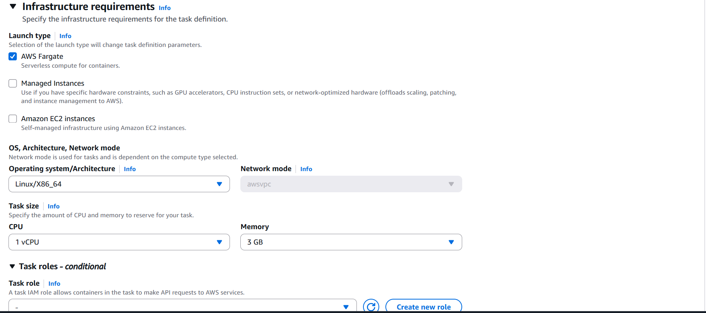
        * define containers
            - 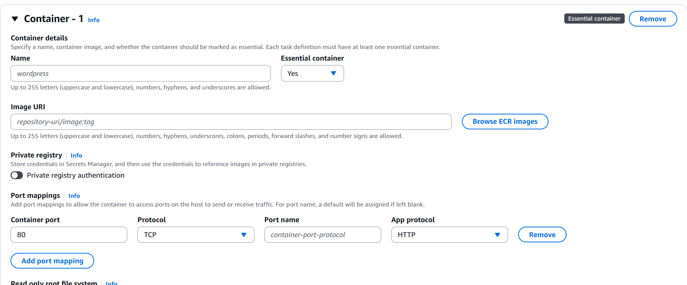
            * define env vars or files, can come from s3, secret manager or parameter store
                - 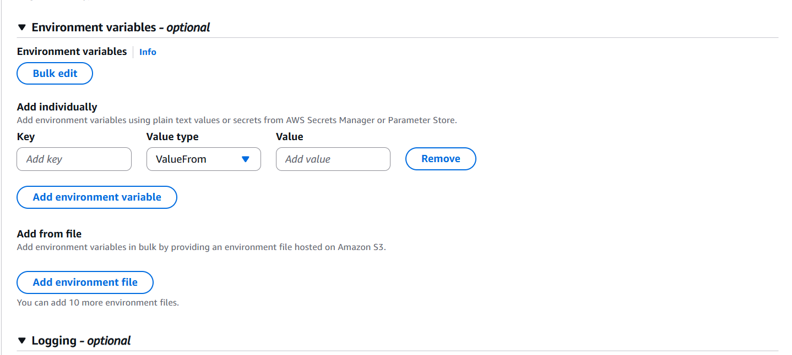
        * other configurations
            - 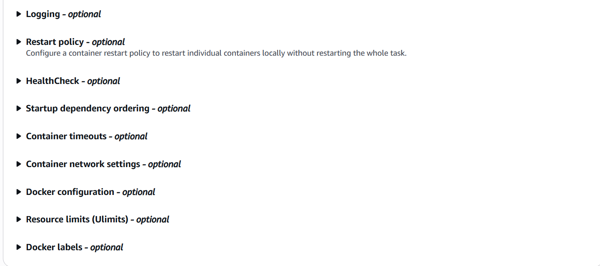
            * including health check, startup dependency ordering (can define orders containers run in task)
        * define storage
            - 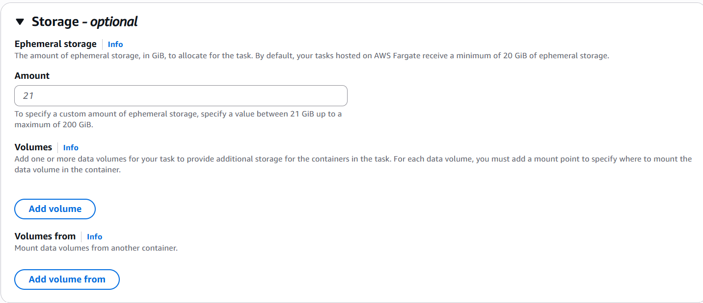

2. Create a `cluster`
    - 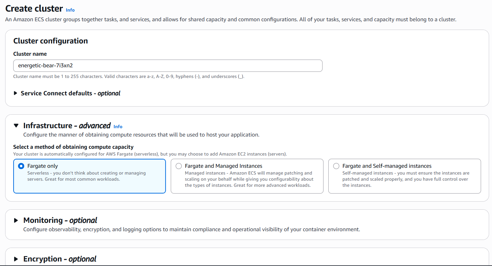

3. Create a `service` (deploy `task definition`):
    - 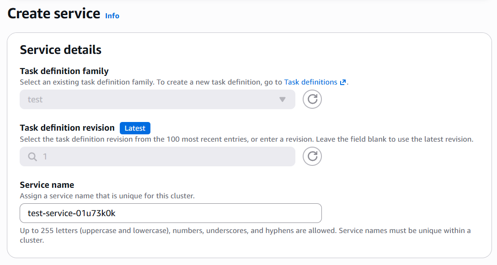
    - define where it will run
        * 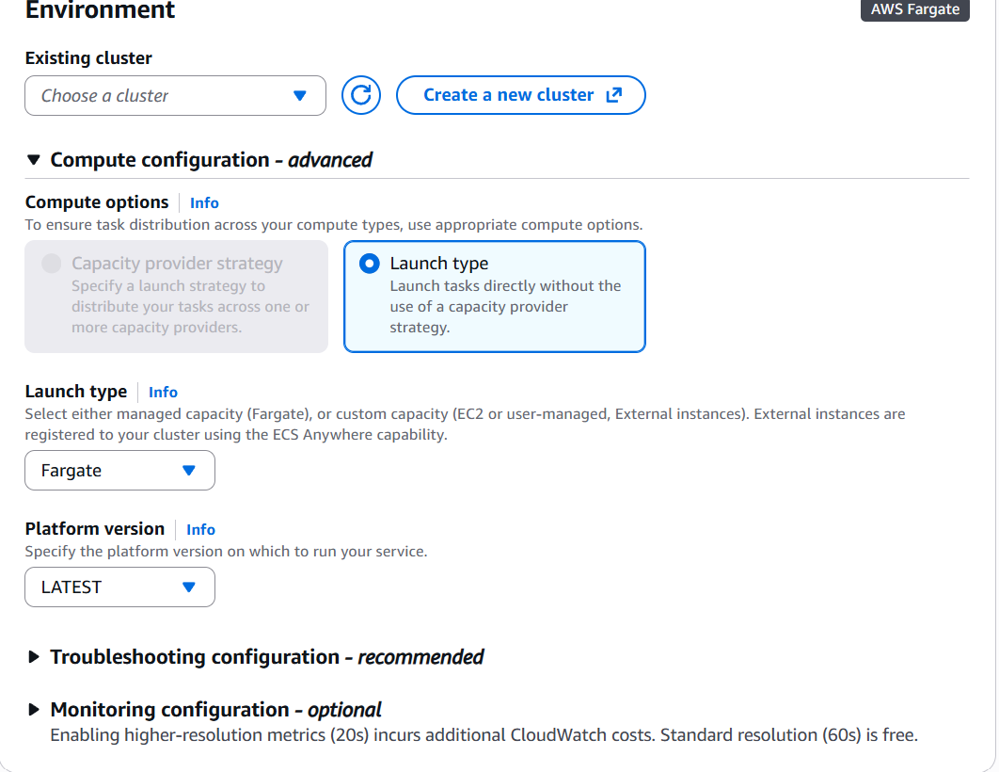
    - define deployment strategy
        * 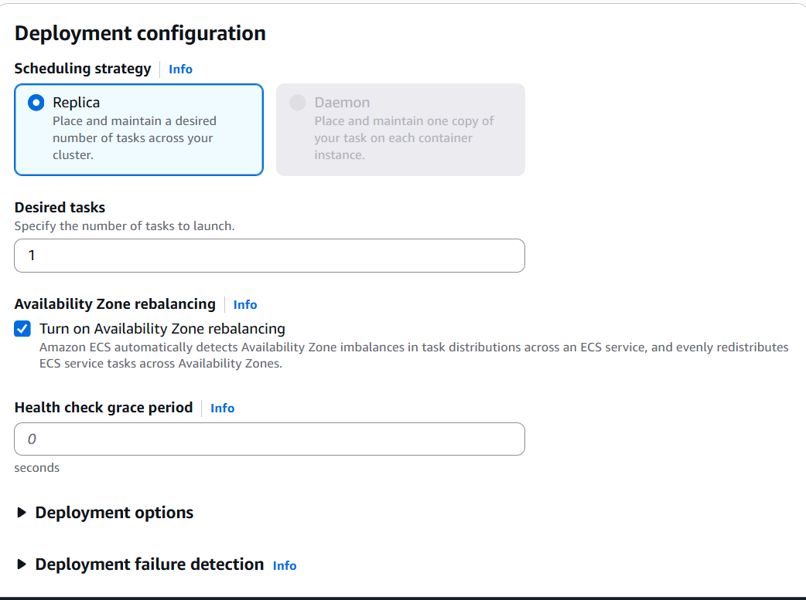
    - define networking
        * 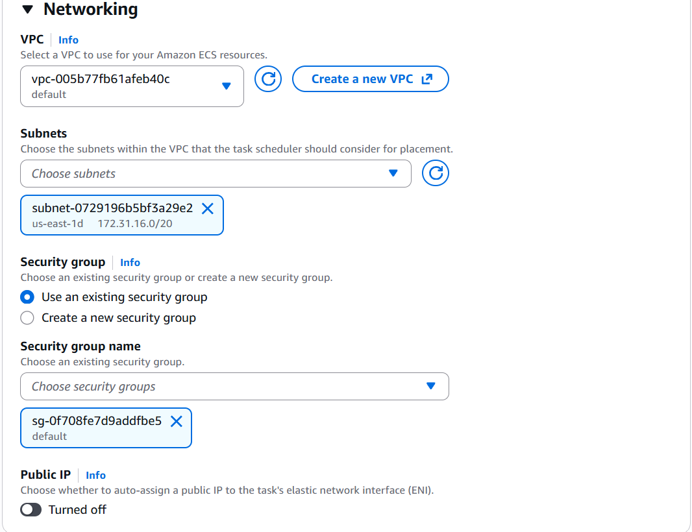
    - additional configurations
        * 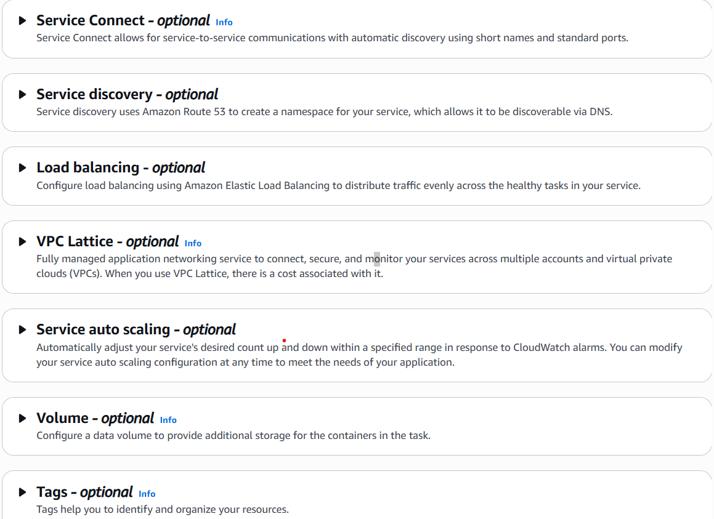

4. Verify Task deployment
    - 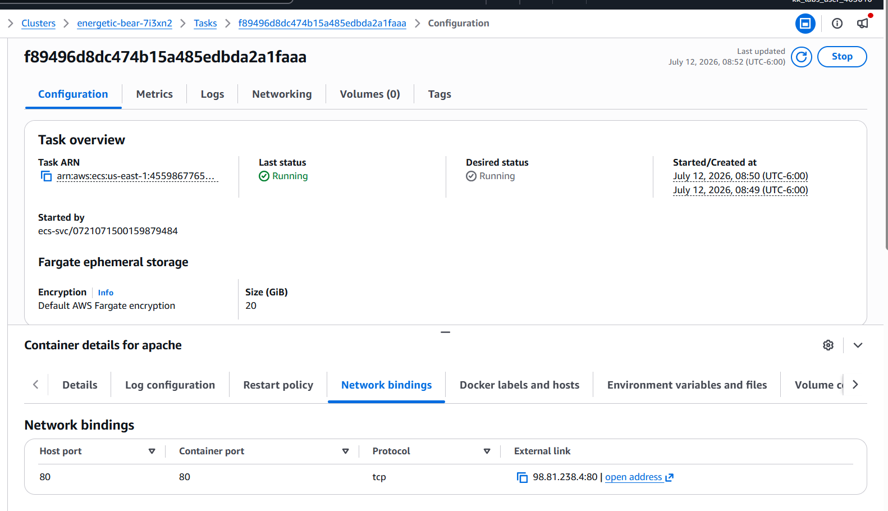
        * you'll see a public ip if you assigned one to the networking of the task you created
            - 

* NOTE: [here](https://github.com/eoyebami/hello-world-api/blob/main/container.tf) I wrote a simple terraform on creating and launching an image on `ecs` `task` and `service`
* NOTE: intercontainer communication can be facilitated with `ServiceConnect`, more info [here](https://aws.amazon.com/blogs/aws/new-amazon-ecs-service-connect-enabling-easy-communication-between-microservices/)

* NOTE: `ECS anywhere` is a tool that allows you to run `ecs` on premises while still being able to view it in aws management console