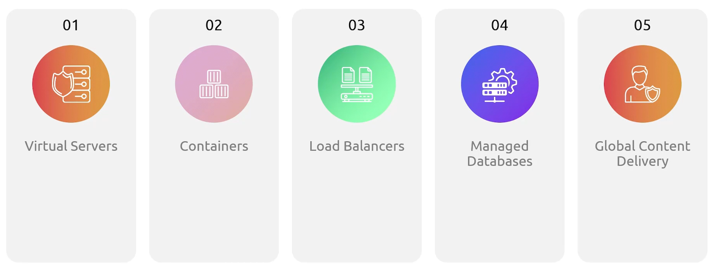
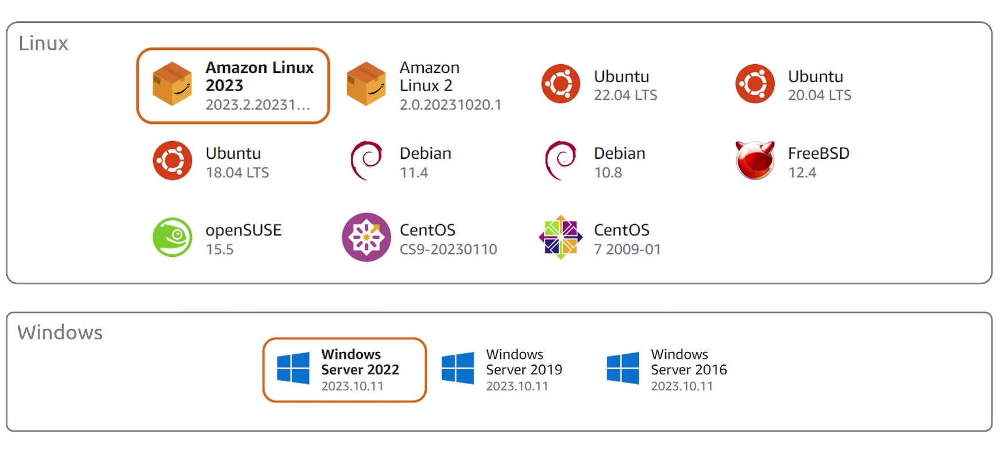
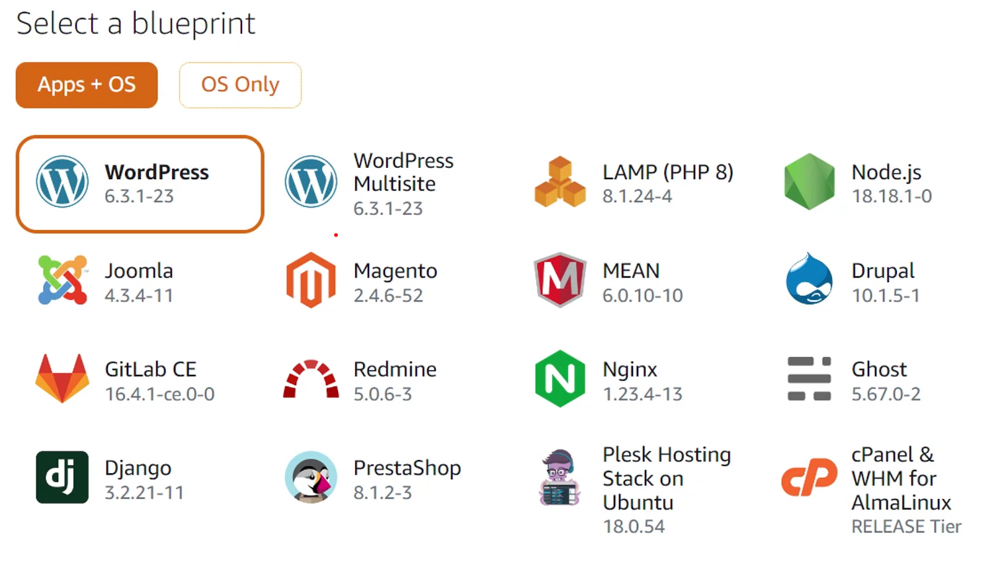
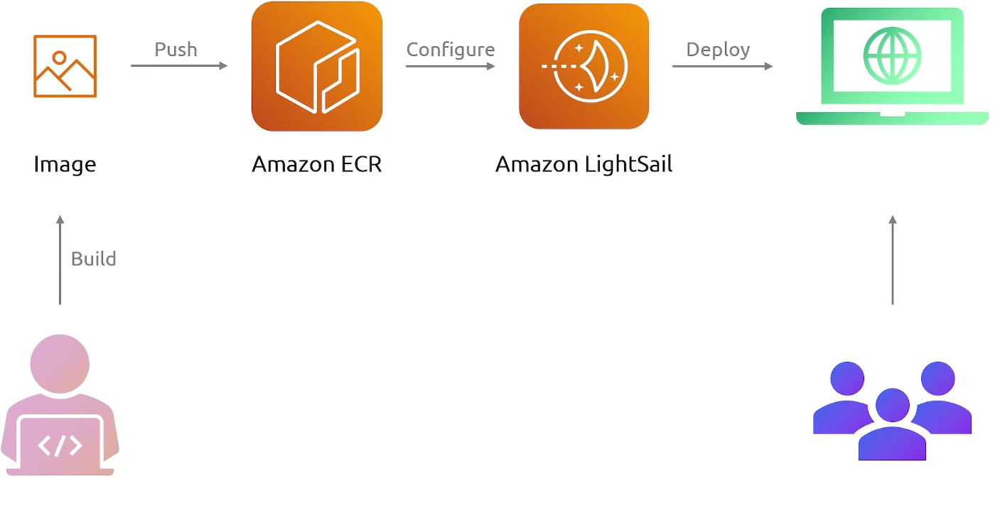

## LightSail
- [Overview](#overview)

### Overview

* AWS `Lightsail` is a virtual private server provider designed to help build websites and applications fast.
    * It simplifies the process of using aws by limiting its features with pre configured core services such as:
        - instances
        - containers
        - dbs and storage
        - networking and dns
    * It there to make running applications in the cloud as simplified as possible
    - 

* For instances you define:
    - location
    - instance platform
    - deployment stack
        * os (ubuntu)
            - 
        * applications (wordpress)
            - 
    - instance plan
    * You don't need to configure networking, aws will take care of it fo you to deploy all necessary components. In this way its almost like `beanstalk` but even more simplified

* For containers you define:

    - Create the image
    - Push to ECR
    - Configure image deploy on `lightsail`
    - Deploy on `lightsail`

* NOTE: for more advanced features you can smooth transition from `lightsail` to `ec2`
