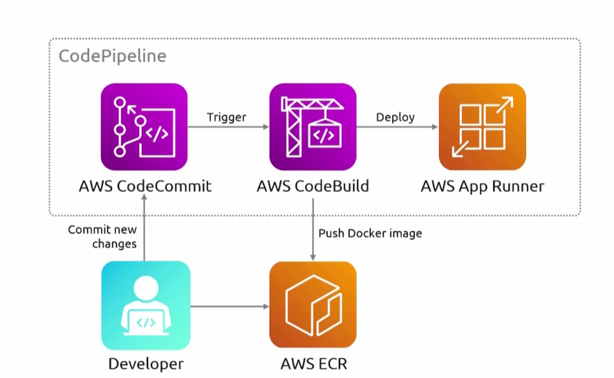

## App Runner
- [Overview](#overview)

### Overview

* AWS `app runner` abstracts the infrastructure portion of deploying to the cloud entirely
    - All you need to do is upload your app code to a vcs and `app runner` will take of deploying it to aws

* There are 2 ways it does this
    - VCS: upload your code to github
        - `app runner` will take care of creating the ci/cd pipeline and deploy your code
    - Images: `ecr`
        - upload your image to `ec`r and `app runner` will deploy the image for you
* Once your app is created, `app runner` will provide a dns for you to use to access your app