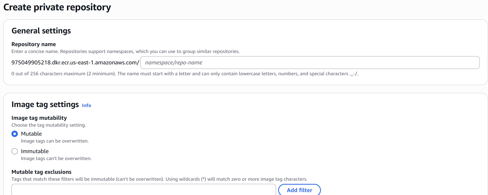
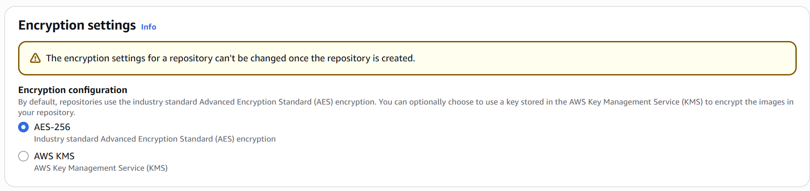
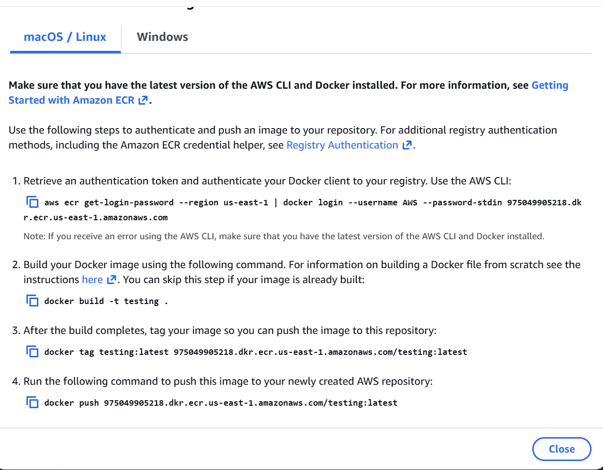

## Elastic Container Registry
- [Overview](#overview)
- [Hands On](#hands-on)

### Overview

* AWS `Elastic Container Registry (ecr)` is a fully managed container registry designed to simply the process of storing, managing, and deploying container images

* There are 2 types of registries in `ecr`
    1. `Public ecr`: 
        - accessible to anyone on the internet, pushing images to public registries is resticted
        - aws charges for storage of images in these repos, but there are no data transfer fees for pulling said images
    2. `Private ecr`:
        - only accessibly to specific accounts our users that are defined by you
        - aws charges for storages of images in these repos AND data transfer fees

* NOTE: extra features of `ecr` include
    - integration with other aws services
    - image lifecycle management to clean up old stale images
    - image scanning

### Hands On

1. Create a repository
    - 
    - 
2. Push images to ecr using the `view push commands` related to the created repository
    - 