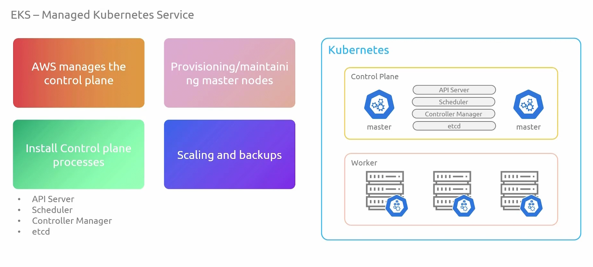
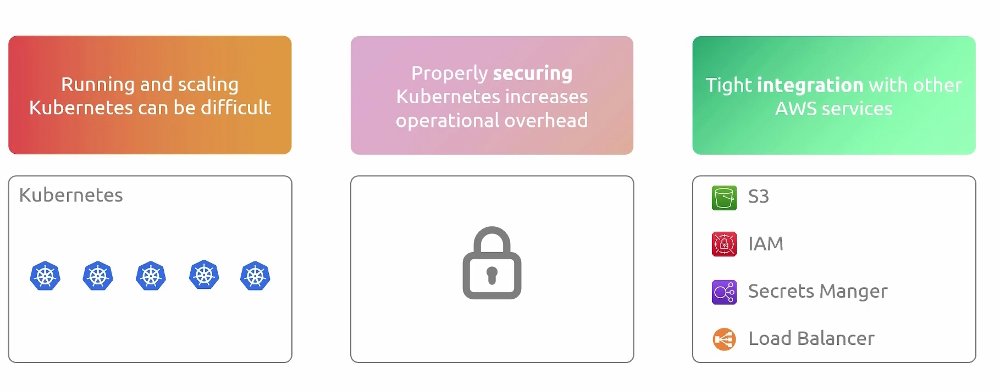

## Elastic Kubernetes Service
- [Overview](#overview)

### Overview

* `EKS` is AWS's managed kubernetes service where the entirety of the control plane is managed by aws
    - 
    - 
* The data plane is managed by the users, of which aws gives us the option to choose from 3 worker node options
    1. Self Managed Nodes:
        - user provisioned ec2 instances
        - worker process (kubelet, kubeproxy, crt) must be installed
        - updates ans security patches are user responsibility
        - must register node with control plane
    2. Managed Nodes:
        - auto provisions and lifecycle manages the nodes
        - runs `eks` optimized images
        - streamlined way to manage lifecycle of nodes using aws `eks` cli
        - every node is part of an auto scaling group thats managed for you by `eks` 
    3. Fargate:
        - serverless architecture
        - worker nodes will be created on demand
        - no need to provision/maintain ec2 servers
        - based on container requirements, farget will select optimal ec2 sizing
        - you pay for what you use

* NOTE: `EKS anywhere` is a tool that allows you to run `eks` on premises while still being able to view it in aws management console