## AWS Lambda
- [Overview](#overview)
- [Triggers](#triggers)
- [Destinations](#destinations)
- [Layers](#layers)
- [Hands On](#hands-on)

### Overview

* AWS `lambda` is a serverless event driven compute service that allows you to run code for any type of application without provisioning or managing servers
    - you take your code and upload it to `lambda` and set up a trigger for when that code should run
    - `lambda` will auto scale based on the resource requirements of that code
    - `lambda` is fault tolerance since it maintains compute capacity across multiple `AZs`

### Triggers

* When defining a `function` you can add `triggers`
    - A `trigger` is the event source that invokes a `lambda function` to run its code, examples include:
        - s3: uploading a file
        - dynamodb: updating date
        - api gateway: user makes an http request
        - eventbridge: cron job or events defined in eventbride can trigger a function
        * NOTE: [here](https://docs.aws.amazon.com/lambda/latest/dg/lambda-services.html) you can find the list of aws services that can invoke `lambda functions`
* Depending on the `trigger`, `lambda` handles the event with one of 2 types of invocations
    1. `synchronous`: triggering service calls function and waits directly for the function to complete and return a response
    2. `asynchronous`: triggering service hands off the event payload to the `lambda queue` and `lambda` runs it independently without making the service wait

### Destinations

* A `lambda destination` is a feature that auto routes the execution results of an asynchronous function invocation to downstream aws services
    - You can configure 2 primary routing conditions:
        1. `On Success`: triggered when a function finishes without errors
        2. `On Failure`: triggered when a function fails all retry attempts or the event expires
    - The json object of the `lambda function` is sent directly to the destionation
    - Examples of destinations include:
        - other lambda functions
        - sns: object is passed as the Message to the dest
        - sqs: object is passed as the Message to the dest
        - eventbridge
* NOTE: more information [here](https://aws.amazon.com/blogs/compute/introducing-aws-lambda-destinations/)

### Layers

* `Lambda Layers` are file archives containing supplementary code, data, dependencies, or libraries for `functions` to use
    - They help reduce deployment package sizes by abstracting these aspects of the code
    - They can be shared across `functions` and even aws accounts
* You can attach up to 5 `layers` to a single `function` and total size cannot exceed 250MB
    - NOTE: there is a folder structure when packaging deps in the zip file for layers, info can be found [here](https://docs.aws.amazon.com/lambda/latest/dg/packaging-layers.html)

### Hands On

1. Create a function
    - you have 3 options:
        1. Author from scratch
        2. Use a blueprint
        3. Container Image
    - 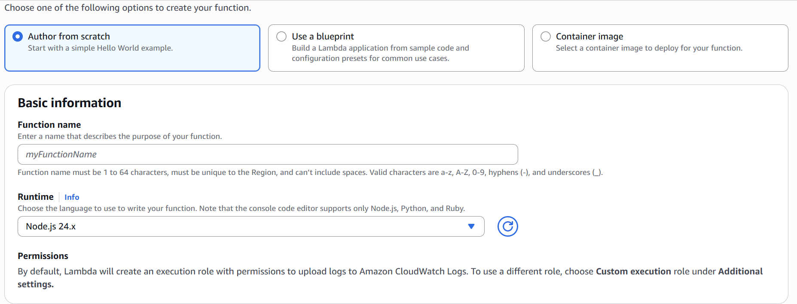
        * select a runtime for your function
    - 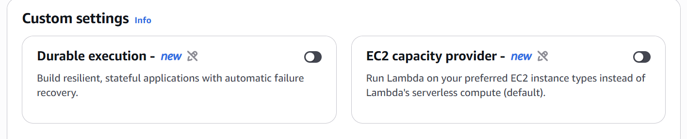
        * add custome settings
    - 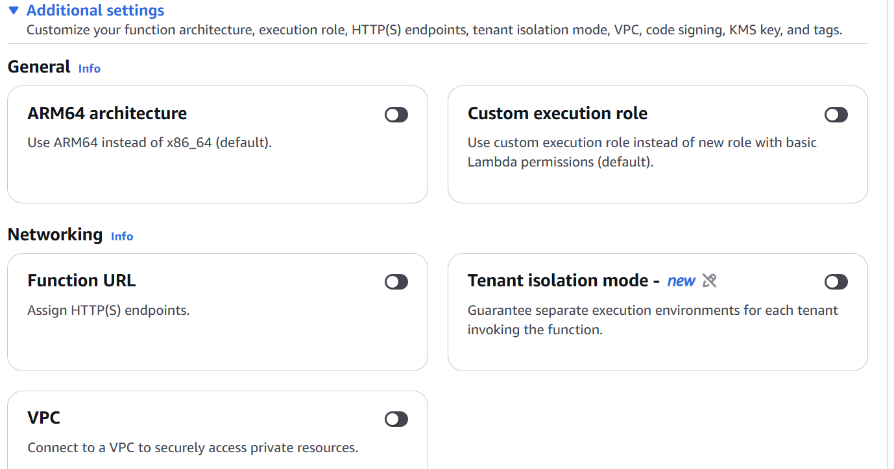
        * additional settings
    - 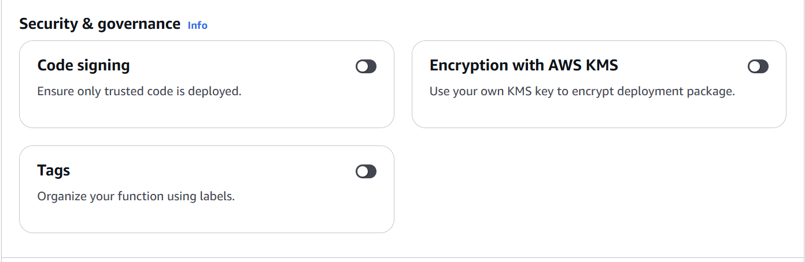
        * security settings

2. Once the function is created you can define both a trigger and a destination
    - 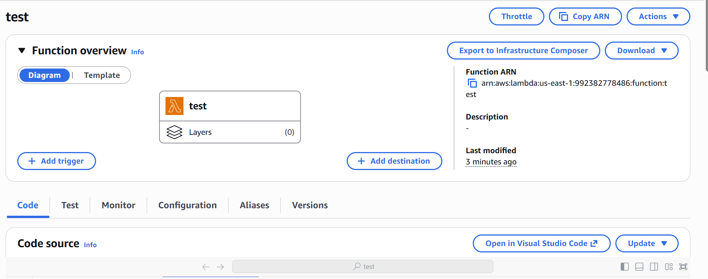
    - you can list all possible triggers
        * 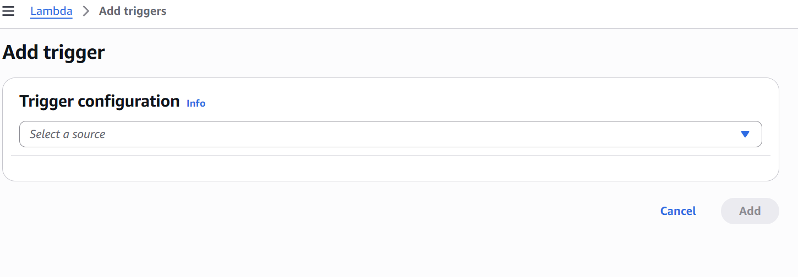
    - you can define your destination as well
        * 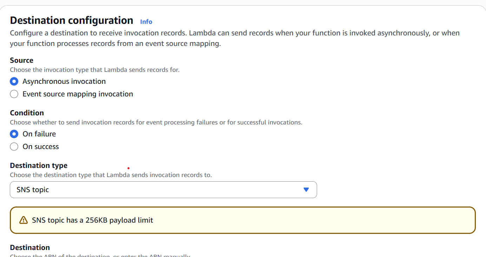
    - code is defined in function:
        * 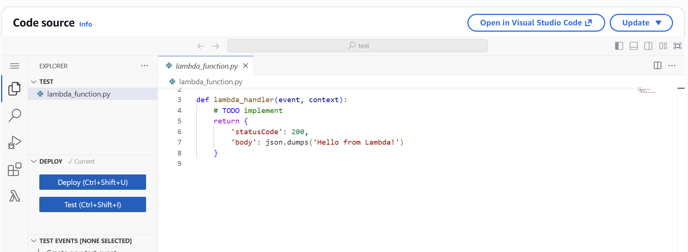
            - when you update the code you must click deploy for version to update
            - you can click test to test your code 
                * when defining a test, you pass in "test data", data that would typically be received from the event trigger, that the code runs against
                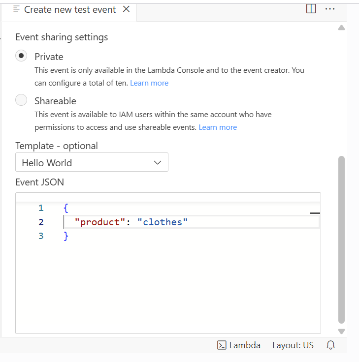
                * you can then invoke the test and you'll get a response from the `lambda`
                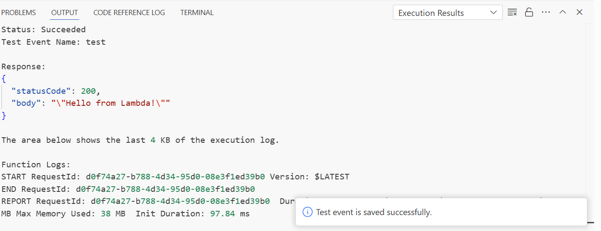
        * when running code that relies on 3rd party packages or library, you need to bundle into you're code when uploaded to `lambda`
            - bundle the code and packages into a zipfile and that's what will be uploaded into the code source
            * An alternative way of doing this would be to create a `lambda layer`
                * 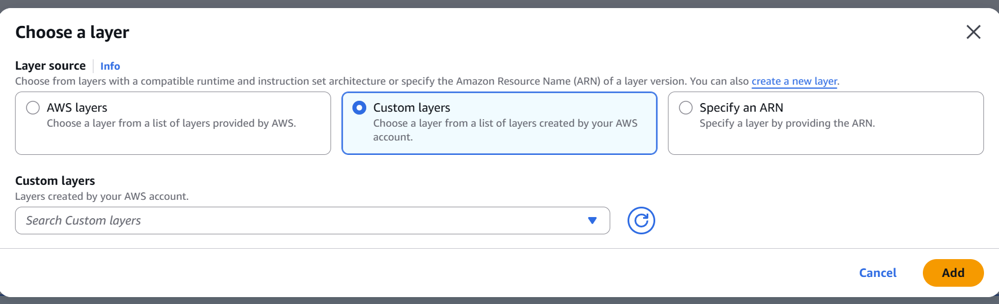
                * 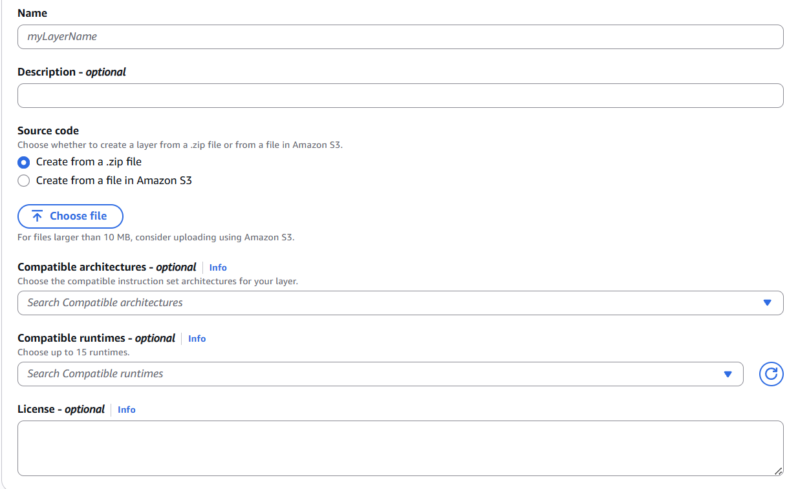