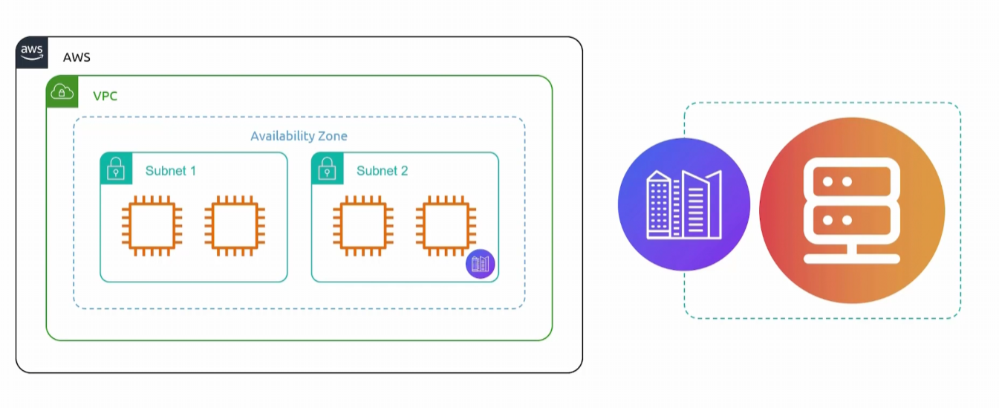

## Outposts
- [Overview](#overview)

### Overview

* AWS `Outposts` delivers native aws infra, services, apis to virutally any on prem or edge location
    - it provides a seamless hybrid cloud experience, by allowing you to run workloads locally for low latency, data residency, or local processing
        - while connecting back to your preferred aws region using aws `direct connect` or `vpn`
            * allowing you to run workloads locally but be able to connect to services within the cloud (in that region)
            * instances in your `outpost` can then connect to resources within your `vpc`
                - `vpc` is extended to include your `outpost`
                
    - it physically places aws desinged hardware to your local data center, colocation space, or on prem facility
        * you can then manage this equipement through standard aws management consoles, cli, and apis
* NOTE: great for people who have a compliance where their workloads must run on prem