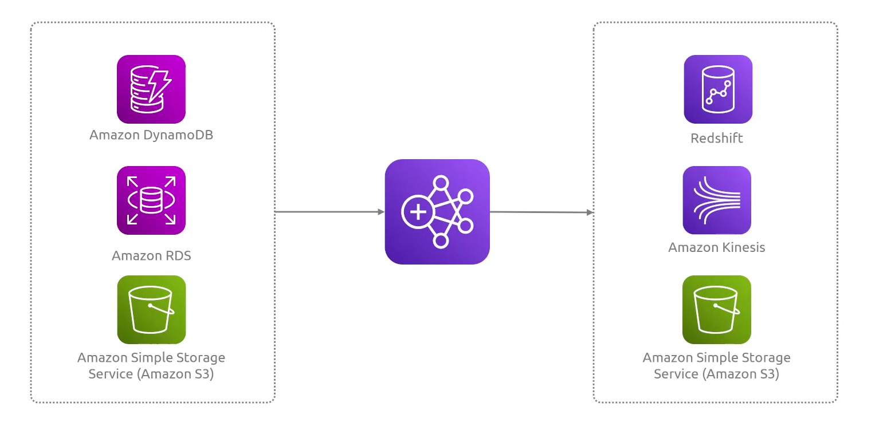

## Elastic MapReduce
- [Overview](#overview)
- [Components](#components)

### Overview

* Amazon `Elastic MapReduce (emr)` is a managed cloud platform that simplifies running large-scaled distributed data frameworks, such as `apache spark` and `hadoop`, on aws
    - allows easy processing and analysis of vast datasets from analytics, ml, and data warehousing

### Components

* `Cluster`: a collect of `ec2` instances
    - `primary node`: manages cluster by running software that coordinates the distribution of data and tasks among the other nodes
    - `core node`: has software components that stores data in a hadoop distributed file sysstem and helps manage that
        - can process data
    - `task node (optional)`: do data processing, don't nessarily store data
* `Scalability`: clusters can easily be resized, you can add or remove nodes as you see fit
* `Spot Pricing`: you can use spot pricing with on demand nodes as this runs interruptable jobs