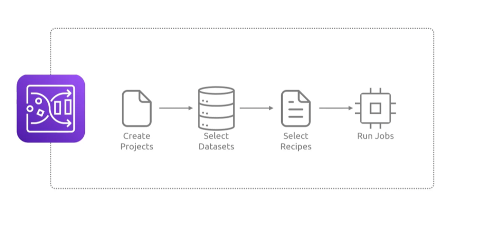

## Glue Databrew
- [Overview](#overview)
- [Components](#components)

### Overview

* AWS `Glue Databrew` is a visual, no-code data preparation tool that allows you to clean, normalize, and transform data up to 80% faster than custom code
    - you can us e a point-click interface to drop duplicates, merge columns, format dates, parse json without writing spark or using python

### Components

* `Datasets`: read only connections to data sources (`s3`, `redshift`, etc)
* `Recipes`: resuable, step-by-step sequences of data transformations that you build and can save for future jobs
* `Jobs`: automated execution of your recipe applied to full datasets, outputting clean files directed to a designated `s3` datalake

### Features

* `Detection`: auto profiles data to spot anomalies, identify missing values, and mask PII
* `Visual Data lineage`: easily track the origin and history of your data throughout the preparation pipeline
* `Severless Scale`: no servers or cluster to provision, the service
    - theres nothing to secure here