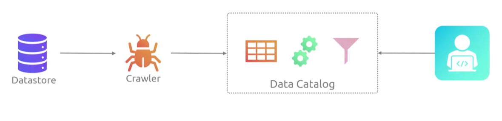
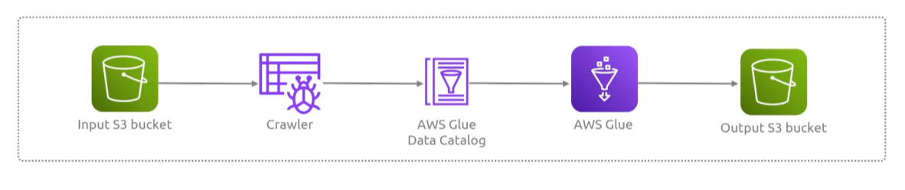
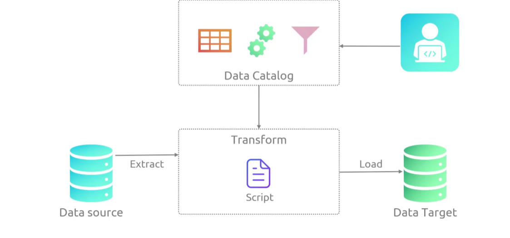

## Glue
- [Overview](#overview)
- [Components](#components)

### Overview

* AWS `Glue` is a fully managed, serverless data integration service that simplifies how companies discover, prepare, move, and integrate data from multiple sources for analytics, machine learning, and application development
    - its functions primarily as an `etl` platform

### Components

* `Data Catalog`: a persistent, centralized metadata repository that stores table defintions, schemas, and metrics
* `Crawlers`: programs that automatically scan you data lakes, warehouses, or databases to infer schemas and populate your data catalogs
    - pulls data from source and creates table definitions in `data catalog`
* `ETL job`: scripts driven by `apache spark` or python shell environments that execute data cleaning and transformation against catalog
    - you can run these on demand or with a trigger
    - pulls data from source, transforms its, and loads it to your data target
    - 
* `AWS Glue Studio`: a visual, drag-and-drop interface for building, running, and monitoring `etl` jobs without writing code
* `DataBrew`: visual data prepartion tool featuring pre-built transformations for data analysts
 
