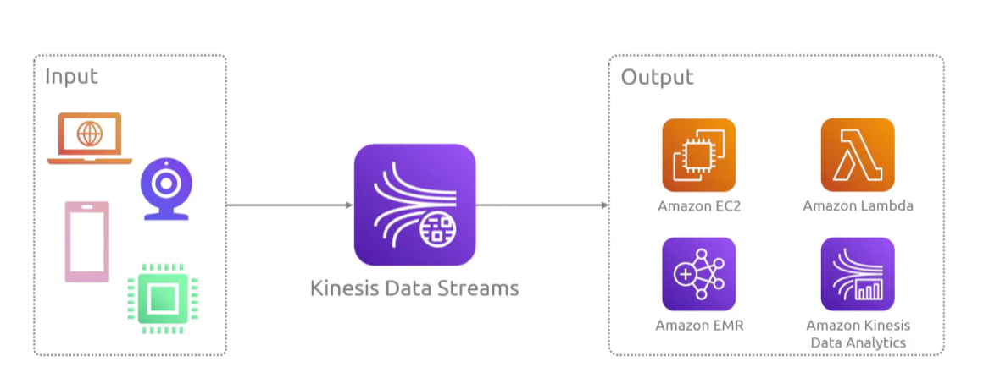
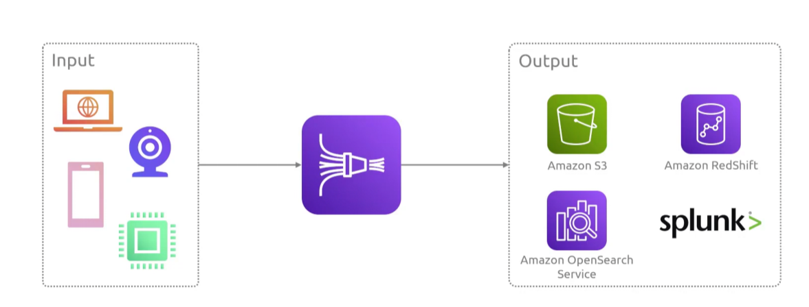
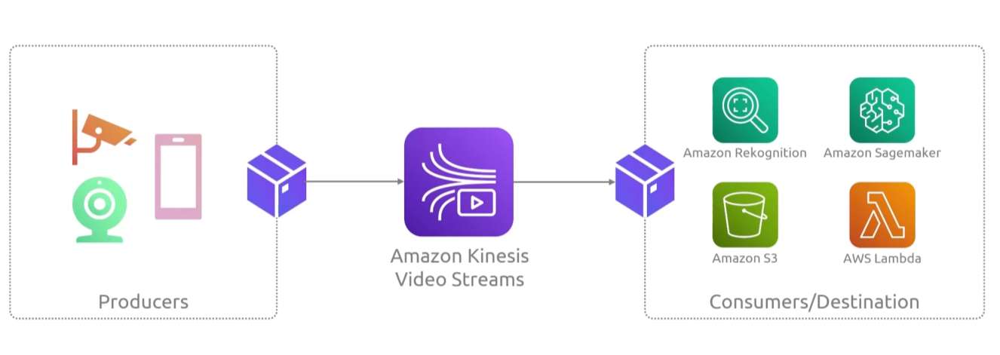
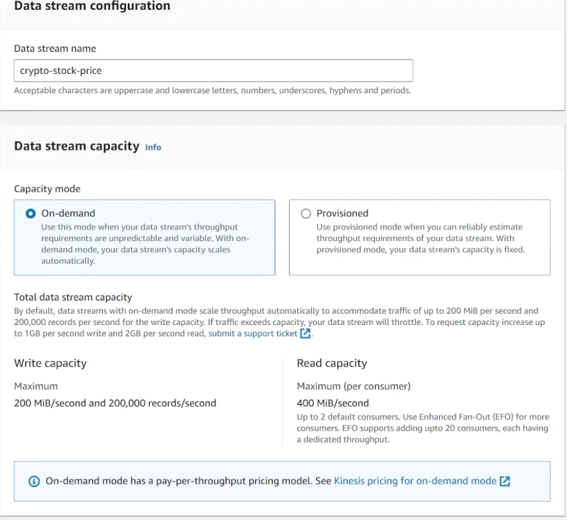
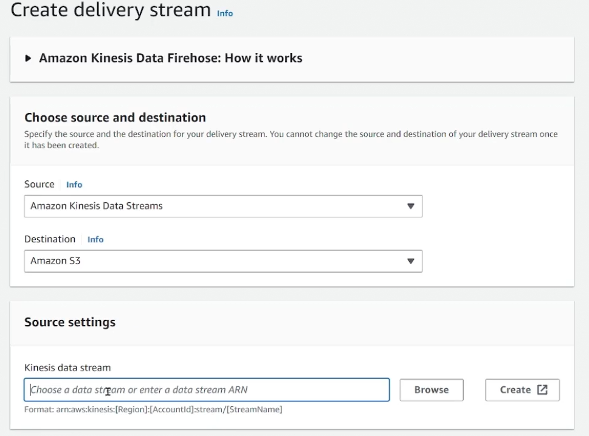
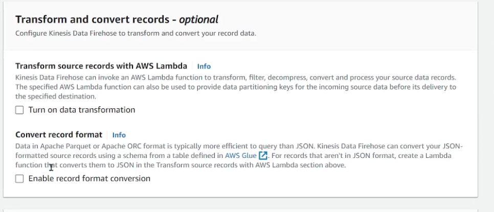
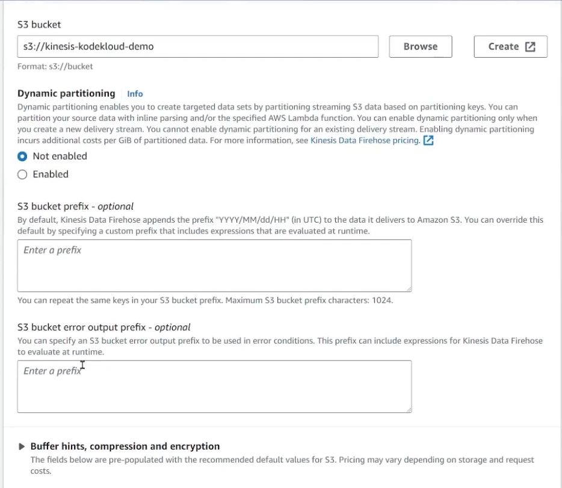

## Kinesis
- [Overview](#overview)
- [Components](#components)
- [Kinesis Data Streams](#kinesis-data-streams)
- [Kinesis Data Firehose](#kinesis-data-firehose)
- [Kinesis Video Streams](#kinesis-video-streams)
- [Demo](#demo)

### Overview

* AWS `kinesis` is a fully managed aws platform that lets you ingest, buffer, and process massive volumes of real-time streaming data
    - great for powering live dashboards, fraud detection, aggregating data from applications, and analyzing sensor data to generate immediate automated actions

### Components

* `Kinesis Data Streams (KDS)`: core service used to collect and store large streams of data records in real time
    - `data record`: unit of data (up to 1MB) containing a sequence number, partition key, and the data itself
    - `producers`: push data
    - `shards`: base throughput unit of stream, 1MB/s (1000 records/s) or write capacity and 2MB/s of read capacity
    - `partition key`: used to group and route data to a specific shared within a stream
    - `consumers`: ead and process data
* `Amazon Data Firehouse`: fully managed, serverless service for loading and transforming streaming data directly into destinations like `s3`, `redshift`, and `opensearch`
* `Kinesis Video Streams`: specialized service to securely stream, store, and process live video and audio data from connected devices for analytics and machine learning
* `HA`: data in `kinesis` is replicated across multiple `AZs` for `4 9's` of availability
    * `firehose` has `3 9's` of availability

### Kinesis Data Streams

* `KDS` allows you to ingest massive streams of real-time data and send it to various services for processing
    - milisecond processing
* It offers 3 capacity modes:
    1. `On demand standard`: auto scales throughput based on observed peaks with no manual provisioning needed
    2. `On demand advantage`: designed to instand scale up to handle sudden, massive traffic spikes at any scale
    3. `Provisioned`: lets you manually assign specific data capacities (`shards`) for predicatable workloads

### Kinesis Data Firehose

* `KDF` captures, transforms, and delivers real-time streams
    - unlike `KDS` it actually does the `ETL` and instead of passing the data to other compute resources for processing it passes it to other data repositories
    - minimium latency of 60 seconds, not as fast as `KDS`

### Kinesis Video Streams

* `KVS` lets you securely ingest, store, and process live video and time-serialized data
    - milisecond procesing
* It provides storage tiers:
    - hot storage: for immediate consumption (live streaming and analytics)
    - warm storage: for low-cost, long term retention
* Processes sensory data using and passes it to downstream consumers 
    - producer libaries: `kvs` has a lib that producers can use to send data to `kvs data streams`
    - parser libraries: `kvs` has a lib that consumers can use to ingest data from `kvs data streams`

### Demo

1. Create a `KDS`
    - 

2. Create a `KDF` with source set to `KDS` and destination to `s3`
    - 
    - you can transform records
        * 
    - 

3. You can then run a dummy app to ship data to the `KDS` and see if the `KDF` is shipping it to the `s3` bucket
