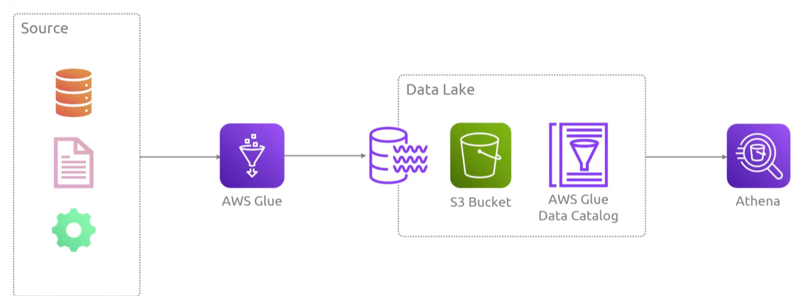
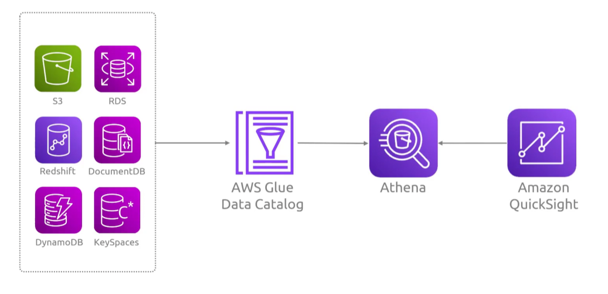
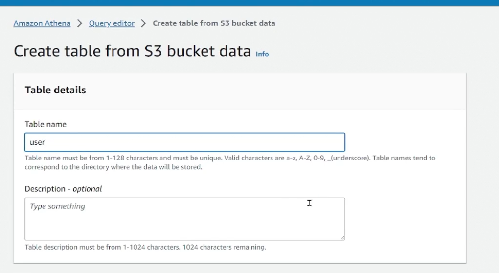
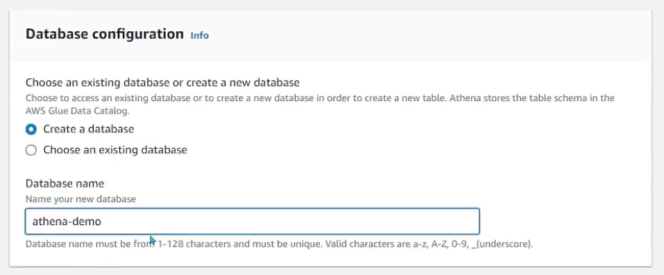
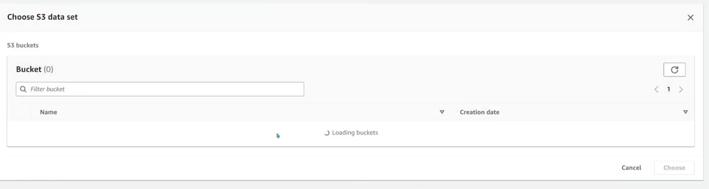
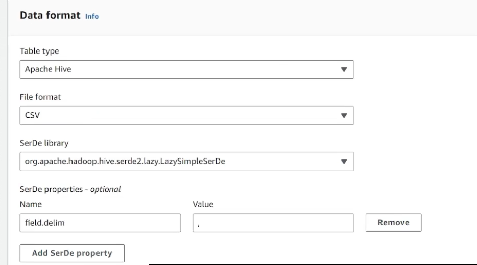
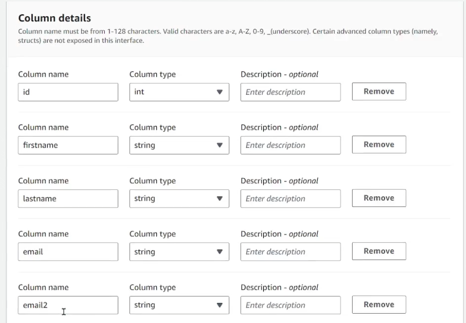
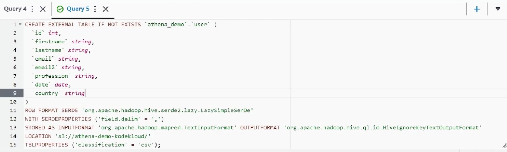

## Athena
- [Overview](#overview)
- [Demo](#demo)

### Overview

* AWS `Athena` is a serverless, interactive query service that lets you analyze data directly in `s3` using standard sql
    - because its serverless theres no infra to manage or setup and you pay only for the amount of data scanned per query
    - auto scales to auto execute queries in parallel, making it fast to analyze large datasets
    - no `etl` reguired, you can install run queries on raw data (csv, json , parquet (fastest option)) without moving or loading to a trad db
    - relies on a catalog, typically `aws glue data catalog`, to understand the schema and the location of your `s3 files`
        * needs `glue` to structure the data so it can understand

* NOTE: this a tool for running ad hoc queries against datasets that you normally don't keep in a db and you want to be able to query it as quickly as you can

### Demo

1. Create a table from a data source (csv file in `s3`)
    - 
2. Pass DB config
    - 
3. Add dataset
    - 
4. Define data format
    - 
5. Pass column details
    - 
    * create table
6. It will run a query to create a table based on data you passes
    - 
        * now you can query that data with sql
