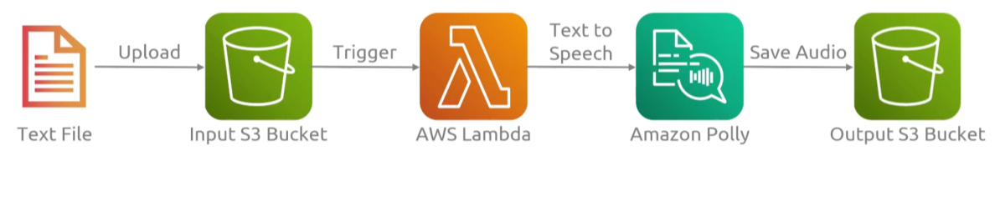
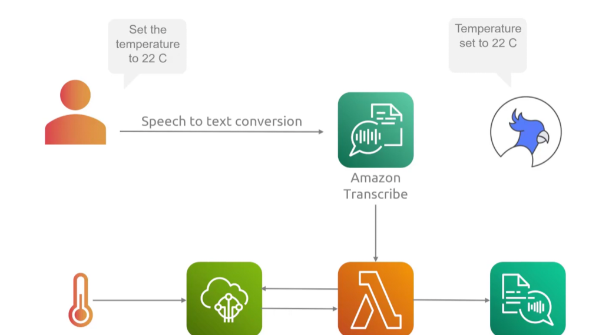

## Polly
- [Overview](#overview)

### Overview

* AWS `Polly` is a `Text-to-Speech (TTS)` service that converts written text into lifelife spoken autod
    - allowing for creation of speech-enabled applicatoins and supports dozen of voices across multiple lanugages
    - uses advacned deep learning and ai tech to create natural sounding human speech
    - has multiple voice engines
        1. standard
        2. neural
        3. long-form
            - more pricey
        4. generative (more expressive like human output)
            - most pricey
    - supports `speech synthesis markup language (ssml)`
        * allows you to customize speech aspects like pronunciation, pitch, volume, and breathing pauses
    - Streaming and real time support features (e.g. `bidrectional streaming api`)
        * allowing for super low latency, real-time speech synthesis ideal for conversational ai 
    - file generation
        * used to store audio
    * Real life scenerio
        - 
