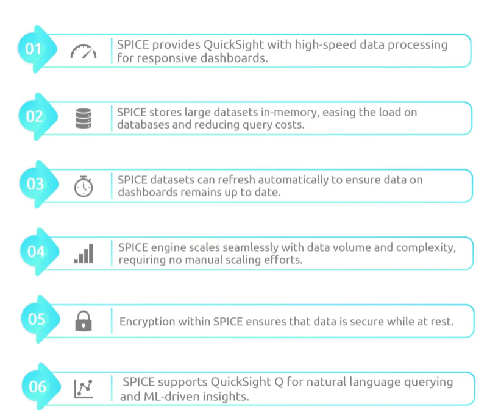

## Quicksight
- [Overview](#overview)

### Overview

* AWS `quicksight` is a serverless service that allows orgs to connect to multiple data sources (`s3, athena, redshift`, and even on prem dbs like `mysql`) to build interactive data visualizations, paginated reports, or gen AI powered data stories
    - `Amazon Q`: incorporated by `quicksight` to allow you to use natural language prompts to build dashboards, search for daya, and generate visual summaries without coding
    - you can even upload data (as csv) directly to it or connect with other cloud dbs
        1. create a dataset
        2. choose data source or upload local
        3. choose whether to query data directly or load it in `SPICE` for better perfomance
            - `SPICE`: super fast, paralele, in-memory calculation engine
                * powers `quicksights` data visualization
                * 
        4. Once dataset is ready you can create an analysis
            - use drag-drop visuals menu to select chart types
            - `quicksight` will auto suggest best chart for your data type
            - you can then share and push the created dashboard for others to see
