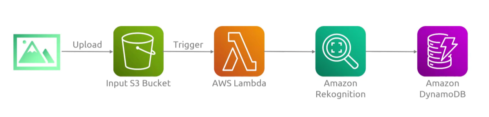
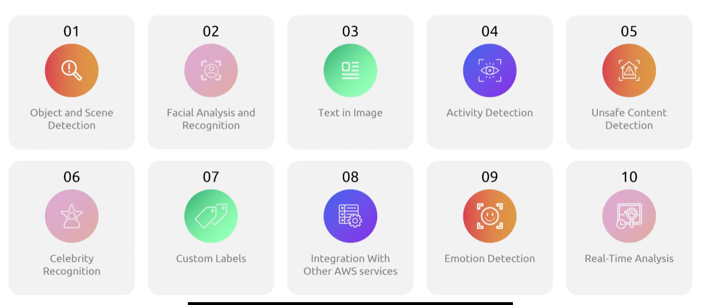
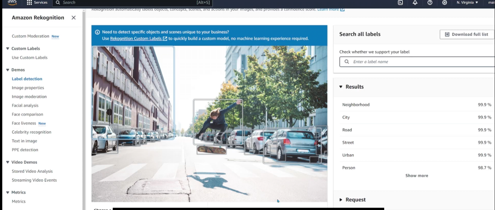
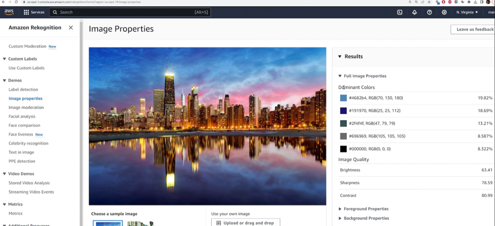
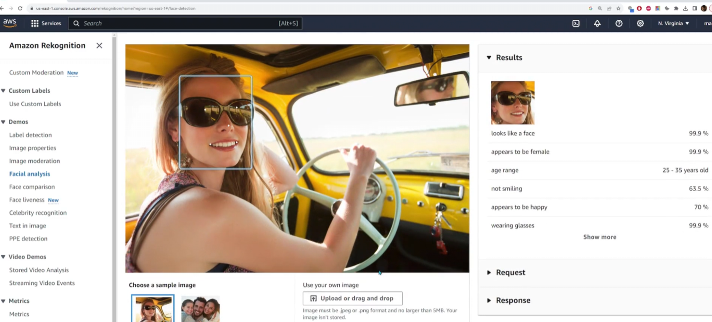
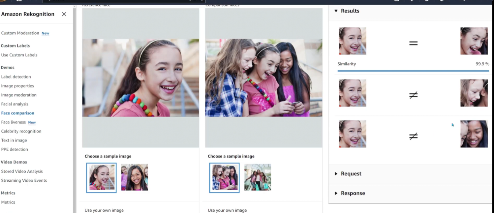
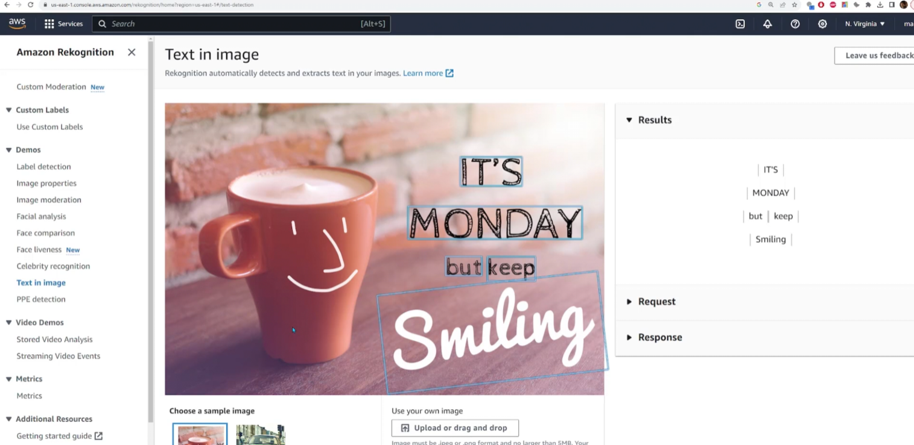

## Rekognition
- [Overview](#overview)
- [Features](#features)
- [Demo](#demo)

### Overview

* AWS `Rekognition` is a computer vision service that automates images/rekognition/image and video analysis
    - it uses pre-trained ai modesl to instantly detect objects, extract text, recognize celbs, moderate inappropriate content, verify identities, and analyze facial attributes without `ml` expertise
    - you can use it to catagorize and tag content based on what it recognizes
        * it suggest keywords based on that context
    - ideally for moderation 
        * 
    - `rekognition` also returns a confidence score from 0-100, for ever prediction
        * indicates how certain the model is about its analysis
        * you can set custom threshold, via `MinConfidence`, to filter results to reduce false positives or negatives

### Features

* `Object and Scene detection`: are you at a beach, or a wedding, etc
* `Facial Analysis and Recognition`: are you happy or sad, is this a celebrity
    - age, race, gender, etc
* `Text in images/rekognition/image`: pulling text, letters, signs, license plates
* `Activity Detection`: eating, dancing, walking, etc
* `Unsafe Content Detection`: porn, violence

### Demo

1. Label generation
    - 
2. Image properties
    - 
3. Facial analysis
    - 
4. Facial similarity
    - 
5. Text in images/rekognition/image
    - 
* NOTE: you can use the sdk to interact with `rekognition`, above examples are done on the `ui`
