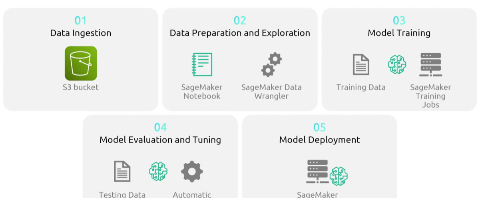

## SageMaker
- [Overview](#overview)

### Overview

* AWS `SageMaker` is a fully managed service that allows you to build, train, and deploy `ml` and fundational models at scale
    - trims down the process of infra management by providing tools for the entire `ml` lifecycle from preparation to prod monitoring
    - great for ML training that requies more control, custom pipelines, and fine tuning
    - ai is just math and `algorithms` that take data and is able to use its patterns to make decisions 
        * `sagemaker` is a tool for train these algorithms

### Features

* `SageMaker Studio`: IDE that provides fully managed jupyter notebooks for all `ml` workflows
    - serverless alternative to `notebook instances`
* `SageMaker JumpStart`: hub of algos, pre trained foundation models, and end-to-end `ml` solutions that can be deployed easily
* `Model training and deploy`: auto scales compute (`gpus` too) for training and deploys models into secure, scalable prod api endpoints
    - you can deploy multiple versions of your `model` and do a/b testing with said model
* `CI/CD`: automates pipeline fro `ml`, and monitors the deployed models for performation degradation or data drift
* `Lakehouse`: integrates with `s3 data lakes` and `redshift` for data processing
* `SageMaker Data Wrangler`: designed to simplify and accelerate data prepping
    - provides visual, low-code/no-code interfact to clean, transform, and analyze datasets similar to `glue databrew` but for `ml`
* `Distributed Training`: allows you to split large `ml` workloads across clusters of multiple `ec2` instances or gpus
    - spot instances can be used for cheaper alternative