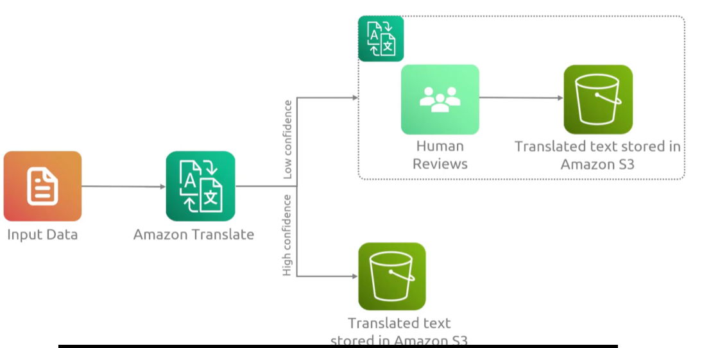

## Augmented AI
- [Overview](#overview)

### Overview

* AWS `Augmented AI (a2i)` is a fully managed service that seamlessly integrates human oversight into `ml workflows`
    - it routes low-confidence model predictions to human reviewers to audit accuracy, correct errors, and continuously improve model perfomance
    - you can use your own reviewers or you can route to 3rd party vendors with `Amazon Mechanical Turk`
        * can scale reviewers seamlessly (keep in mind you'll either supply your own reviewers or use `turk`)
* Used when you need a human second option about machine learning labled data to improve the confidence of said labled data

### Use Cases

* `Content Moderation`: flags potentially unsafe images or text through `rekognition` and sends borderline results to human reviewers
* `Document Processing`: reviews and corrects low-confidence `ml` outputs for clinical data, taxes, or forms processed by `textract`
* `Custom ML Pipeline`: integrates directly with `sagemaker` so you can set specific confidence thresholds
    - e.g send all predictions less than 80% confidence to humnads