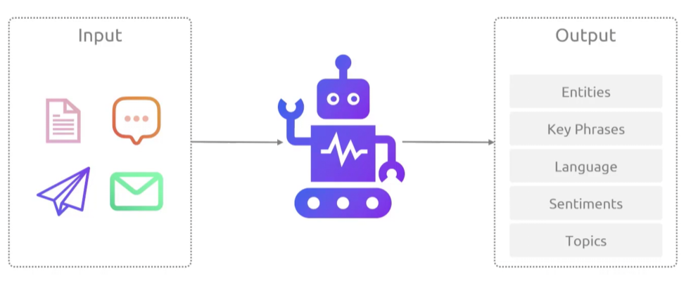
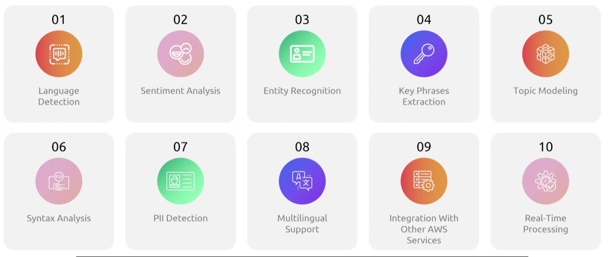
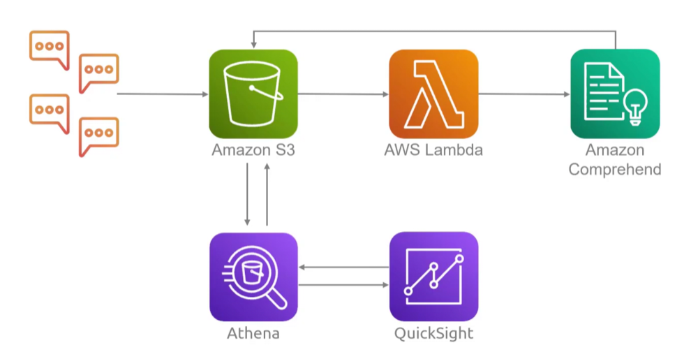

## Comprehend
- [Overview](#overview)

### Overview

* AWS `comprehend` is a fully managed natural language processing (nlp) serice that uses macine learning to extract insights, entities, and sentiment from unstructure text without requring mchine learning expertise
    - it is a text analysis machine that can derive insight from inputs
        * emails, documents, newsletters, product reviews

* NOTE: it can also detect PII and you can ask it to remove it

* `Use Cases`:
    - 
        * Product reviews sent to `s3` that then trigger a `lambda` function that calls `comprehend` to gauge the reation of the reviews
        * Reviews aggregated and filtered by `athena` and visualized with `quicksight`
