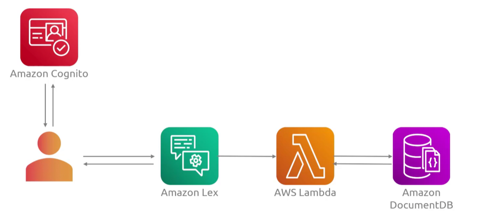

## Lex
- [Overview](#overview)

### Overview

* AWS `Lex` is a fully manage AWS service for building conversational voice and text interfaces into any application
    - it combines `automatic speech recognition (asr)` and `natural language understanding (nlu)` to handle complex, multi-turn interactions
        * `asr`: allows `lex` to interpret user input that its hearing and convert that text to speech
        * `nlu`: used to understand the intention of the text
    - it is a user-to-chatbot interaction