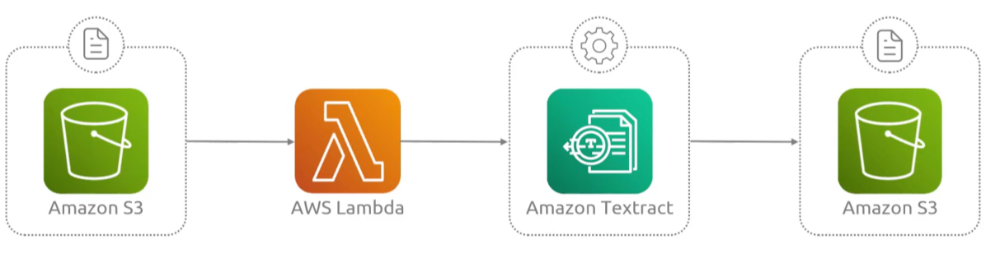

## Textract
- [Overview](#overview)

### Overview

* AWS `Textract` is a fully managed `ml` tool that auto extracts printed text, handwriting, tables, and structure data from scanned documents and pdf
    - it detects both printed and handwritted text in various document types
    - auto pulls data from tabbles, forms and key/value pairs without manual template updates
    - allows users to ask specific questions about document content or analyze layout elements like titles and paragraphs
* `Common Use Cases`:
    - capturing line items, totals, and invoice numbers
    - processing medical claims or financial documents 
    - turning paper archives into searchable digital data