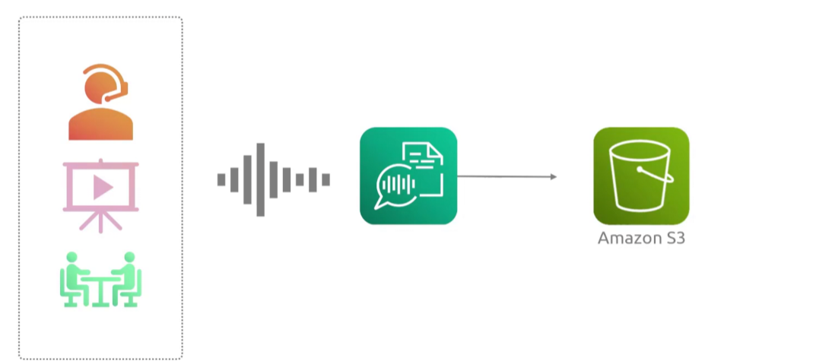

## Transcribe
- [Overview](#overview)
- [Features](#features)

### Overview

* AWS `Transcribe` is a fully managed `automatic speech regonition (asr)` service that converts speech to text
    - it is the inverse of `polly`

### Features

* `Standard Transcription`: general purpose speech-to-text for media files and archives
* `Medical Transcription `: specialied vocabulary for clinical conversations and doctor-patient notes
* `Call Analytics`: multi channel audio processing designed for customer service metrics and insights
* `Speaker Identification`: can recognize when multiple people are speaking
    - known as speaker diarization
    - can go up to 10 unique speakers and labels them from `spk_0` to `spk_9`
* `Real time & Batch`: can process live audio streams or pre-recorded files stored in `s3`
* `Privacy Features`: auto redacts PII
* `Customization`: custom language models and vocabularies to improve accuracy for domain-specific jargon