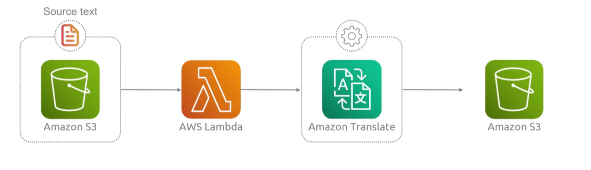
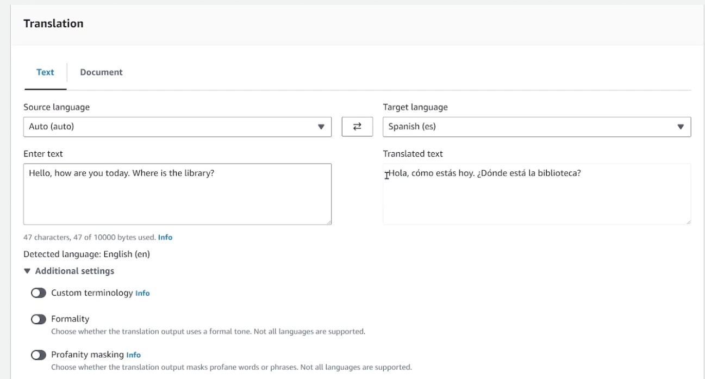
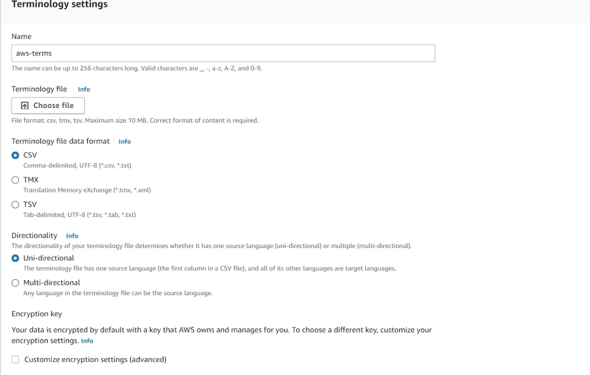
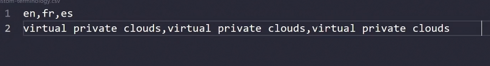

## Translate
- [Overview](#overview)
- [Components](#components)
- [Features](#features)

### Overview

* AWS `Translate` is a fully managed neural machine translation service that delivers fast, high-quality, and affordable language translation for text and documents across a variety of supported languages
    - use case: 
        1. source text gets uploaded to `s3` (utf-8)
        2. triggers lambda
        3. translate picks up source text and translate

### Components

* `Encodder`: reads source material and constructs a representation of what its trying to say
* `Decoder`: uses representation to generate a translation, one word at a time, in the target language

### Features

* `Neural ML`: uses deep learning tech to provide fluent, context-aware translations
* `Real-time and Batch`: supports synchronous api calls for apps and asynchronous batch jobs for large text volumes
* `Customization`: allows for custom terminology and active custom translation to match brand vocabulary
    - 
    - 
* `Format Preservation`: translate plaintext, html, and word docs whule keeping original layouts intact
