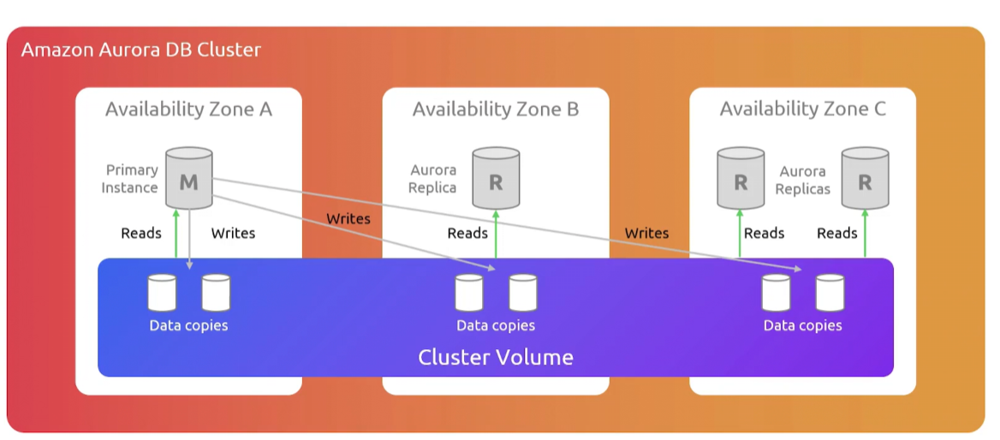
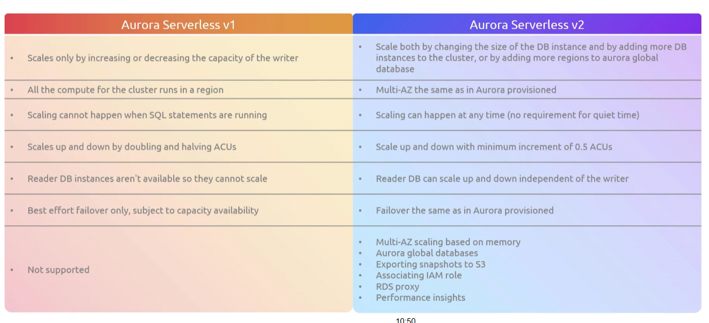
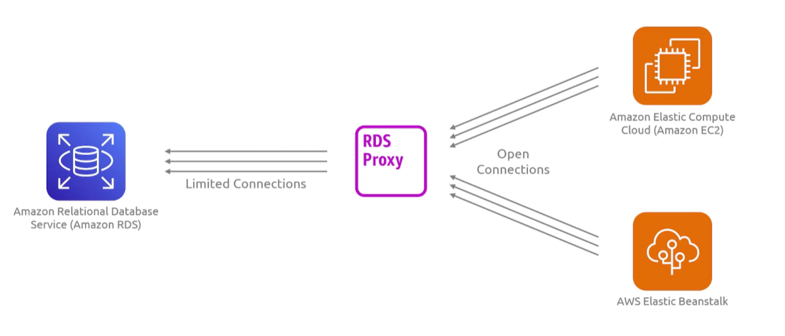

## Relational Database Service
- [Overview](#overview)
- [Instance Types](#instance-types)
- [Deployment Types](#deployment-types)
- [Blue/Green Deployments](#bluegreen-deployment)
- [Storage Types](#storage-types)
- [RDS Configurations](#rds-configurations)
- [Aurora](#aurora)
    - [Types](#types)
- [RDS Proxy](#rds-proxy)

### Overview

* AWS `Relational Database Service (rds)` is a managed scalable solution for running relational databases
    - `rds` simplifies the process of:
        1. routine datbases operations
        2. HA and fault tolerance
        3. scalability
        4. backup and restore
        5. monitoring and performance
        6. security and patches
    - with this you can focus on just writing your application to interact with the db rather than hiring a db admin to do it for you
* `RDS` supports a variety of different types of relational databases; including:
    - mysql
    - postgresql
    - mariadb
    - oracle
    - microsoft sql server

### Instance Types

* `RDS` supports 3 instance types:
    - `general purpose`: provide a balance of compute and memory resources
        * comprised of the `M` Family instance types
    - `memory optimized`: for memory skewed in their resource allocations
        * comprised of the `R` Family instance types
    - `compute optimized`: for compute intensive workloads
    - `burstable performance`: for low cpu utilization workloads
        * store up cpu credits to be used during spikes

### Deployment Types

* `RDS` also provides different deployment types:
    - `single-az`: deployed in one `AZ`
        * has higher latency for read/write ops
    - `multi-az`: deployed in multiple `AZs` and offers auto failover
        * one standby (synchronously replicates data) 
        * two readable standbys (multi-az db cluster) with improved write latency and read capacity
            - can have `cross-region replica`
    - `read-replicas`: independent read-only copies of primary db, deployed in separate `AZ` to scale read-heavy workloads away from primary db
        * can be promoted to standalone instance in a DR scenerio where the primary db has failed
        * has support for `cross-region replicas`
        * can support up to 5 read replicas (unless it `aurora`)

### Blue/Green deployment

* In `rds` you can create a blue/green deployment to copy db environment to a separate synchronized environment
    - with this you can make changes to the db cluster in the green env without affecting the blue deploys workloads
        * you could upgrade the engine version, change parameters, etcs
    - once you're ready you can switch over the environments to transition the green deployment to be the live environment
        * switch over typicallys takes under a minute with no data loss and no need for application changes

### Storage Types

* AWS `rds` offers 3 storage types:
    - `general purpose ssd`: cost effective storage for broad range of workloads running on medium sized db instance
        * `gp3`: max throughput 4000MiB/s, max iops 64,000
            - allow you to provision iops and through put independently of volume size
        * `gp2` max throughput 1000MiB/s, max iops 64,000
    - `provisioned iops ssd`: made for heavy duty, latency sensitive, high transaction prod dbs
        * minimum storage size of 100GB with max at 16TB
    - `magentic`: legacy storage type that relies on an HDD
        * much slower and not recommended for modern dbs

### RDS Configurations

* `DB Parameter Groups`: collection of parameters and settings that control the behavior of your `rds` db
    - control performance, security, and resource allocation
        * dynamic parameters: changes apply to db immediately
        * static parameters: require a manual reboot of the `rds` to take effect
* `DB Cluster Parameter Groups`: same as parameter groups but enforce global settings across all instances in a cluster
* `DB Options Groups`: additional configurations that are engine specific
    - control encryption, security, and performance enhancements
* `DB Subnet Groups`: define subnets where your `rds` instances will be deployed within your `vpc`
* `DB Security Groups`: firewalls for your `rds`
* `DB Snapshots`: allow you to take snaphots and backups of `rds`
    - can use these snapshots to restore to a point in time
* `Parameter Store`: used to store sensitive `rds` data (pass, endpoints) which can be retrieve later by other compute resourcres to connect to instance without hardcoding secrets
* `Perfomance Insights`: visualize performance of instance (load and query execution patterns)
* `Enhanced Monitoring`: provide additional metrics to assist with troubleshooting
* `Audit and Log Data`: `rds` provides this data to track db activities and security related events 
* `SSL and Encrytion`: supports encryption at rest and in transit

### Aurora

* AWS `Aurora` is a fully managed, high performance relation db compatible with both `mysql` and `postgresql`
    - it separates compute from storage and automatically replicates 6 copies of your data across 3 `AZs`
        * storage volume is striped across hundreds of storage nodes, each with its own locally attached ssd and spread across multiple `AZs`
        
    - it can promote a read replica in under 30s
    - offers point-in-time recovery, backtracking (supported in specific versions), and instant cloning
    - each db cluster can have up to 15 read-replicas
    - outperforms standard mydsql throughput by up to 5x
    - outperforms standard postgresql thoughput by up to 3x
    - `aurora global database` allows for a single db to span up to 11 aws regions (1 writer and 10 read replicas)
        * for globally distributed applications
        * data is replicatde aysncharonously

#### Types

* There are 2 types of `aurora` databases:
    - `provisioned`:
        * fixed capacity
        * need to manually scale up or down
    - `serverless`:
        * has on demand automatic scaling for variable workloads
        * "pay as you go" model
        * uses `aurora capacity unit(acu)` as the unit of measurement that represents 2GiB of mem, corresponding cpu, and networking
            - `min acu`: 0.5
            - `max acu`: 128
        * 

### RDS Proxy

* When a compute resource connect with an `rds` db it opens a connection to that db
    - this becomes a problem as the number of compute resource, connecting to that db, increases
    - this exhausts cpu and memory as the db has to process theses connections
* With `RDS proxy` we can configure a pool of db connections and any compute resource needing to connect to your db will do so through the proxy
    - the proxy reuses the connections, as it has allotment, for incoming connections
    - connections can also be queued if pool of connections is maxed out, to take load off of db
    - minimizes disruptions when failovers happen, because proxy will auto route to new primary instance
        * reduces failover time by up to 66%
    - fully managed, HA, serverless, and scales up automatically