## Dynamodb
- [Overview](#overview)
- [Components](#components)
- [Seconday Index](#seconday-index)
- [Streams](#streams)
- [Table Classes](#table-classes)
- [Features](#features)
- [Hands On](#hands-on)
- [Accelerator](#accelerator)

### Overview

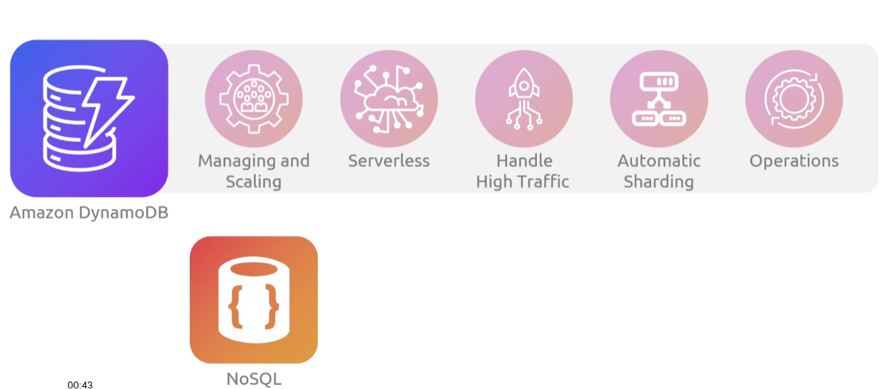

* `AWS Dynamodb` solves the problem of managing and scaling `nosql` databases
    - it provides us a fully managed and serverless db solution

### Components

* `Tables`: collection of data
    - schemaless; neither `attributes` or `datatypes` have to be defined beforehand
        * this makes it `nosql`
* `Items`: entry in your `table`
    - no limit of `items` to store in a table, `dynamodb` will scale
    - each `item` will have a `primary key` which acts as the identifier for that `item`
        * Defined when you create the `table`
    - there are 2 types of `primary key`
        * `partition key`: one attribute and must be unique
            - used as input to internal hash function
            - output determines partition (physcial storage in `dynamodb`) where `item` will be stored

            People // Table Name
            { // Item 1
                "PersonID": 1, // Attributes (also the primary parition key)
                "FirstName": "Bob"
            }
            { // Item 2
                "PersonID": 2,
                "FirstName": "Alex
            }
            ```

        * `composite primary key (parition key + sort key)`: 2 attributes, both must be unique
            - multiple `items` can share the same partition keys but different sort keys
            - all `items` with the same `partition key` value will be stored together in a sorted order by the `sort key` value
            - great for retrieving an aggregate of data sharing the same `partition key`

            ```
            People // Table Name
            { // Item 1
                "School": "Libertas", // partition key
                "SchoolId": 1, // sort key
                "Country": "USA",
                "FirstName": "Bob"
            }
            { // Item 2
                "School": "libertas",
                "SchoolId": 2,
                "Country": "USA",
                "FirstName": "Alex
            }
            ```

* `Attributes`: composes an `item`, property
    - each `attribute` can only have one value, but `nested attributes` are supported up to 32 levels deep

### Seconday Index

* `Secondary index`: a data structure that allows you to query base table data using an `alternate key` rather than just the `primary key`
    - `global seconday index (gsi)`: allows a `partition key` and `sort key` that can be different from the base table's `primay key`
        - they span all partitions across the table
        - up to `20 GSIs` per table
    - `local secondary index (lsi)`: shares the same `partition key` as base table but a different `sort key`
        - strictly local to their partition
        - up to `5 LSIs` per table (must be created when you create the table)
    * When base table is updated, so are corresponding indexes

    ```
    People // Table Name
    // Primary Index
    { // Item 1
        "School": "Libertas", // partition key
        "SchoolId": 1, // sort key
        "Country": "USA",
        "FirstName": "Bob"
    }
    { // Item 2
        "School": "libertas",
        "SchoolId": 2,
        "Country": "USA",
        "FirstName": "Alex
    }

    // Secondary Index
    { // Item 1
        "Country": "USA",
        "SchoolId": 1, 
        "FirstName": "Bob"
    }
    { // Item 2
        "Country": "USA",
        "SchoolId": 2,
        "FirstName": "Alex
    }
    ```

### Streams

* `Dynamodb Streams` is a feature that captures a time-ordered sequence of all data modifications in you db
    - as changes occur it writes these events to a log where they're retained for up to 24hrs
        * (e.g. you want send a welcome email to every new customer, you can use streams to trigger a `lambda` that will extract email information and send welcome letter using `ses`)
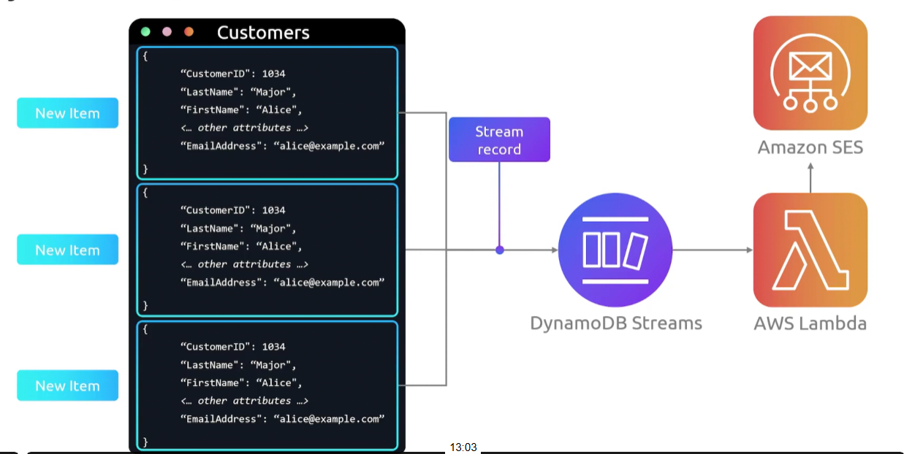

### Table Classes

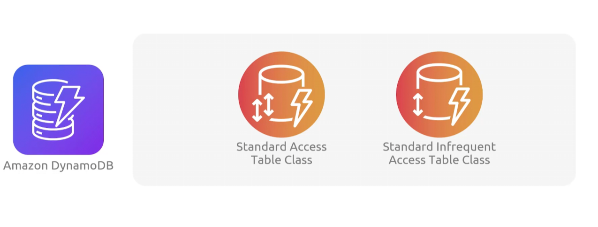
    - `on demand classes` are also included, where no capacity planning is needed 

* All secondary indexes associated with a `table` use the same `table class`
* `Table Classes` can be changed at anytime


### Features

1. `key/value and document data modules`
2. `serverless`: no versions and no downtime
3. `global tables`: multi active, you can read and write from any replica in the globe
    - 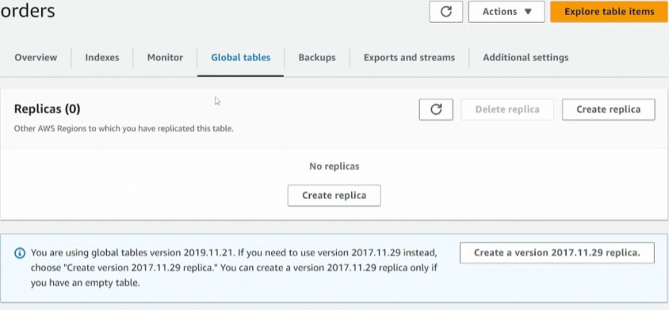
4. `on demand backup and restores`
5. `autoscaling`: which increases and decreases read/write capacity based on utilization monitored by cloudwatch

### Hands On

1. Create a `table`
    - 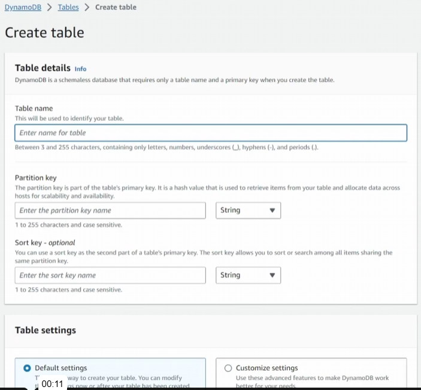
        * 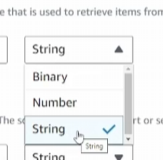
    - Select Table Class
        * 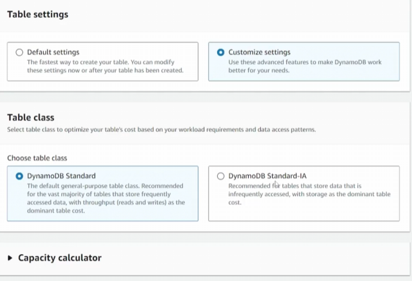
    - Define read/write capacity
        * 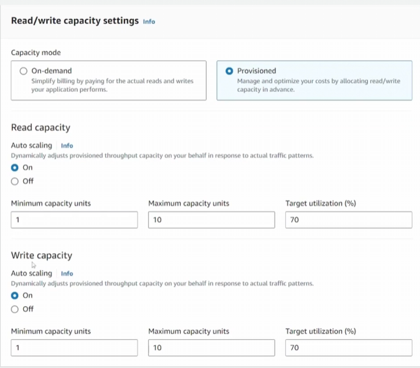
    - Configure seconday indexes
        * 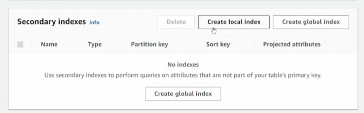
    - Encryption
        * 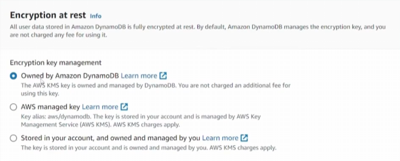

2. Add `items` to `table`
    - 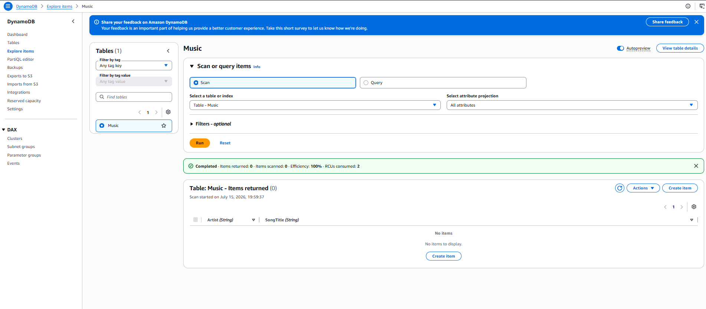

### Accelerator

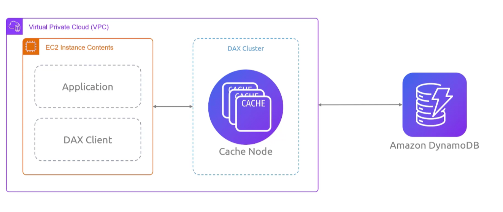
* Amazon `Dynamodb Accelerator (DAX)` fully managed caching service built for `dynamodb`
    - performance of up to 10x from miliseconds to microseconds
    - dax nodes add in-memory acceleration  
    - dax cluster consists of 1 or more nodes, with one as the primary and additional as read-replicas (up to 1 primary + 9 replicas)
* Redirects all of the applications `dynamodb` requests to the `dax cluster`, which will then loadbalance to `dynamdbo`
    - if request is cached, it returns immediately, if not it will send to `dynamodb` and then cache it
    - by offloading read requests to the cache, it reduces number of requests made to `dynamodb`, lowering costs at scale
