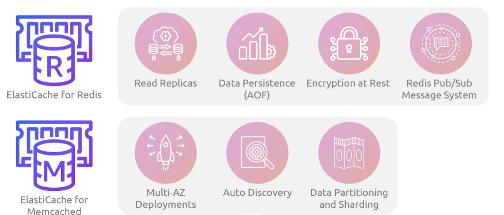
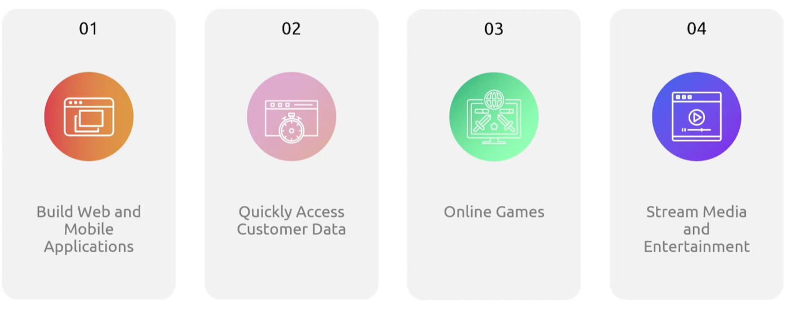

## ElastiCache
- [Overview](#overview)
- [Components](#components)
- [MemoryDB](#memorydb)
    - [Components](#components-1)

### Overview

* AWS `ElastiCache` is a managed highly performant cache that can scale to hundreds of millions of operations per seconds with microsecond response times
* `Elasticache` suports 3 caching engines
    - `valkey`: open source redis compatible key/value store and cache
        * fork of redis 7.2.4, created after redis moved from open source license
    - `redis oss`: widely used, fully featured in-mem data store
        * supports complex data types, persistence
    - `memcache`: simple multi-threaded key/value cache that is ideal for caching db queries and session data
        * solely for raw string caching speed and predicatable latencies

    

### Components

* `Cluster`: grouping of one or more cache nodes, primary unit of scale in `elasticache`
    - can have multiple clusters running in `elasticache` environment
* `NodeTypes`: determine cpu and mem of nodes 
* `Cluster Parameter Groups`: configuration for the engine settings for cache cluster
* `Cache Security Groups`: controls network access to cache cluster
* `Subnet Groups`: collection of subnets where cache clusters can be placed

### MemoryDB 

* `MemoryDB` is a fully managed, in-mem db compatible with valkey and redis oss
    - unlike other caching services that sit in front of a traditional db, `memorydb` is built to act as your primary db
    - unlike traditional dbs (which store data in disk), `memorydb` stores data in memory for faster response times
* Use Cases:
    - 

#### Components

* `Cluster`: cluster of one or more nodes
    - with primary and read replica nodes
* `Nodes`: smallest building blocks of `memorydb` deployments that run on `ec2`
    - each node belongs to a `shard` which belongs to a cluster
* `Shards`: a `memorydb` dataset is partitioned into `shards`
    - each `shard` has a primary node and up to 5 replica nodes
    - cluster always has at least one `shard`
* `Parameter Groups`: collection of engine specific parameters and configurations settings for cluster
* `Subnet Groups`: collection of subnets where clusters can be placed
* `ACL`: control what users can run what within the cluster

