## Opensearch
- [Overview](#overview)
- [Components](#components)
- [Features](#features)
- [Hands On](#hands-on)

### Overview

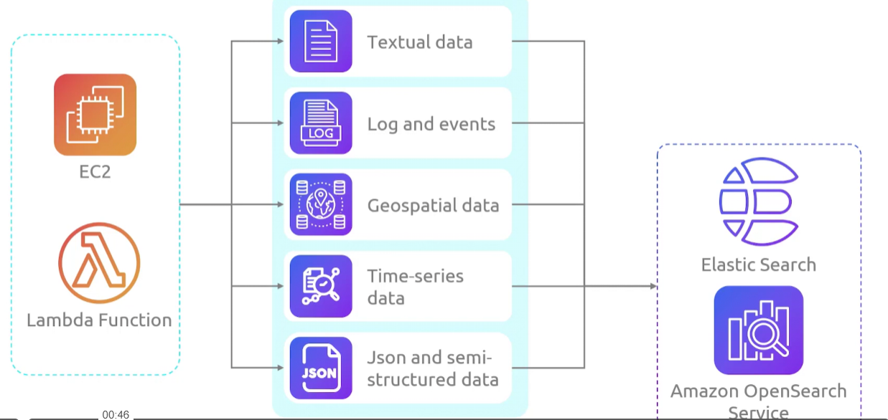
* AWS `Opensearch` is a tool that allows developers to ingest. seach, visualize and analyze large volumes of data
    - derived from `elasticsearch` after `elasticsearch` went private

### Components

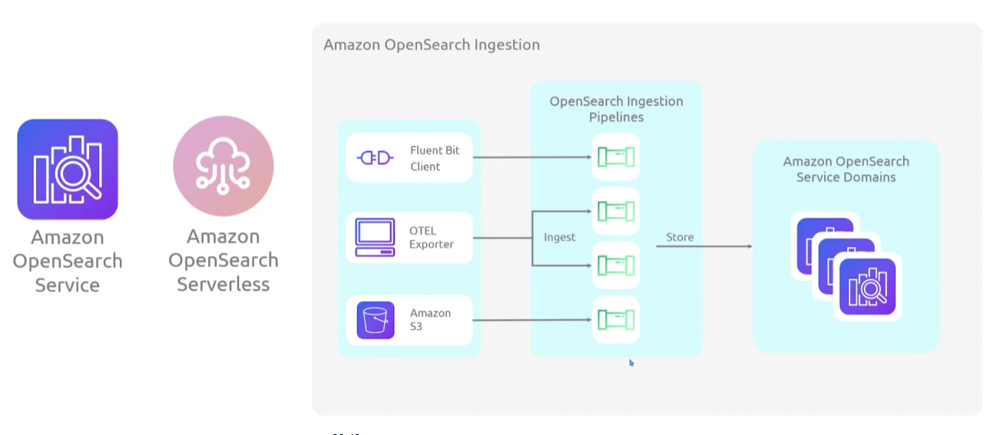

* `Opensearch` has both service and serverless options
* `Opensearch Ingestion` is an `opensearch` datacollector that delivers real time log and metrics data to opensearch service domains or serverless collections
    - each cluster you make in `opensearch` will have its own service domain
    - replaces `logstash` and `jaeger` by configuring the pipelines that send data from the producers over to the db

### Features

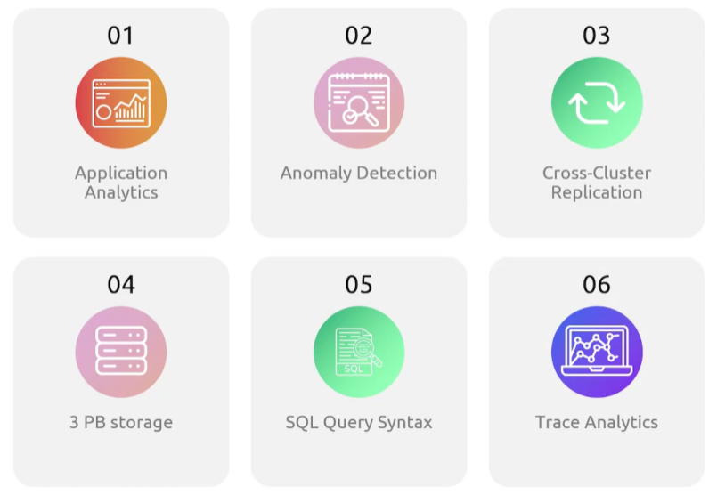

### Hands On

1. Create a Domain (Cluster)
    - 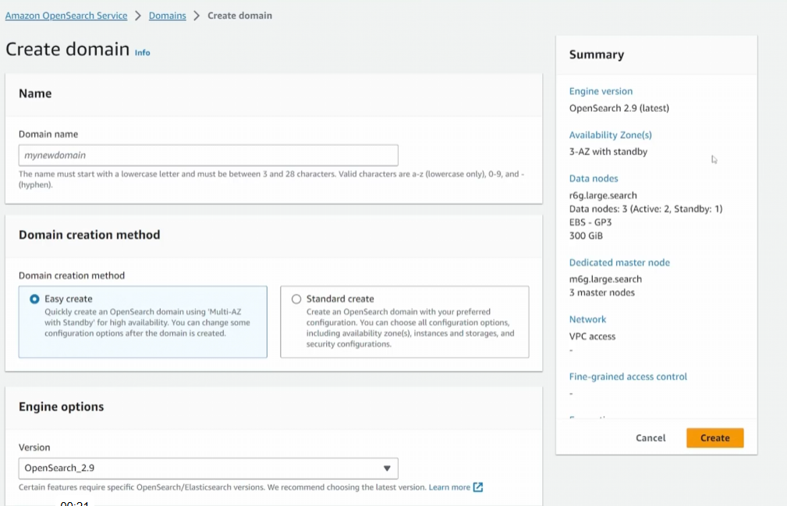

2. Specify templates and deployment options
    - 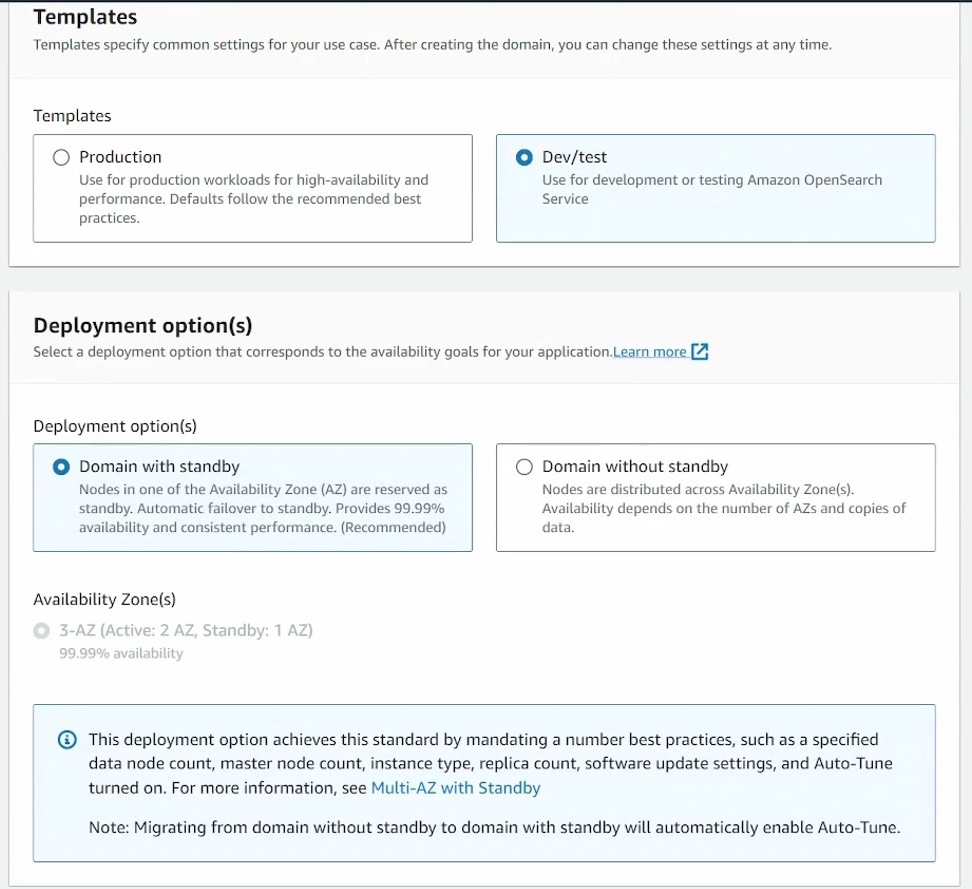

3. Specify engine options
    - 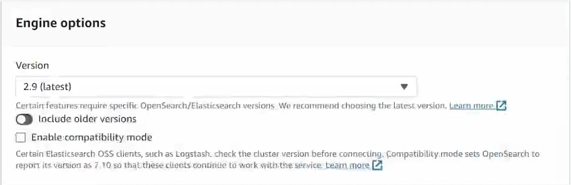

4. Specify data nodes
    - 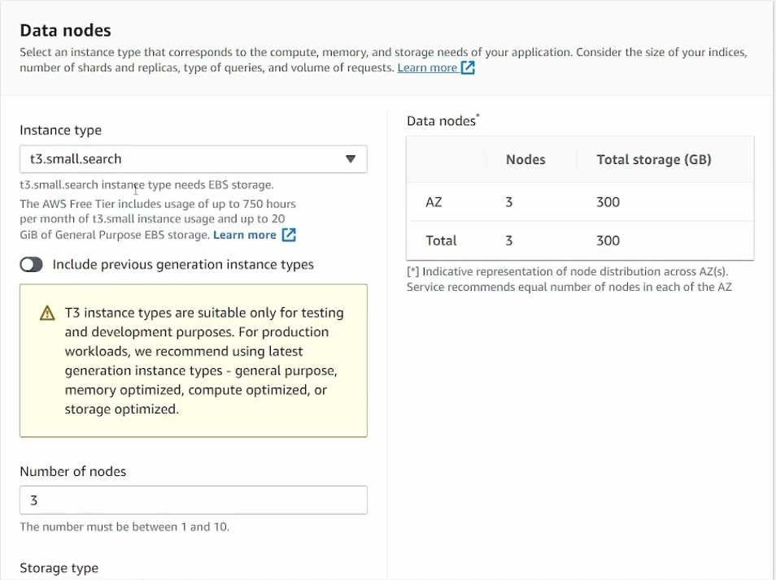
    - 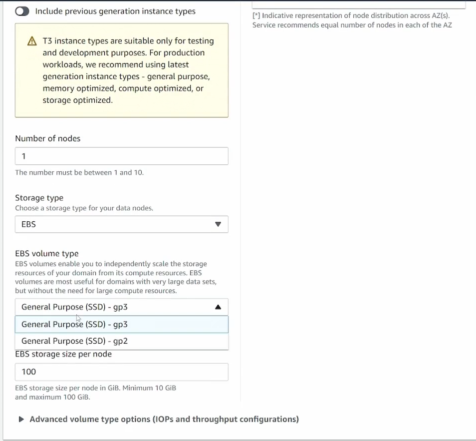

5. Define extra configuration
    - 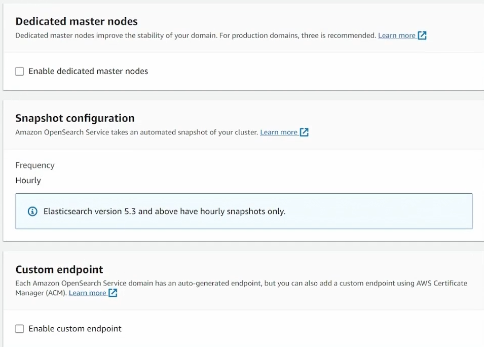

6. Define networking
    - 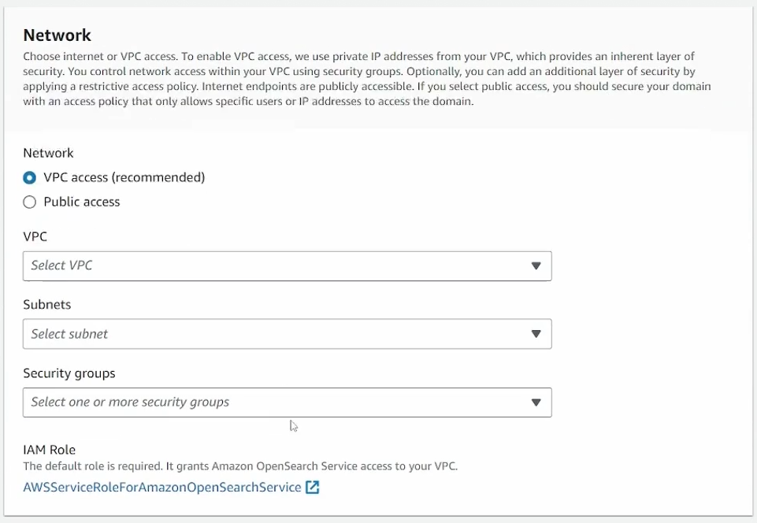

7. Define fine grain access control and saml/cognito settings
    - 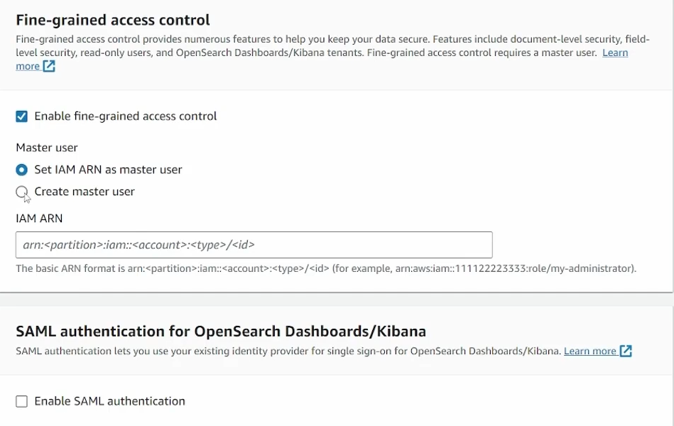
    - 

8. Define access policy 
    - 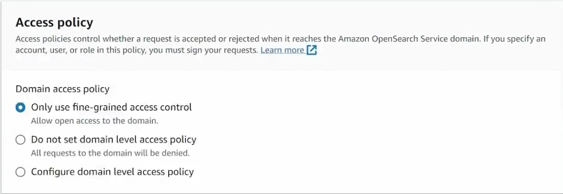

9. Encryption
    - 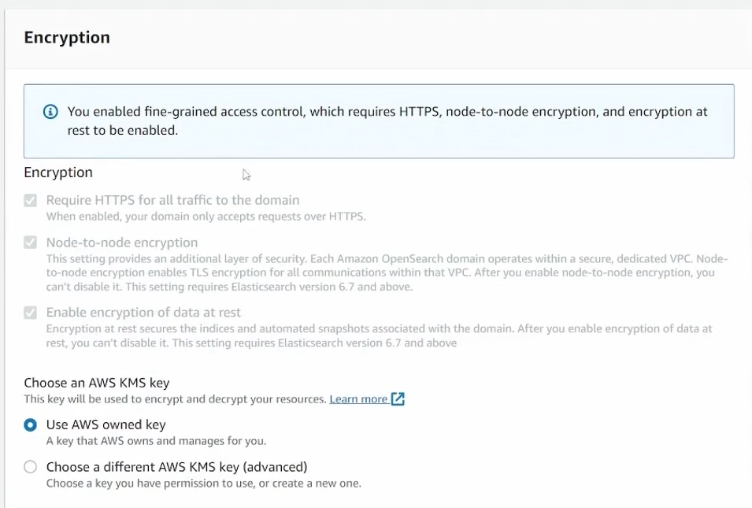

10. Once deployed you'll see the cluster configuration
    - 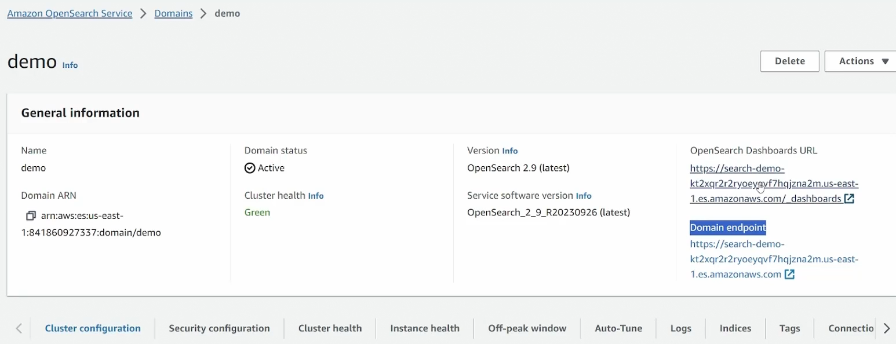
        * both dashboard (kibana) and domain endpoint (opensearch) are available