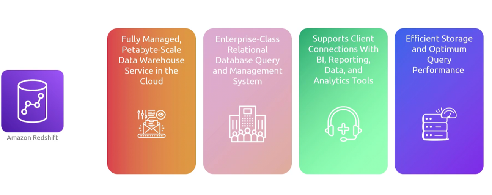
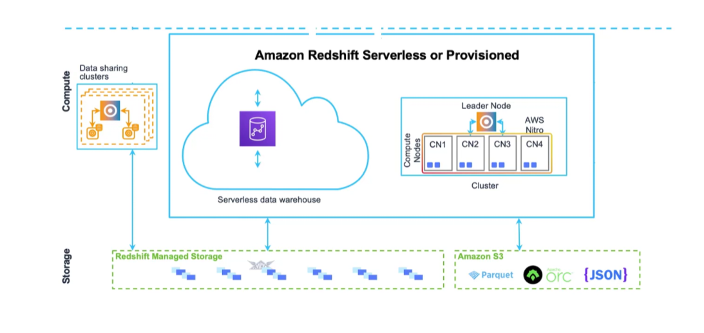

## Redshift
- [Overview](#overview)
- [Components](#components)
- [Features](#features)
- [Serverless](#serverless)

### Overview

* AWS `Redshift` is a `data warehouse(dwh)`
    - a data warehouse is meant to consolidate data, whether it be from logs, dbs, etc
        * it provides a unified view of said data
    - traditional databases are designed for transactional operations whereas warehouses are designed for analytical operations
    - they store historical data over time in order to track changes, identify trends, or monitor patterns
    - allows `ETL(extract, transform, and load)` capabilities for data analytics
    - handles structured data at an aggregate level

### Components

* `Clusters`: core infra component composed of one or more compute nodes
    - for every 2+ compute nodes a leader nodes is added to to coordinate compute nodes and handler external comms
    - leader nodes handle communication with any external clients
        * receives sql queries, parses them, generates execution plans, and distributes compiled code compute nodes
            - holds only metadata and not actual user daya
    - compute nodes store data that is divided into partitions called slices and executes the compiled query plan set by the leader
        - sends intermediate results back to the leader node for final aggregation
    - each compute node has its own cpu and mem
    - scability is supported in these cluster by allowing for upgrade of instance types or addition of compute nodes 

* `Storage`: the `dwh` data is stored in `redshift managed storage(rms)`
    - `rms` allows you to scale up to petabytes by using `s3`
    - `rms` allows you to abstract compute from storage and pay for them separately

* `Database`: a relational database that has similiarities to postgresql

### Features

* `Columnar storage`: minimizes total data read from disk to enhance query performance
* `Massively Parallel Processing (mpp)`: query processing can be distributed across multiple nodes
* `Data compression`: automatic data compression to minimize storage requirements
* `Scalability`: add or remove nodes or change instance types, adds auto increase to cluster capacity to handle peaks 
* `Integration`: with other aws resources
* `Data ingestion`: cp commands, data loading from `s3`, data pipeline
* `Sql compability`: compatible with sql tools
* `Security`: encryption in transit and reset, integration with `iam`
* `Automated Backups`: backup to s3 and point in time recovery
* `HA`: redundancy, multi node clusters, read replicas
* `Concurrency`: supports multiple queries and users for collaborative work
* `Materialized Views`: to precompute and store aggregated data
* `Workload Management`: control query queues and resource allocation to different types of queries
* `Monitoring and Management`: tools for monitoring metrics
* `Integration with BI Tools`: tableau, etc
* `Datalake Integration`: datalake for comprehensive data analytics

### Serverless

* With `serverless` you can properly incorporate the pay as you go model
    - with the non serverless models, you'll incur costs during times when those compute resources aren't in use
* With `serverless` your `redshift` cluster can auto scale up or down
    - `redshift` measures `dwh` capacity in `RPUs (1 rpu = 16GB ram)` so you pay for workloads you run in `RPU-hours` on a per second basis
        * you define a min and max `rpu` limit
        * base capacity is 128rpus that can be adjusted in units of 8 starting from 8 to 512rpus    
        * 8-24rpu can support up to 128TB of data, 32 rpus is the minimum` for more than 128TB of data
