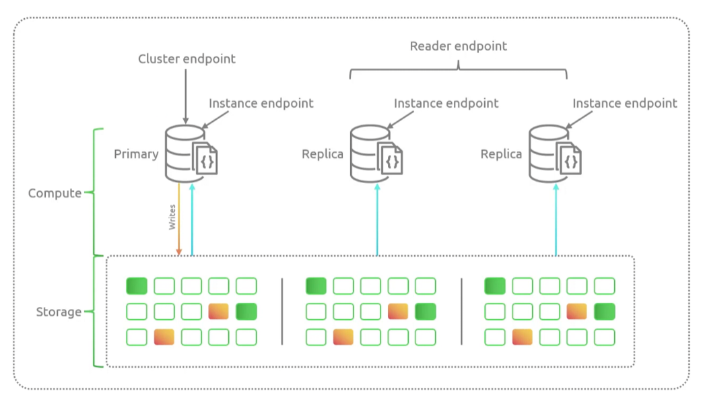
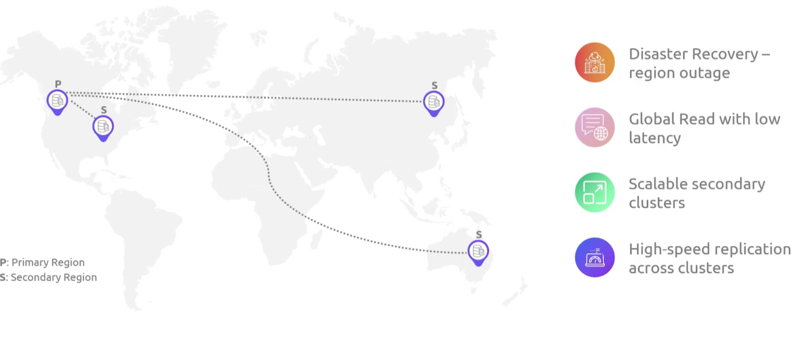

## DocumentDB
- [Overview](#overview)
- [Components](#components)
- [Global Cluster](#global-cluster)
- [Features](#features)

### Overview

* AWS `DocumentDB` is a mongodb compatible managed nosql db

### Components

* `Cluster`: grouping of 0 or more db nodes
    - 1 primary node 6 read replicas each with their own instance endpoints
    - can have up to 16 instances
* `Storage`: cluster volume uses cloud data storage to replicate data 6 ways across 3 different `AZs`
    - has one cluster volume that can store up to 128TB of data

### Global Cluster

* `DocumentDB` supports global cluster where data can be replicated globally with low latency
    - can be replicated to clusters in 5 different aws regions
        * each cluster can be scaled independently

### Features

* `MongoDB compatibility`: for easy transition
* `Storage Auto Repair`: and issue with cluster volume is automatically fixes segment issues by using data in other segments
* `Cache Warming`: page cache is managed separately from the db, so that it can survive if db goes down
* `Crash Recovery`: designed to recover from crashes almost immediately
    - performed asynch on a separate parallel thread
* `Write durability`: ensures writes are recorded on a majority of nodes before acknowledging write to client 
* `Read Preferences`: can be configured to read preferrable from primary or secondary and if either are not available it will fallback to alternative
    - if primary is not available it will read from a replica
    - if replica is not available it will read from primary
    * near preferred can also be used to read from lowest latency between client and instances in cluster