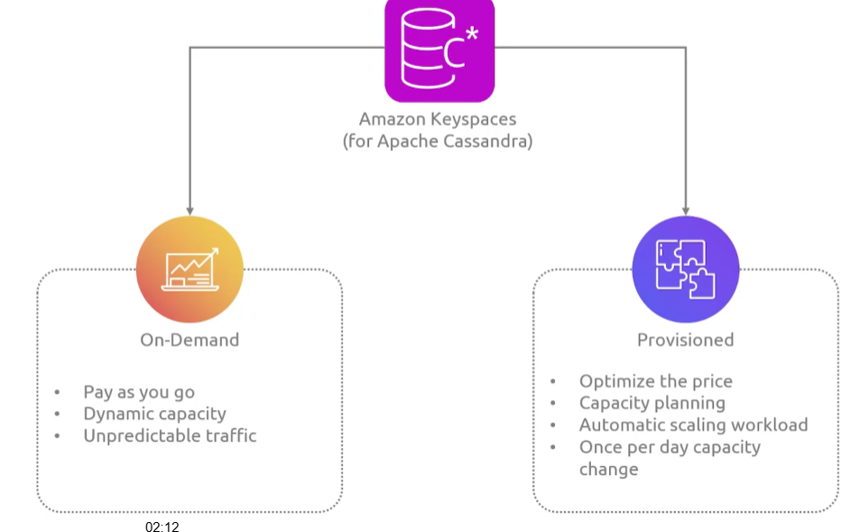
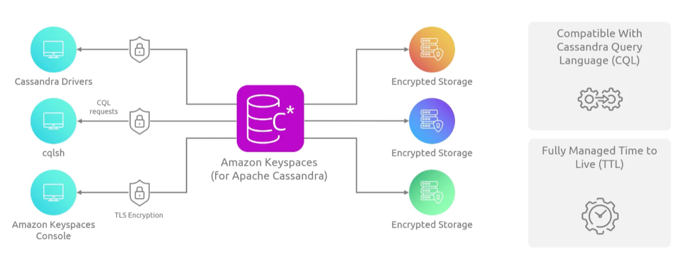
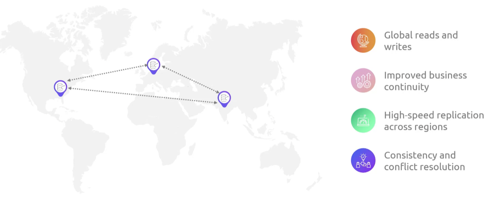

## KeySpaces
- [Overview](#overview)
- [Components](#components)
- [Multi Region](#multi-region)

### Overview

* AWS `Keyspaces` is a highly scalable, available, maintenance free, serverless managed apache cassandra nosql db

- 

### Components

* `Keyspaces` 
  - will store 3 copies of your data in multiple `AZs` for HA
  - has encryption at rest, monitoring, iam integrations, and vpc endpoints 

### Multi Region

* When oyou enable multi region replication in `keyspaces`, multiple replica `keyspaces` will be created per region
    - these replicas will be treated as a single unit
    - `keyspaces` uses storage based async replication to propogate writes across these region replicas
    - active active cluster with built it conflict resolution for writes happening in same region