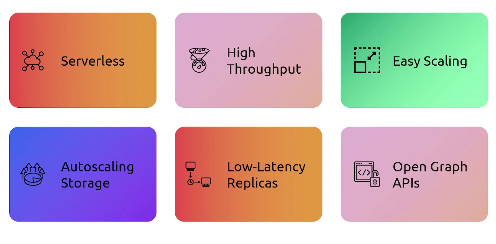
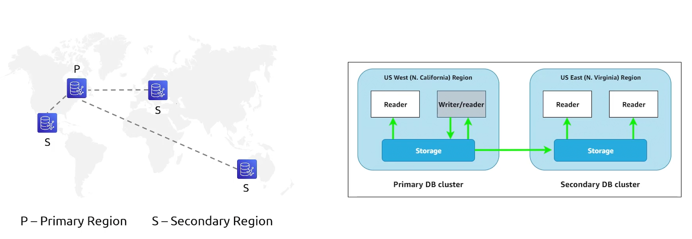

## Neptune
- [Overview](#overview)
- [Features](#features)
- [Global Databases](#global-databases)

### Overview

* AWS `Neptune` is a fully managed graph database
    - graph dbs are a specialized nosql db that store relationships as direct memory pointers
    - ideal when the connections between data are just as important as the data itself
* Use Cases:
    - 
        * (e.g ecommerce platform needs to suggest products based on what similar users have bought)

### Features

### Global Databases

* `Neptune` supports a global db
    - you can have 1 primary db and up 5 secondary read only clusters in separate regions 