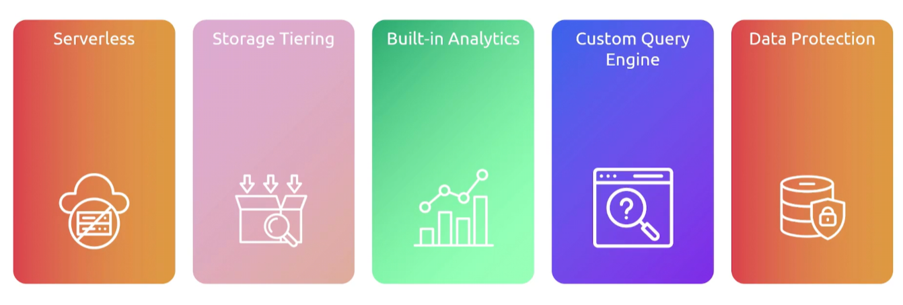

## TimeStream
- [Overview](#overview)

### Overview 

* AWS `timestream` is a fully mananged, serverless time-series database that is designed to handle trillions fo events daily
    - it features automated scaling and cost-optimized data lifecycles that it auto keeps recent data in memory and moves historal data to magnetic storaes
    - ideal for iot data
        * real-time information generated by connected physical devices, sensors, and actuators
        * drives everythin from consumer smart homes to smartc cities by continously capturing, sharing, and acting on physical metrics
    - schemas are predefined but are dynamically created based on attributes of incoming timeseries data 
    - when stored, data is partition based on time and attributes of the data 
    