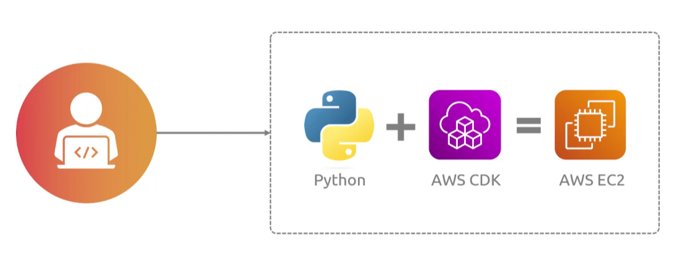
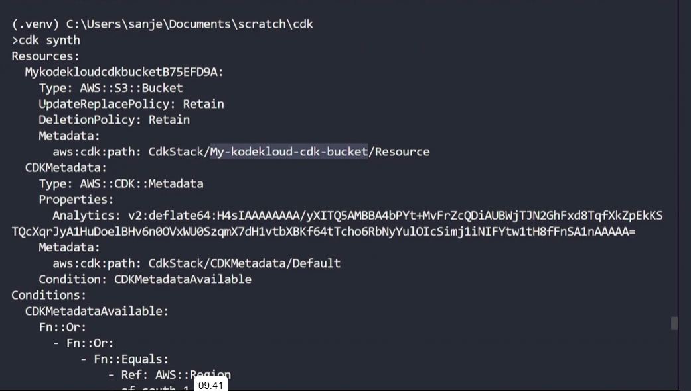
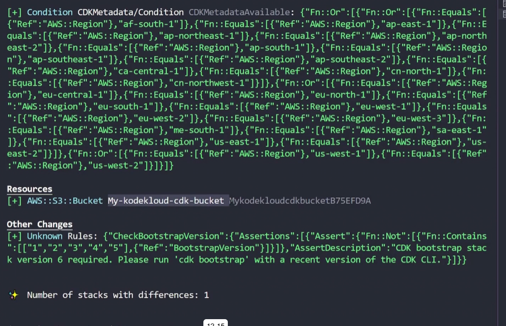
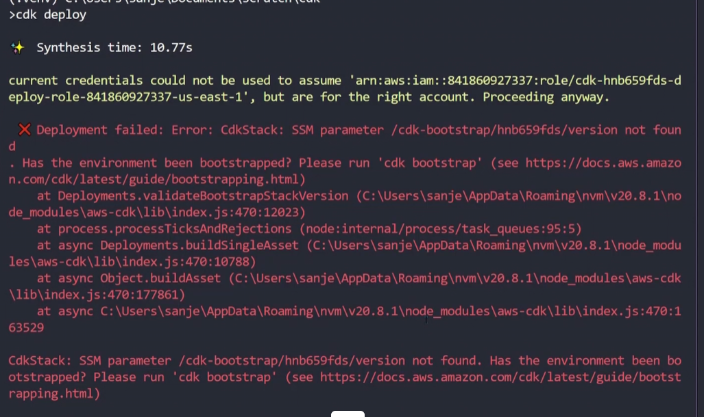
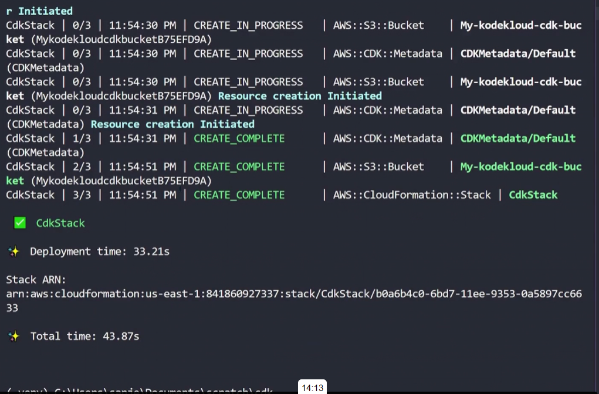

## Cloud Development Kit 
- [Overview](#overview)
- [Demo](#demo)

### Overview


* AWS `Cloud Development Kit (cdk)` lets you define infrastructure in a programming language instead of writing yaml by hand
    - you run `cdk synth` and it generates a `cloudformation template` and then `cdk deploy` hands that template to `cloudformation`, which does the actual provisioning
    - then appeal is that you get loops, conditionals, functions, and classes which can be beneficial in iterations 

### Demo

1. Install aws cdk

    ```bash
    npm install -g aws-cdk
    cdk --version
    cdk list # list all stacks in the app
    cdk synthesize # synthesizes and prints the cloudformation template for this stack
    cdk bootstrap # deploys cdk toolkit stack into aws
    cdk deploy # deploys the stack(s) into your account
    cdk destroy # destroys the stacks
    cdk diff # compares the specific stack with the deployed stack
    cdk init sample-app --language python # initializes cdk template based on language
    ```

2. Create an `s3 bucket`

    ```bash
    # initialize venv
    source .venv/bin/activate
    pip install requirements.txt
    ```

    ```python
    from constructs import Construct
    from aws_cdk import (
        Duration,
        Stack,
        aws_s3 as s3
    )
    class CdkStack(Stack):
        def __init__(self, scope: Construct, construct_id: str, **kwargs) ->
        None:
            super().__init__(scope, construct_id, **kwargs)

            bucket = s3.Bucket(
                self, "MyEncryptedBucket",
                encryption=s3.BucketEncryption.KMS
            )
    ```

    ```bash
    cdk synth
    ```
    

3. Pass AWS Credentials
    - `aws configure`

4. Diff and Launch cdk
    
    ```bash
    cdk diff
    ```
    

    ```bash
    cdk bootstrap # there will be a failure if you don't run this first
    cdk deploy
    ```
    
    

4. Destroy stack

    ```bash
    cdk destroy
    ```
