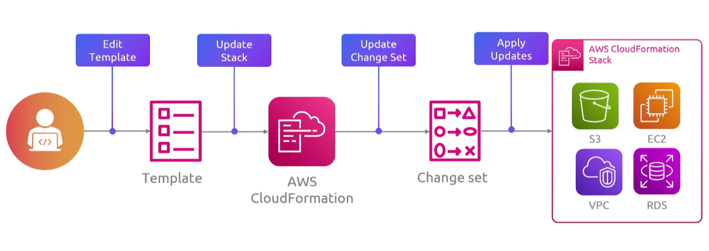
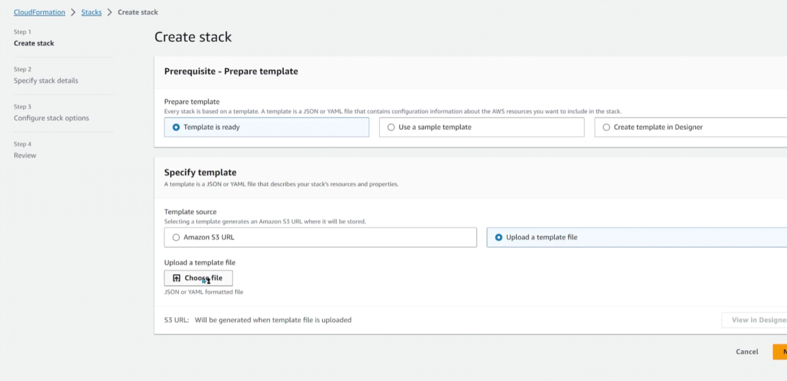
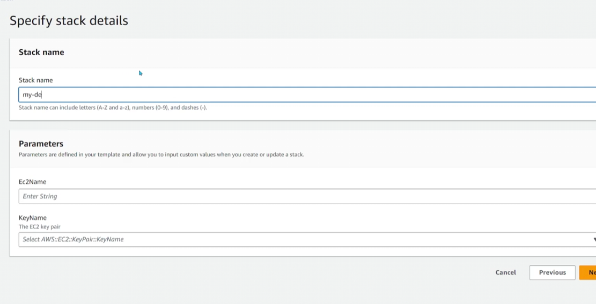
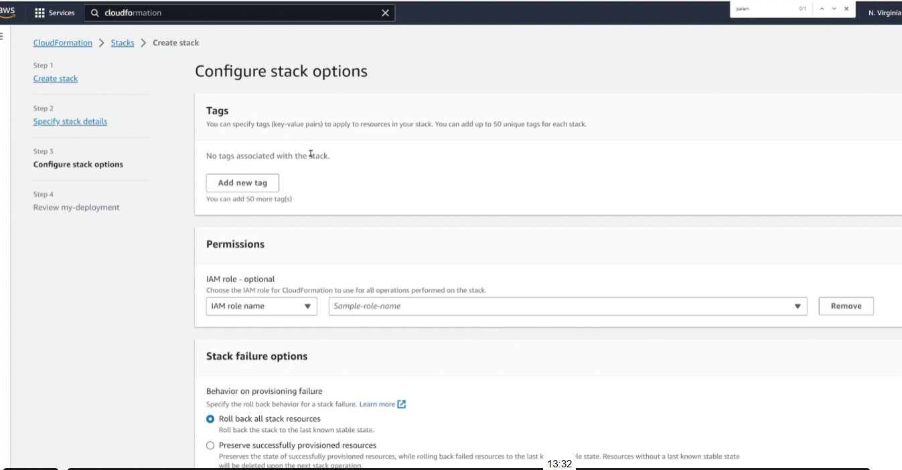
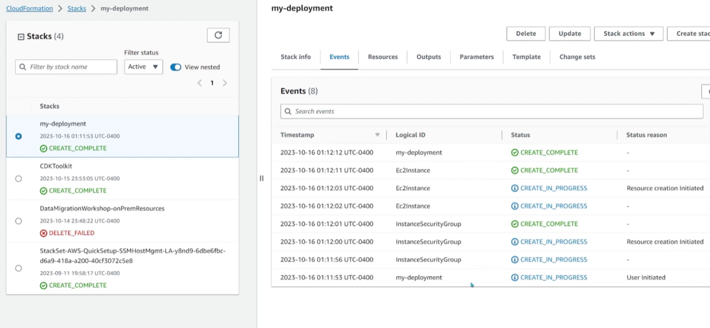
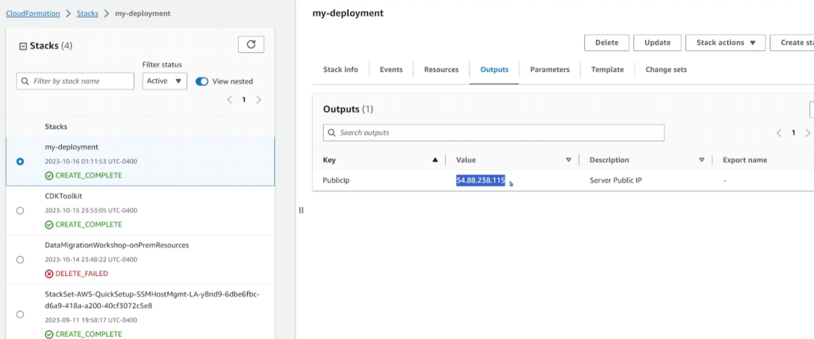

## Cloudformation
- [Overview](#overview)
- [Components](#components)
- [Template](#template)

### Overview


* AWS `Cloudformation` is aws' `IaC` where you define templates in yaml or json describing what you want and `cloudformation` provisions it for you

### Components

* `Templates`: declare your resources and how they relate
    - `cloudformation` figures out the dependency order
* `Stacks`: are what you get when you deploy a template
    - a `stack` is a single unit you can update or delete as a whole
    - deleting a `stack` tears down every resource it creeated
* `Change Sets`: let you preview what an update would do before you apply it
* `StackSets`: extend `cloudformation` across account and region boundaries
    - a stack lives in one acount in one region
    - a stackset lets you take a single template and deploy it as stacks into many accounts and many regions from one place

### Template

* You can find template reference [here](https://docs.aws.amazon.com/AWSCloudFormation/latest/TemplateReference/aws-template-resource-type-ref.html)

```yml
Parameters: # used to define user input that can we referenced later
  KeyName:
    Description: The Ec2 Key pair
    Type: AWS::EC2::KeyPair::KeyName # will produce dropdown with keypairs the user can select
  Ec2Name:
    Type: String
Resources: # define all the sources you want cloudformationt o make
  Instance1: # name of resource being created
    Type: AWS::EC2::Instance # type of resource being created
    Properties: # define resource configurations
      ImageId: ami-xxx
      KeyName: !Ref KeyName
      Tags:
        - Key: Name
          Value: !Ref Ec2Name # user input ref
      SecurityGroups:
        - !Ref InstanceSG # we can reference other resoource by names we gave it
  InstanceSG:
    Type: AWS::EC2:SecurityGroup
    Properties:
      GroupDescription: Enable SSH Access throught port 22
      SecurityGroupIngress:
        - IpProtocol: tcp
          FromPort: 22
          ToPort: 22
          CidrIp: 0.0.0.0/0
Outputs: # outputs to display after the run
  PublicIp: # name of each output
    Description: Server Public IP # description of the output
    Value: !GetAtt Instance1.PublicIp # value of output
```

* You can then deploy the template as a stack
    - 
* Give stack name and fill out parameters
    - 
* Configure stack options
    - 
* Deploy and view output
    - 
    - 
