## Cloudwatch
- [Overview](#overview)
- [Components](#components)
- [Demo](#demo)

### Overview

* AWS `Cloudwatch` is a monitoring and observability service that collects metrics, logs, and events to track resource health, set automated alarms, and visualize data across aws and hybrid applications

### Components

* `Metrics`: time-series numeric data
    - each metric lives in a namespace (i.e AWS/EC2) and is identified by its name plus a set of dimensions
    - most aws services publish metrics for a free 1-min granularity
* `Logs`: are organized as `log groups` containing `log streams`
    - retention is set per `log group` and defaults to never expire
    - `log insights`: purpose built query language for ad-hoc searching and aggregation across log groups
    - `metric filters`: pattern matches that turn log lines into metrics
    - `subscription filters`: real time streaming of matching log events
    - `live tail`: an interactive streaming view for watching logs as they arrive
* `Alarms`: watch a metric and change state based on a threshold
* `Dashboards`: visualization layer 

### Demo

* `log groups` are group together by service or resource 
    - 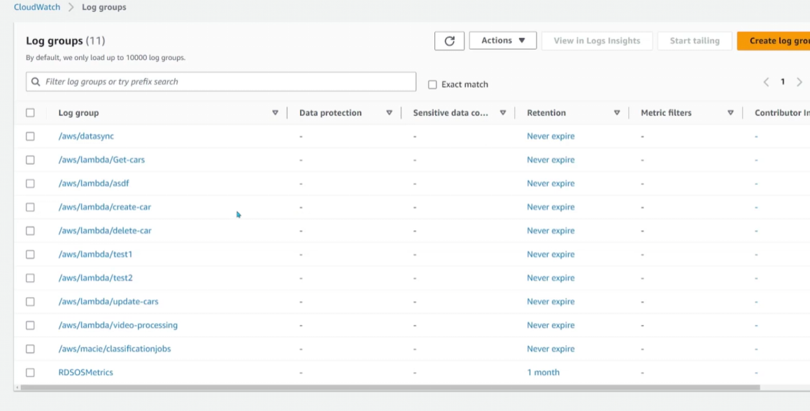
    - 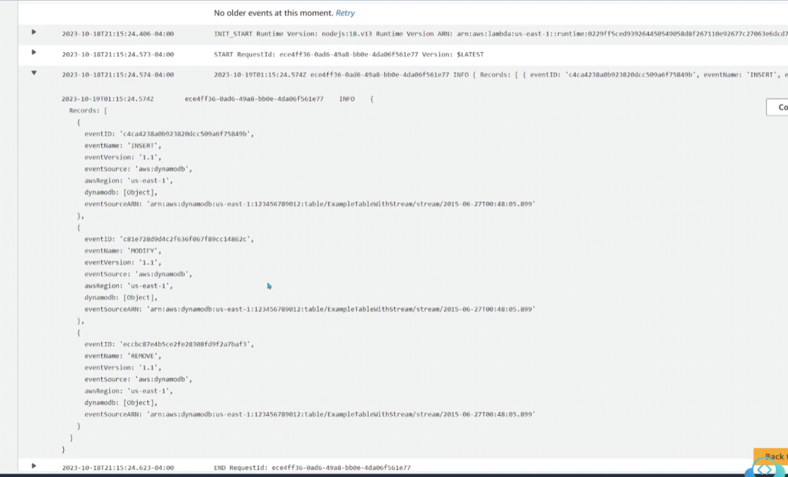
    * you can `live tails` off `log groups`
        - 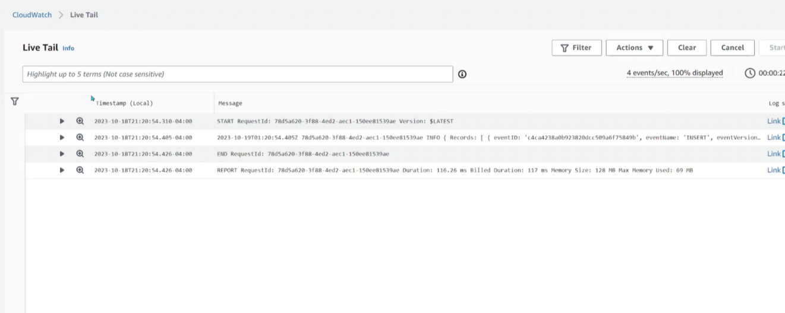
    * query logs on `log insights`
        - 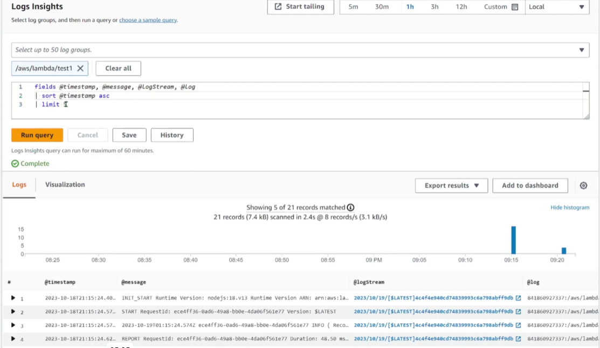

* `metrics`
    - 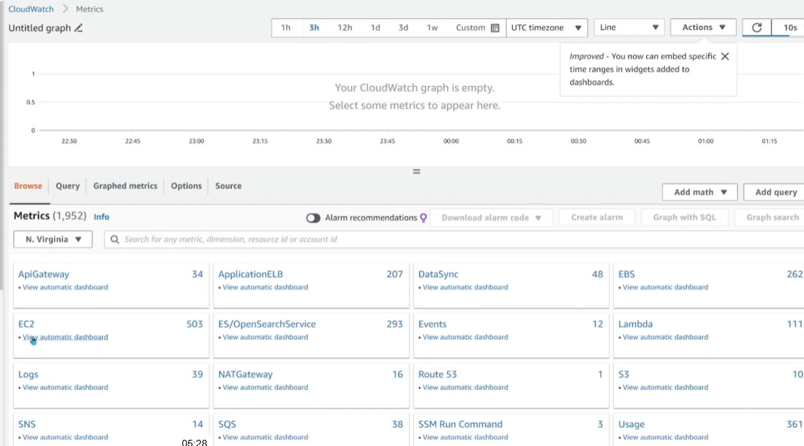

* `alarms`
    - 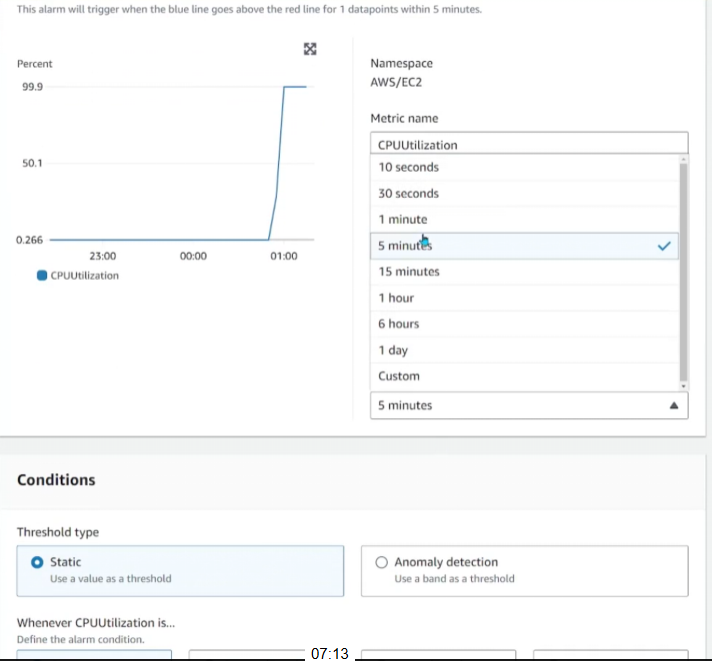
    - 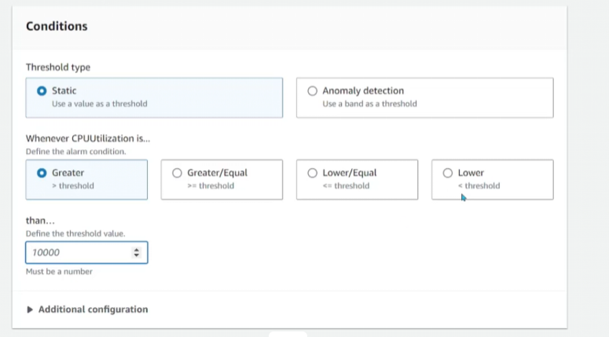
    - 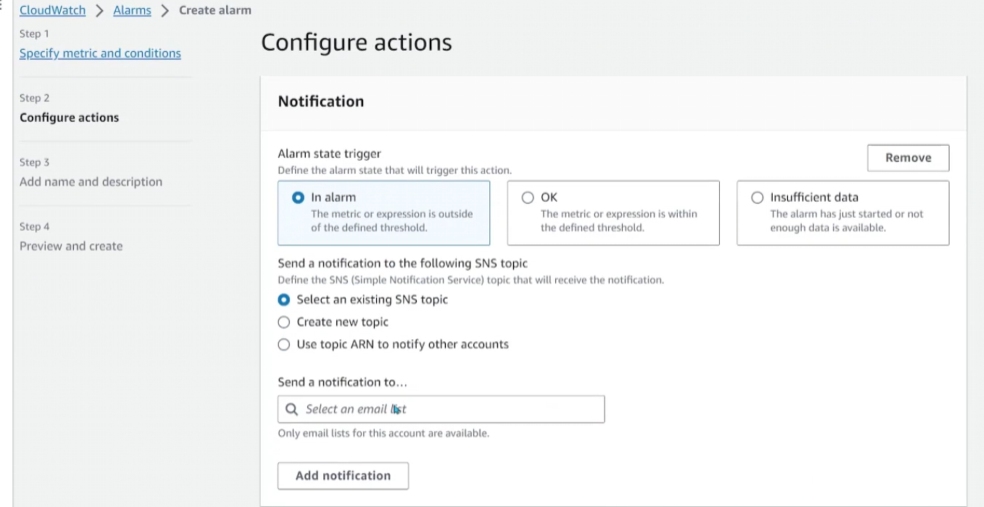
    - 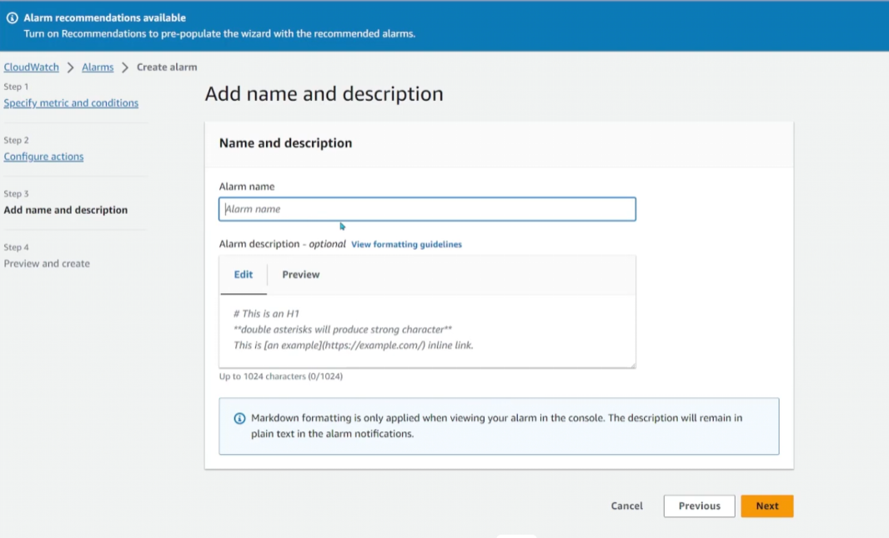

* `dashboards`
    - 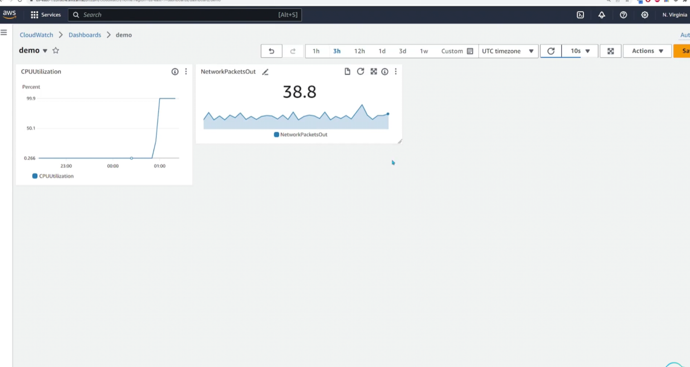
    - 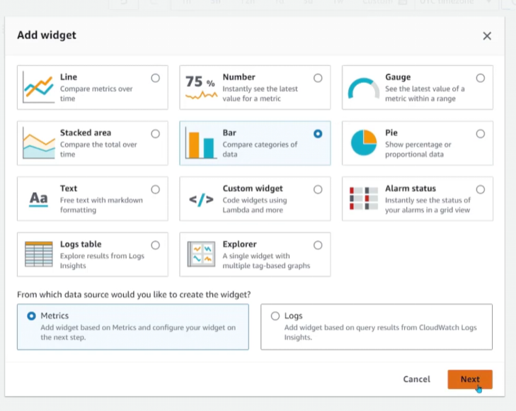
