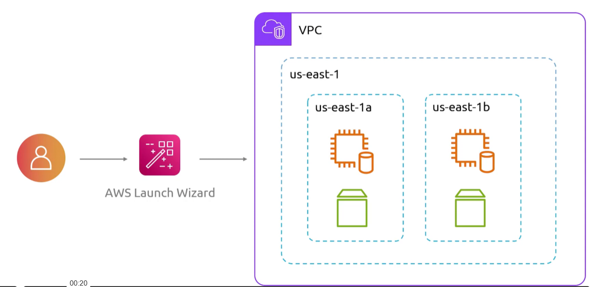
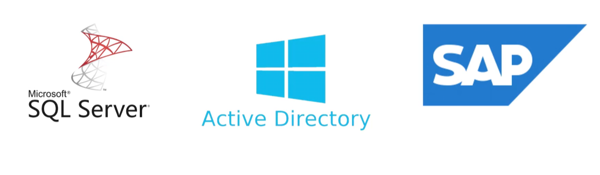
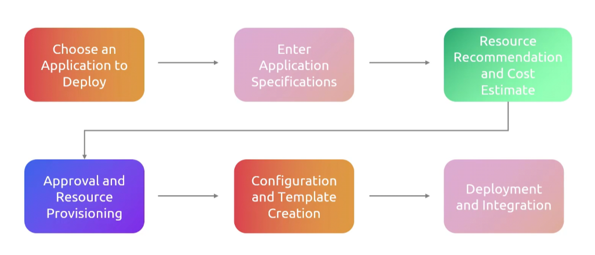

## Launch Wizard
- [Overview](#overview)

### Overview

* AWS `Launch Wizard` is a service that guides you through the sizing, configuration, and deployment of third party services such microsoft sql server on `ec2`
    - it supports both sql server single and HA deployments on `ec2`
    - it will handle provisioning your resources while following best practices

