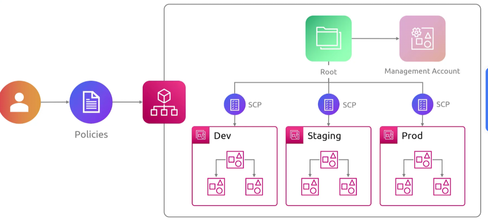

## Organizations
- [Overview](#overview)
- [Components](#components)

### Overview

* AWS `Organizations` is an aws service for centrally managing multiple aws accounts as a single entity
    - an `organizatoin` is the container that holds those account

### Components

* `Management Account`: the account that creates the organization
    - it pays the bills and has administrative authority over the others
* `Member accounts`: every other account in the organization
    - you can invite existing accounts or create new ones directly from the organization
* `Root`: the top level container that holds all the accounts and OUs
    - ever organization has exactly one
* `Organizational Units (OU)`: folders for organization accounts
    - nestable up to 5 levels deep
    - common patterns are grouping by environment or by business unit
* `Service Controle Policies (SCPs)`: guardrails attached to the root or an account that cap what IAM principals in those accounts are allowed to do
    - it doesn't grant permissions, it sets a ceiling
        * e.g. no account under this OU may use any regoin outside us-east-1