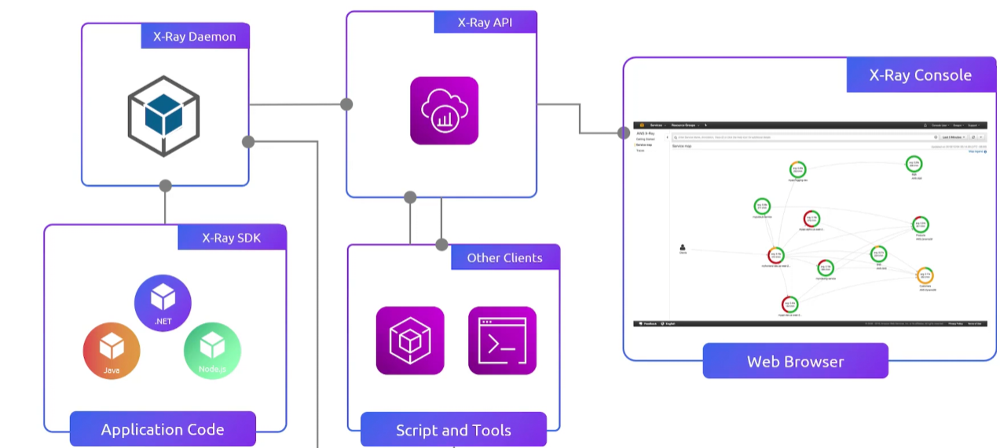
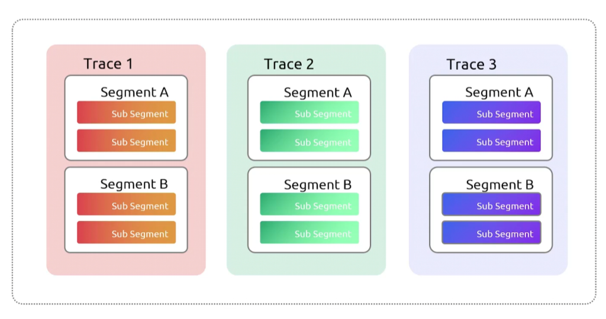
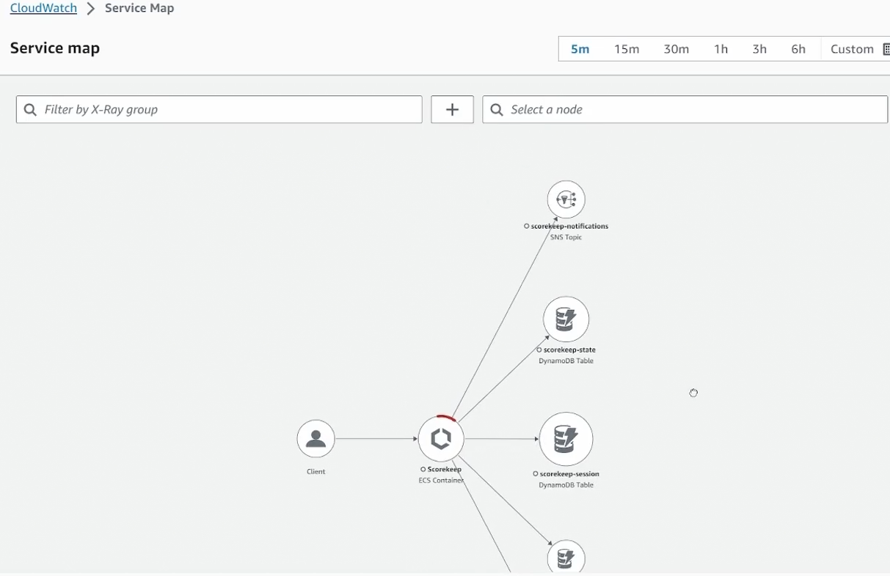
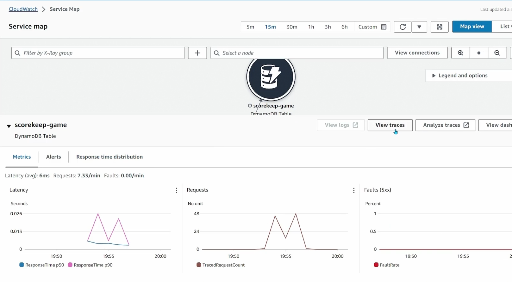
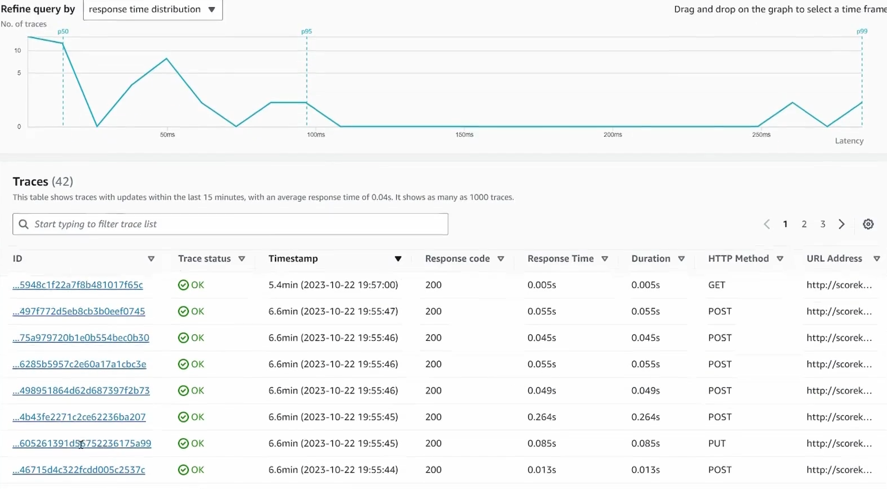
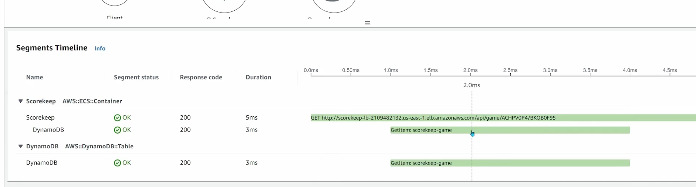

## Xray
- [Overview](#overview)
- [Components](#components)
- [Demo](#demo)

### Overview

* AWS `Xray` is a distributed tracing service and application performance monitoring service
    - helps devs analyze and debug production microservices, track request paths, and identify performance bottlenecks
    - using the xray sdk or opentelemetry standards in your application code to capture request data
    - a local or managed daemon process gathers the trace segments via UDP and uploads them to the cloud
    - it aggregates data into unified traces accessible through the console for filtering and troubleshooting

### Components

* `Trace`: one request's fully journey through your system, tied together by a `trace id` that propagates in the `X-Amzn-Trace-Id` header
    - a trace is a collection of segments
* `Segment`: is one service's contribution to that trace
    - start time
    - end time
    - metadata
* `Subsegments`: break a segment into finer pieces (e.g. dynamodb call, sqs publish, the outbound http request)
* `Annotations`: are indexed key/value pairs you can filter and search traces on
* `Service Map`: shows all the components that make up our application

### Demo

1. View Service Map 
    - 
    * you can view traces for a segment
        - 
        - 
        - 
