## Control Tower
- [Overview](#overview)
- [Components](#components)
- [Demo](#demo)

### Overview

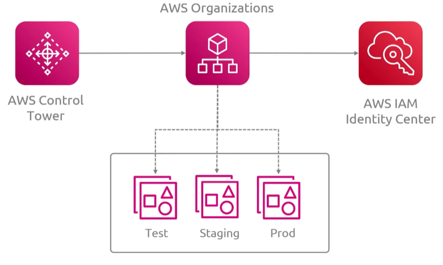
* AWS `Control Tower` is a layer on top of aws `organizations` that automates the setup of a secure, compliant, multi-account landing zone
    - it provides preconfigured governance controls and centralized visibility for cloud environments
    - `control tower` automates almost the entire process of working with `organizations`
* When you set up a landing zone, `control tower` either creates a new `organization` or uses an existing one
    - you can create Organization OUs and `control tower` registers it and it appears in the `organizations` console too
    - `control tower` authors and attaches them
    - 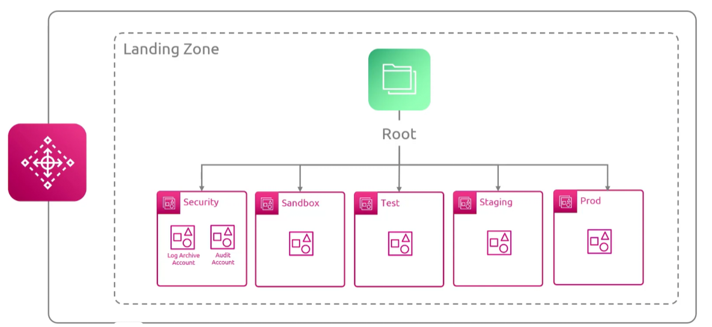
* You can configure drift notifications to alert when changes occur that differ from configurations

### Components

* `Landing Zone`: a pre arch environment featuring a root structure, a security OU, and an optional sandbox ox
* `Shared Accounts`: automatically provisions a `log archive` account for centralized logs and an `audit` account for security acces
* `Account Factory`: a built in catalog workflow that standardizes the creation and provisioning of new member accounts
    - allows you to automate the creation of new accounts
* `Controls`: guardrails
    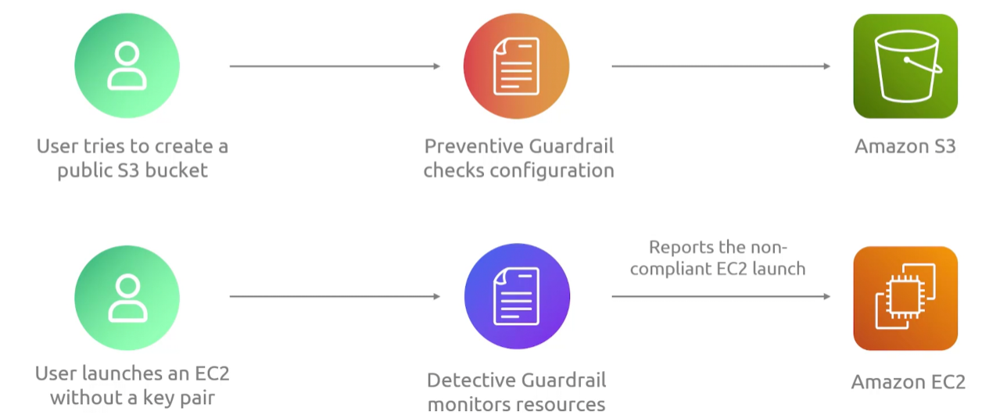
    - `preventive`: implemented as `scps` and `iam policies` that block actions outright
    - `detective`: implemented as `aws config rules`
        * flag non compliant resources after the fact
    - `proactive`: cloudformation hooks
        * reject noncompliant resources at deploy time before they are created

### Demo

1. Set up landing zone
    - 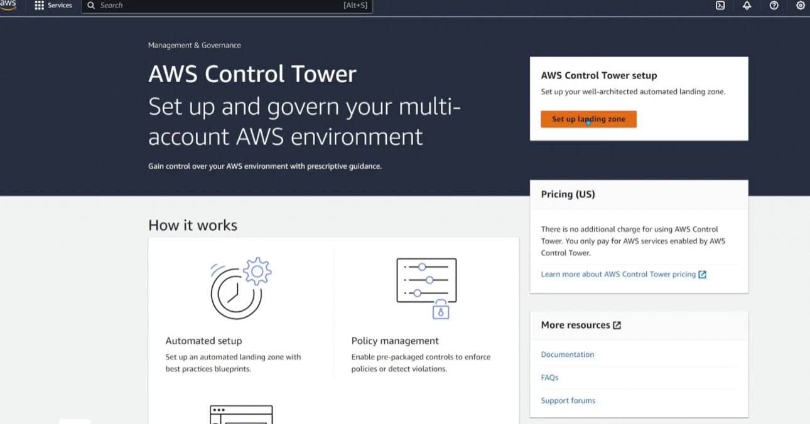
    - 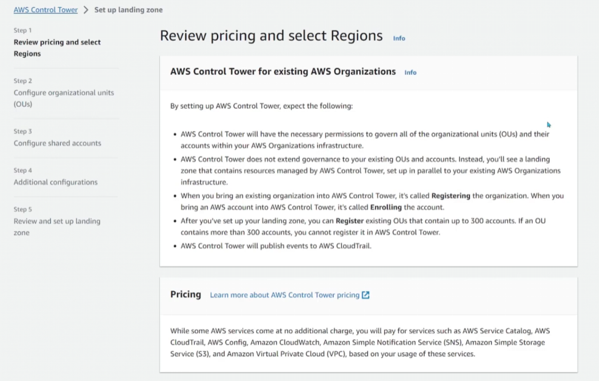
    * select home region
        - 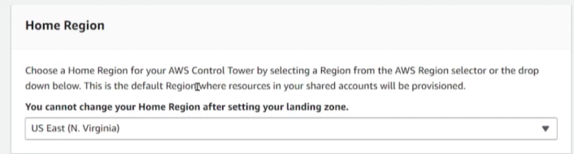
    * set region deny settings
        - 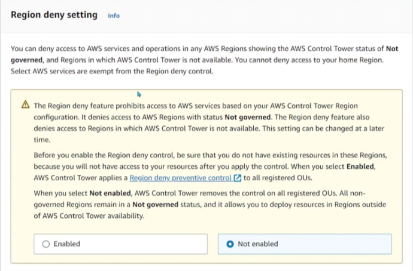
    * select regions you want control tower to govern
        - 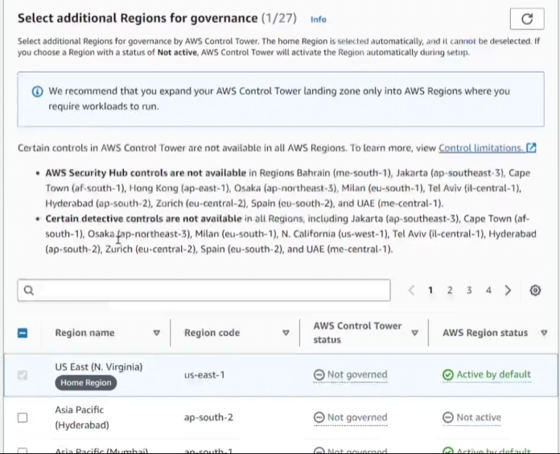

2. Configure OUs
    * define foundational (log-archive and security account) and additional OU
        - 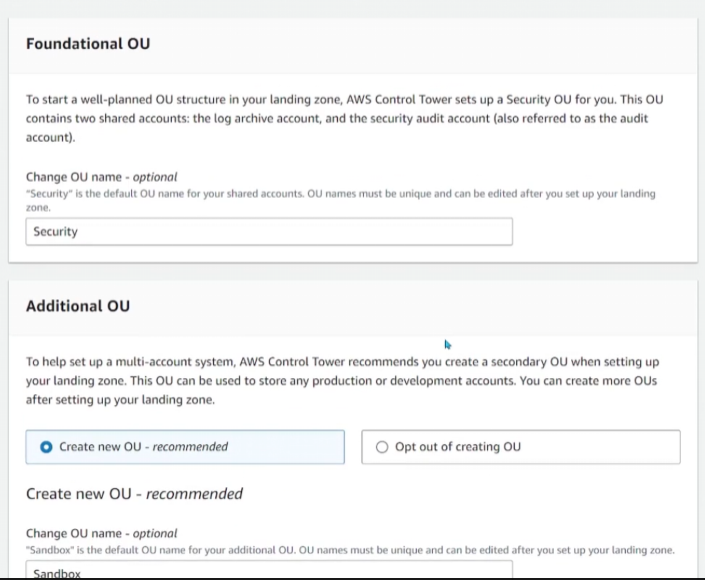

3. Configure shared accounts
    * management account, log-archive, and audit
        - 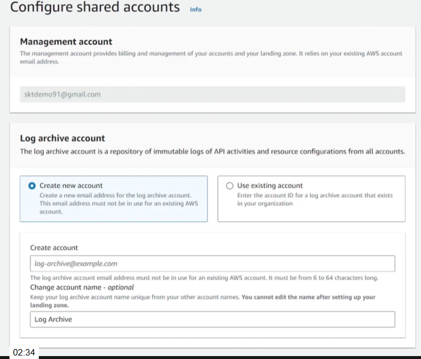
        - 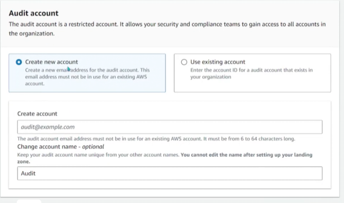

4. AWS Account access configuration
    - 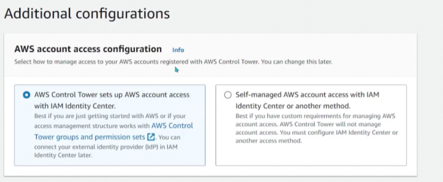
    * define cloudtrail config
        - 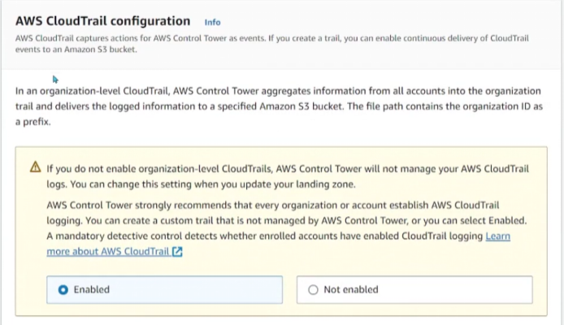
    * define log config for s3
        - 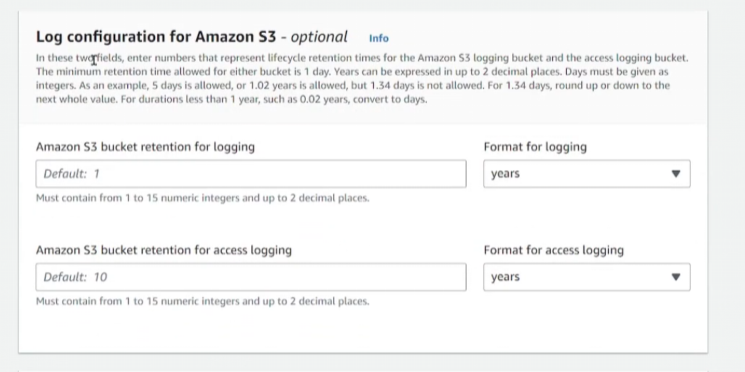
    * define kms encryption
        - 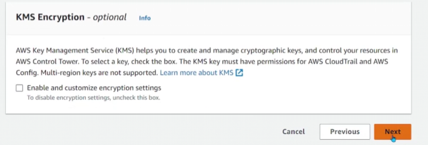

5. Create Landing Zone
    - 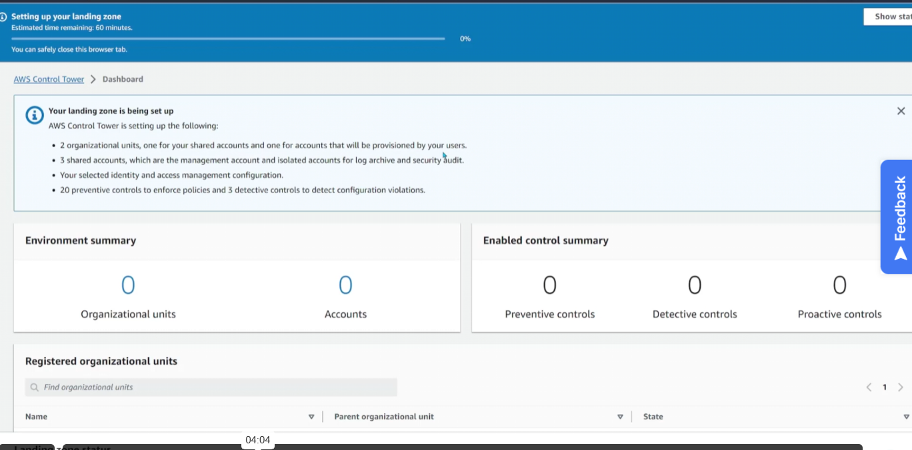
    - 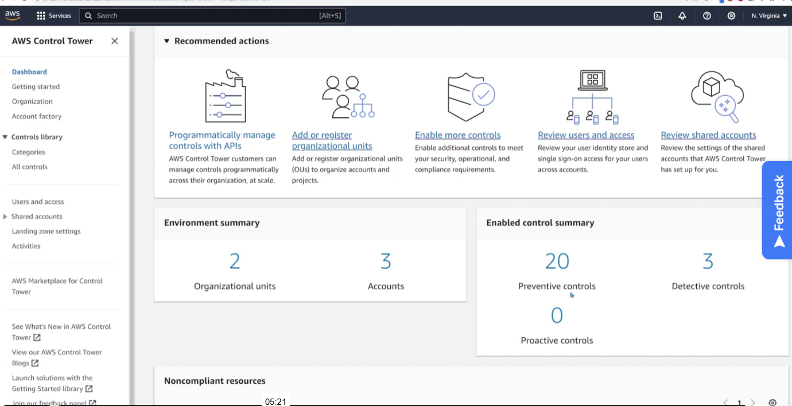

6. You'll see control tower created those accounts and a control tower admin account for those accounts 
    * you'll receive emails to accept invitation to activate account 
        - 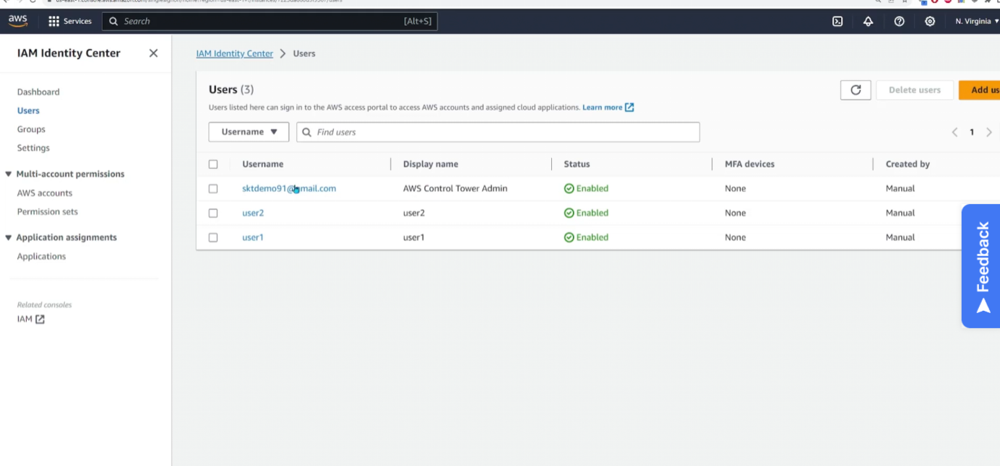

7. In control tower you'll see a user portal url you can use for accessing the landing zone
    - 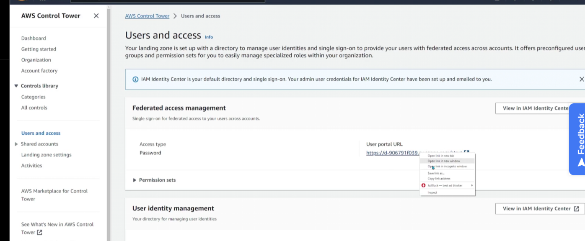
    - 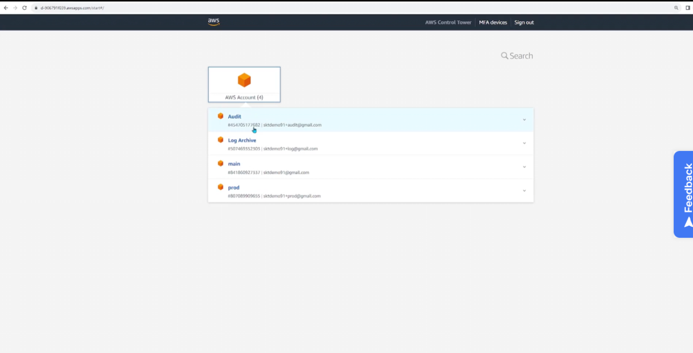

8. You can create new aws accounts under `account factory` in the control tower
    - 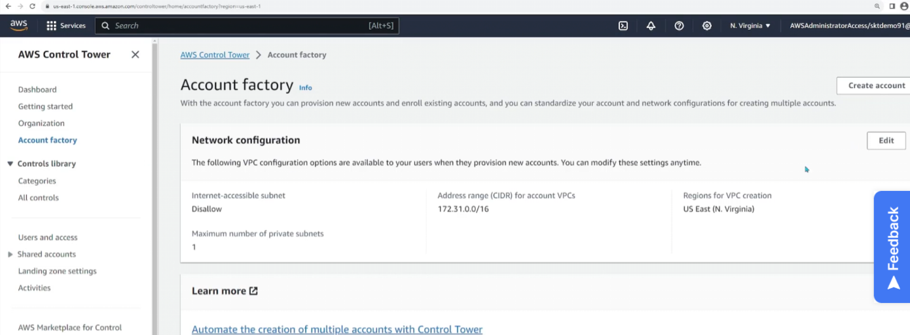
    - 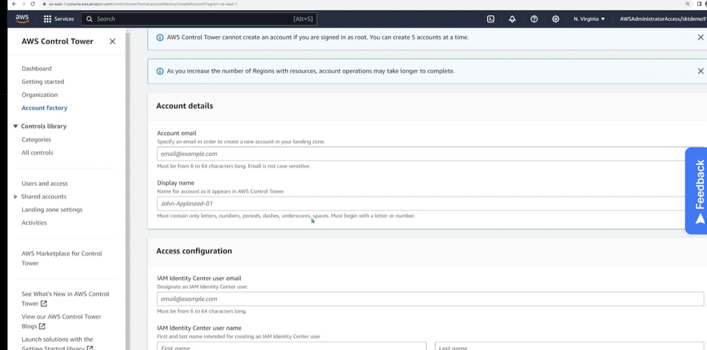
    - 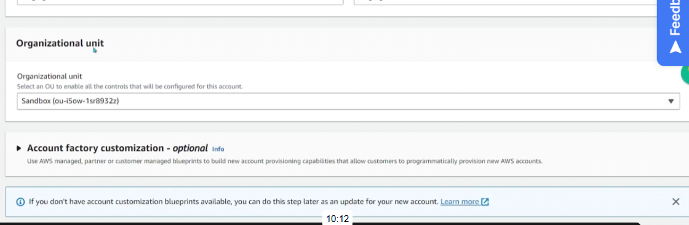
    - 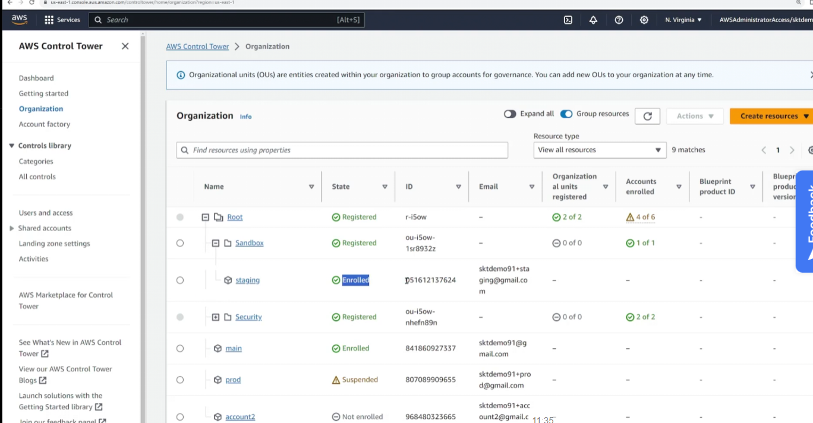
    * you can define default network configurations in `account factory`
        - 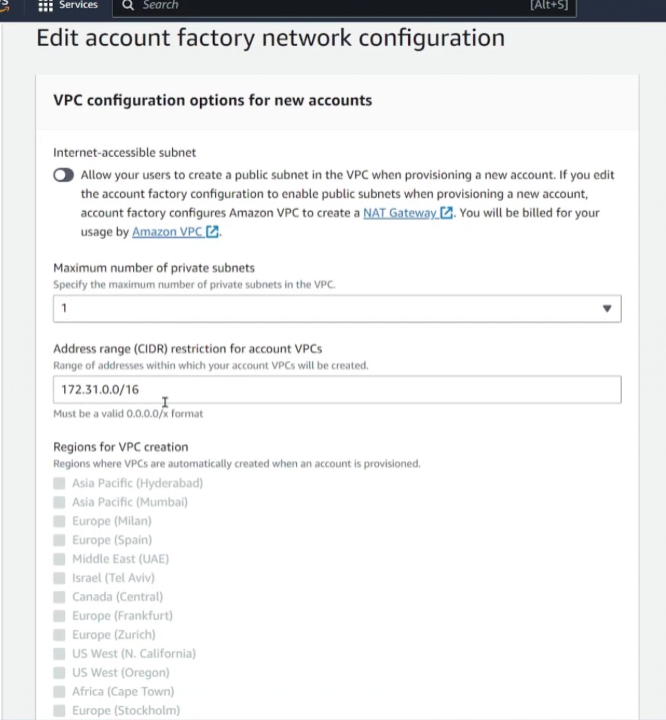
