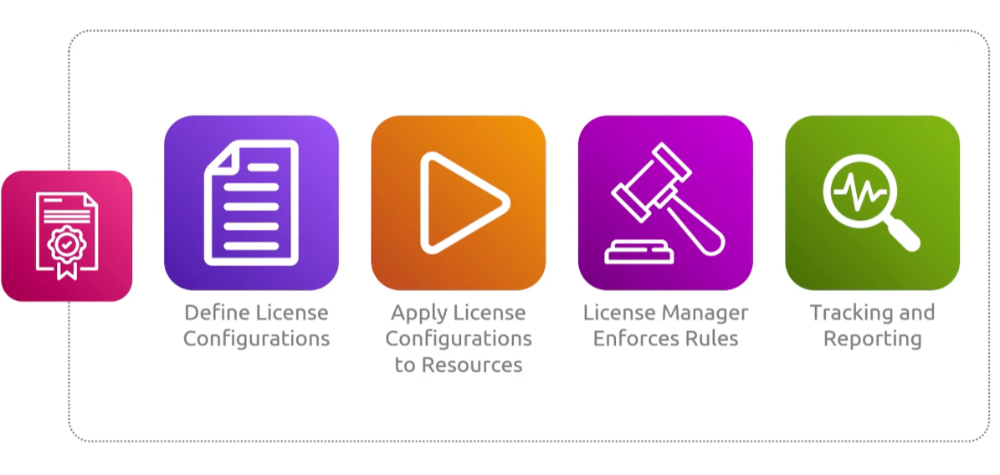

## License Manager
- [Overview](#overview)
- [Components](#components)

### Overview

* AWS `License Manager` is a service that helps you track, manage, and enforce software licenses from vendors like SAP, Oracle, and IBM across AWS and on-premise environments

### Components

* `Custom Rules`: define limits based on vcpus, physical sockets, or cores to block over deployment
* `Cross env tracking`: monitor usae across aws accounts, regions, and on prem servers via `ssm`
* `Dedicated Host Management`: automate the allocation, recovery, and release of host resource groups for `bring your own license (BYOL) workflows