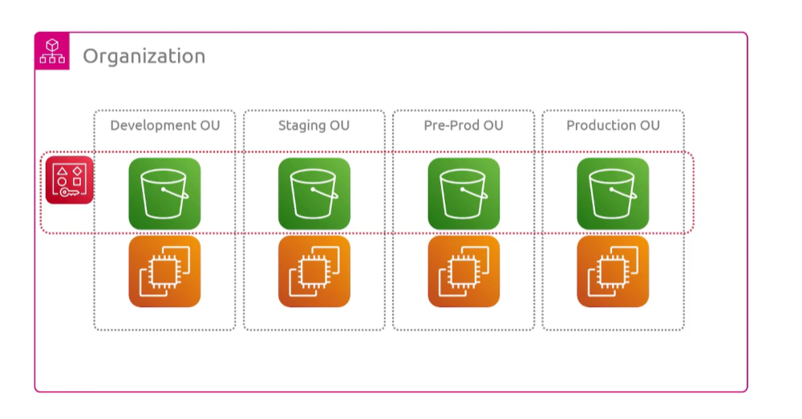
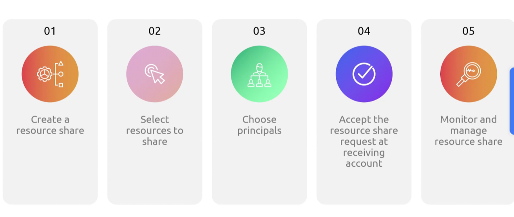

## Resource Access Manager
- [Overview](#overview)

### Overview

* AWS `Resource Access Manager (ram)` lets you share specific resources with other aws accounts instead of duplicating them per account
    - a classic case is a vpc, you can share subnets into the workload accounts
        * transit gateways are another big one thats shared
        * in the example of a shared subnet, owner pays for `nat gw` and the like, while participant pays for their own instances
    - in aws organizations, shares to accounts within the org are auto accepted, otherwise recipient will need to accept invitation